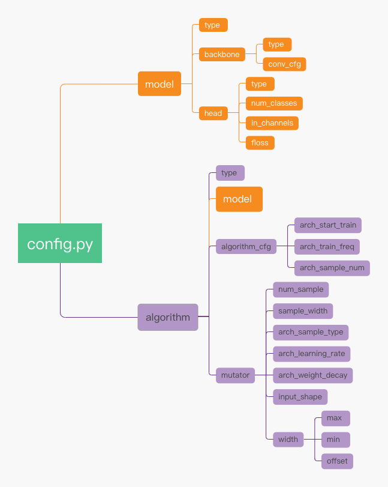

# Prerequisites
- Linux
- Python 3.6+
- Pytorch 1.1+
- CUDA9.0+
- [MMCV](https://github.com/open-mmlab/mmcv)
- [PAVI](http://parrots.sensetime.com/doc/sensetime/zhayp4/my15s1) [PAVI安装](http://sdkdoc.parrots.sensetime.com/en/install.html)
- [MME](https://gitlab.sh.sensetime.com/openmmlab-enterprise/mme)


# Installation

- 启动集群环境并安装GML

在公司现有的集群上，启动torch环境并且注明mmcv版本，(也可以自己准备一个torch/[parrots](http://parrots.sensetime.com/doc/pavi/fg3xkc/kb8ygp)环境并安装MMCV)

```bash
source /mnt/cache/share/platform/env/pt1.7.1 mmcv=1.4.6
# 注：其他集群有环境需求，也可联系sunyue1

cd /path/to/workspace
git clone https://gitlab.sz.sensetime.com/parrotsDL-sz/gml.git
cd gml && pip install -e .
```

## 1. 代码库适配MME

### 1.1 [教程](https://openmmlab.feishu.cn/docs/doccnKfdwWEIf3RQYQUfesSfq2c#tuT9FL)

### 1.2 验证适配是否成功

准备一个适配好MME的codebase，并且安装在workspace下。

简要文件夹结构如下

```bash
- workspace
    - gml/
        - tools/
    - codebase/
        - configs/
            - original_config.py
```

#### 1.2.1 验证codebase与mme的互通

```bash
cd /path/to/gml
bash tools/slurm_train.sh PARTITION JOB_NAME workspace/codebase/configs/original_config.py
```

如果能够正常启动并训练，即可基本证明适配MME成功。

#### 1.2.2 验证codebase与gml的互通（optional）

在任意位置新建一个config，里面：

1. 将来自于codebase的组件，如backbone、loss等替换成gml中类似的组件。
2. 以`original_config.py`为基础，新建一个config，其中：

    a. 调用gml的一个算法，推荐使用[fitnet](../configs/kd/fitnet/README.md)
    b. 酌情将codebase中的部分组件替换为gml中的组件，比如backbone、loss等

启动训练

```bash
cd /path/to/gml
bash tools/slurm_train.sh PARTITION JOB_NAME /path/to/new_config.py
```

如果能够正常启动并训练，即可基本证明适配MME成功。

## 2. 适配GML

- 代码适配

在mme v0.2.1中支持配置algorithm字段用于网络结构搜索、模型剪枝、模型蒸馏等性能提升模块；正常完成MME适配的算法，可以安装GML进一步的优化现有性能。

```python
# mme/tools/train.py v0.2.1
    if 'algorithm' in cfg:
        model = build_algorithm(cfg.algorithm)
    else:
        model = build_model(cfg.model)
```

- 验证gml是否安装成功

```python
import gml
from gml.models import build_algorithm

print(gml.__version__)
```

- 监督训练过程

通过PaviLoggerHook监控训练曲线，需要提前进行 pavi login登陆。

```python
log_config = dict(
    interval=100,
    hooks=[
        dict(type='TextLoggerHook'),
        dict(type='PaviLoggerHook', init_kwargs=dict(project='bignas_cls'))
    ])
```

- 验证

```python
import gml
from gml.models import build_algorithm
print(gml.__version__)
```
验证gml的bin文件是否生成
```bash
which search-init
which search-run
which search-ctl
```

# Configs

## 1. GML通用关键字: algorithm
algorithm是在MME中调用GML算法的关键字：

```python
# algorithm是GML特有的字段，里面会设置所用到的GML算法（即type）
# model即基础模型设置，比如MMClassfication中的ResNet50模型
# **kwargs代表不定形参数，对于不同的具体的GML算法会有不同的参数配置
algorithm = dict(
    type='ImageClassifierDistiller',
    model=dict(
        type='mmcls.ImageClassifier',
        backbone=dict(
            type='resnet50'
        ),
        neck=None,
        head=dict(
            type='ClsHead'
        )
    ),
    **kwargs,
)
```

其中：

  - `type` 设置具体的GML性能提升算法的类名，比如 `'ImageClassifierDistiller'`

  - `model` 设置所需要提升的具体的基础模型结构。在不同的性能提升算法中，该参数可能会有不同的含义。比如，在知识蒸馏中，`model`代表student模型、在NAS中，`model`带代表超网（supernet）。值得注意的是，你可以在`model`中直接使用来自于GML自带的backbone，详情请看[《GML设计文档》](http://parrots.sensetime.com/doc/sensetime/shmln4/hrrkne)<br>
  例子:

    ```python
    algorithm = dict(
        type='ImageClassifierDistiller',
        model=dict(
            type='mmcls.ImageClassifier',
            backbone=dict(
                type='gml.ResNetSlice',  # 这里可以直接调用来自GML的backbone
                **kwargs
            ),
            neck=None,
            head=dict(
                type='ClsHead'
            )
        ),
        **kwargs,
    )
    ```

  - `**kwargs` 代表不定形参数，在不同的性能提升算法中，会有所不同，具体的`**kwargs`请查看对应模块中的详细解释。

## 2. 每个性能提升模块的特有参数

### 在线量化 QAT

<details>

<summary>配置文件解释</summary>

我们以[模型配置文件](../configs/qat/IAO/classification/iao_res18_cifar10_quantization_8xb16.py)举例：

1. `_base_`中为原始模型的训练config。因为在QAT量化的过程中，我们实际上是对其forward过程进行了装饰，所以我们仍然需要其原本的训练config
2. `algorithm`为GML关键字，其中：
    1. `model`即为原始模型的结构配置
    2. `quantizer`为量化器，在GML中，quantizer的类型与部署所用的backend相关，例中为`TorchDefaultQuantizer`，其支持qnn，fbgemm两种backend，具体每种`quantizer`所支持的backend请看其对应的docstring。在本字段中：
        1. `input_layer`是一个字符串，是模型输入层的名字。
        2. `output_layer`是一个字符串，是模型量化最后一层的名字。**注意：** 这里的量化最后一层，不为模型的最后一层，一般为模型推理快要结束的某一层，因为在QAT中，我们一般不会对输出层做量化处理
        3. `fuse_config`是一个字典，代表着需要融合的模型部分算子，其中：
            1. key为模型某一个模块的名字
            2. value为一个列表，里面为key模块中需要融合的子模块。
        4. `custom_qconfig`是一个字典，其将会在backend默认的qconfig基础上生成新的qconfig。**TODO**

</details>

### 知识蒸馏 KD

<details>

<summary>配置文件解释</summary>

我们以[模型配置文件](../configs/kd/factor_transfer/classification/ftloss_res18_cifar10_distillation_8xb16_teacher_res50_neck_mimic.py)举例：

1. `_base_` 中为student 模型原始的config。因为蒸馏时student模型本身没有任何改动，所以也不会改动student本身的任何config
2. `Algorithm`为GML关键字, 在示例中：
    1. `type`为所用的蒸馏算法，目前共有两个独立蒸馏算法，其中：
        1. `TeacherStudentDistillation`为`teacher student架构`蒸馏算法
        2. `ABTeacherStudentDistillation`即[Knowledge Transfer via Distillation of Activation Boundaries Formed by Hidden Neurons](https://arxiv.org/pdf/1811.03233.pdf)
    2. `distiller`为所用蒸馏器，其中：
        1. `InplaceDistiller` 为[Slimmable Networks](https://github.com/JiahuiYu/slimmable_networks)中所用到的蒸馏器
        2. `TeacherDistiller` 为`teacher student架构`通用蒸馏器, 能够覆盖mmcls、mmdet等常见模型蒸馏场景
    2. `use_meal` 为是否使用[MEALv2](https://arxiv.org/abs/2009.08453)的关键字
    3. `pretrained` 为蒸馏器的预训练模型地址，Default to None
    4. `distill_cfg` 为蒸馏器配置关键字。里面包含蒸馏的所有配置，对于多个teaher模型时，teacher为一个list，单个teacher时为dict，其中：
        1. `ckpt_path`为teacher的pretrain weight地址，可以为空，会有warning提示
        2. `model`为teacher模型的模型结构配置，里面的其他关键字与普通模型相同
        3. `distill_head_cfg`为蒸馏监督层的相关配置。`distill_head_cfg`为list，list中的每个dict：
            1. `student_module`为监督的student 层的名字
            2. `teacher_module`为监督的teacher 层的名字
            3. `head`为蒸馏head的配置，里面包含监督所用的loss和connector，其中：
                1. `type` 为 `'BaseDistillationHead'`
                2. `name` 为蒸馏head的名字
                3. `stu_connector`为监督的student feat层所需的转换，即`stu_connector`接收`student_module`并输出转换后的student feat
                4. `tea_connector`为监督的teacher feat层所需的转换，即`tea_connector`接收`teacher_module`并输出转换后的teacher feat
                5. `loss`为此监督所用的loss，所用的loss均在`gml/distiller/losses`下
            4. 若`stu_connector` 或 `tea_connector`中有`pretrain_criterion`关键字，则对应的connector将会在student正式训练之前进行pretrain，其中pretrain的流程可以在具体的connector的`forward_pretrain`中看到，如：[Paraphraser](../gml/models/connectors/factor_transfer_connector.py#L41)

</details>

## 模型结构搜索 NAS

<details>

<summary>配置文件解释</summary>

### `model` 字段

首先进入ResNet18目录。
确定要搜索的维度，并适当修改模型代码。
对于有的维度，已有代码就能很好的适配，不需要做额外的修改，比如`base_channels`; 对于有的维度，比如我们想搜每个stage的`planes`,就得对代码做适当的修改,以满足传入可搜索参数的需求：

```python
# gml/models/backbones/resnet_slice.py
@BACKBONES.register_module()
class ResNetSlice(nn.Module):

    def __init__(self,
                 depth,
                 search_space=dict(), # 搜索空间注入
                 num_stages=4,
                 strides=(1, 2, 2, 2),
                 dilations=(1, 1, 1, 1),
                 out_indices=(0, 1, 2, 3),
                 style='pytorch',
                 frozen_stages=-1,
                 bn_eval=True,
                 bn_frozen=False,
                 with_cp=False):
        super(ResNetSlice, self).__init__()
        # 对应搜索空间加载 经过 build_search_space_recur 解析之后会得到一个大的搜索空间，每个叶子节点就是对应维度的搜索空间。
        self.search_space = build_search_space_recur(search_space)
        self.stage_out_channel = self.search_space.get('stage_out_channel',
                                                       (64, 128, 256, 512))
```

GML提供一系列预选模型结构例如`MobileNetV3Slice`、`ResNetSlice`以及`ShuffleNetV2_OneShot`，可以通过配置文件的gml.XXX 进行导入，再针对具体的视觉任务配置相应的`neck`、`head`以及`loss`等。<br>
于此同时，我们在配置文件中也要定义对应`mutator`可搜索类型的搜索空间。确定要搜索的维度对应的搜索空间。

```python
model = dict(
    type='gml.ImageClassifierSearch',
    backbone=dict(
        # 可搜索的backbone 使用 "scope.type" 的语法，指定从 gml 中寻找需要的模块
        type='gml.MobileNetV3Slice',
        conv_cfg=dict(type='Conv2dSlice'),
        search_space=dict(
            MB_stage_blocks=[
                dict(type='Categorical', data=[1], default=1),  # first conv
                dict(type='Categorical', data=[1], default=1),  # last conv
            ],
            MB_kernel_size=[
                dict(type='Categorical', data=[3], default=3),  # first conv
                dict(type='Categorical', data=[1], default=1),  # last conv
            ],
            MB_expand_ratio=[
                dict(type='Categorical', data=[1], default=1),  # first conv
                dict(type='Categorical', data=[6], default=6),  # last conv
            ],
            MB_out_channels=[
                # lower下界、upper上界
                # dict(type='Int', lower=32, upper=97, step=8, default=64),
                dict(type='Categorical', data=[16, 24], default=16),  # first conv  # noqa: E501
                dict(type='Categorical', data=[1792, 1984], default=1984),  # last conv  # noqa: E501
            ])),
    head=dict(
        type='gml.LinearClsHeadV2',
        num_classes=1000,
        in_channels=1984,
        # inplace distill: max 的softlabel用于其他子网的监督
        distiller_mode='soft',
        loss=dict(
            type='mmcls.LabelSmoothLoss',
            loss_weight=1.0,
            label_smooth_val=0.1,
            num_classes=1000),
        soft_loss=dict(
            type='mmcls.CrossEntropyLoss',
            use_soft=True,
            loss_weight=1.0),
        topk=(1, 5),
    ),
    resize_process=dict(type='ResizeSlice', resolution=dict(
        type='Int', lower=192, upper=289, step=32, default=224)),
    # 将搜索空间的可搜索维度传递给connect_head
    connect_head=dict(in_channels='backbone.feat_dim')
    )
```

- model的type为 gml.ImageClassifierSearch，和任务相关

### `algorithm`字段
设置训练采样逻辑并开始训练超网络，首先针对目前的One-Shot Weight Sharing NAS算法，其中gml.BigNAS给予了非常便捷的控制逻辑复现，用户可以轻松地在`algorithm`中指定训练的逻辑以及对子网采样的控制。

```python
algorithm = dict(
    # nas相应的算法字段
    type='gml.BigNAS',
    model=model,
    # 采用的超网采样策略
    strategy='sandwish4',
    drop_ratio=0.2,
    drop_path_ratio=0.2,
    # 配置相应的mutator类，baseline即为 RandomMutator
    mutator=dict(type='gml.StateslessMutator')
)
```

  -  `mutator` 控制整个训练过程中subnets如何采样，其中`StateslessMutator`无序采样，
  -  `strategy` 会控制每一次迭代如何进行（`sandwish4`即为`max+random+random+min`）

### `DynamicDistEvalHook`字段

动态评估逻辑`DynamicDistEvalHook`，可以控制评估固定配置的网络结构，便于训练中查验子网精度。

```python
search_eval_cfg = dict(
    type='DynamicDistEvalHook',
    evaluator=dict(
        type='NaiveEvaluator', units='M', default_shape=(1, 3, 224, 224)),
    gpu_collect=True,
    bn_stats_calib_kwargs=dict(
        num_iters=-1,
        sync_params=True
    ))
```

  - 当默认情况，则会选取搜索空间的最大最小的配置进行评测
  - `bn_stats_calib_kwargs` 重新标定BN步骤

</details>

## 模型剪枝 Pruning

<details>

<summary>配置文件解释</summary>
在剪枝中，我们定义model和backbone时基本沿用mmcls中的设置而不需要过多额外的设置，主要需要定义algorithm，以剪枝算法DMCP为例，其config配置主要参数如下：

1. `_base_`中为student 模型原始的config。因为剪枝时目标网络模型本身没有任何改动，所以也不会改动这部分config
2. `model`为剪枝算法中的目标模型的模型结构配置，里面的其他关键字与普通模型相同。
3. `algorithm`为剪枝算法的关键字，里面包含剪枝的所有配置。`algorithm.type`为所用到的剪枝算法的名字。对于多个teaher模型时，`distillation.tea_cfg`为一个list，单个teacher时为dict，其中对于每个`distillation.tea_cfg`：
    1. `algorithm_cfg`为算法的配置参数，主要有 DMCP中，需要额外设置的结构参数的更新开始位置`arch_start_training`， 更新结构参数的频率`arch_train_freq`以及训练后的采样次数`arch_sample_num`
    2. `model`为模型
    3. `mutator`为DMCP剪枝中的变化器`mutator`的相关配置：
        1. `num_sample`为进行马尔可夫优化时的三明治训练次数，应该与arch_sample_type的长度相等
        2. `sample_width`为采样的比例，一般默认为None，在mutator中计算
        3. `arch_sample_type`为采样的模式，分为`['max', 'min', 'scheduled_random', 'non_uni_random', 'arch_random']`等五种，分别代表每次采样所使用的模式，模式可重复调用
        4. `arch_learning_rate`为结构参数的学习率
        5. `arch_weight_decay`为结构参数的权重衰减
        6. `input_shape`为计算FLOPs的时候的模拟输入特征的尺寸，和FLOPs直接相关
width为预设的采样的氛围，形如字典形式，例如{max:1, min:0.1, offset:0.1}

配置文件的树状结构如下：

<p>
    <div align="center">
        
        <br>
        <span style='font-weight: bold'>图 1.</span> 配置文件字段结构
    </div>
</p>

</details>

## 超参搜索 HPO

<details>

<summary>配置文件解释</summary>

我们以在[超参优化demo](../README.md#hpo-demo-run..)中提到的[配置文件](../configs/gridsearch/search_config.yaml)举例：

1. `task`
    1. `template` 是一个必选参数，后面跟的是怎么跑单个任务（现在仅支持用slurm在对应的计算结点上跑）。其中`{}`内的参数即需要搜索的这些参数，具体的可以在下面的`search_args`中进行配置。
    2. `search_args` 是一个必选参数，用于为`template`中需要搜索的参数提供搜索空间，具体支持`Categorical`,`Real`,`Int`,`Nested`,`File`五种类型的搜索空间。然后解析引擎会根据每个arg的搜索空间做笛卡尔组合得到所有的搜索配置。
2. `searcher` 中定义搜索使用的策略，其中各个参数的作用如下。
    1. `type`为使用的搜索策略，支持`GridSearcher`, `BatchSearcher`, `RandomSearcher`，`SkoptSearcher`和`EvolutionSearcher`，默认为`GridSearcher`。当策略为`BatchSearcher`时，搜索参数只能为`Nested`,并且`Nested`中包含的参数只能为普通类型,如`int`,`str`等。
    2. `reward_attribute`为要最大化的scalar名字，默认为`acc`。
3. `scheduler`
    1. `type` 为使用的scheduler种类。
    2. `parallel_size` 为并行运行的子job数量。
    3. `stop_criterion` 指定了父任务的停止规则，可以定义如下参数：
        1. `max_tries`：最多运行的子job数
        2. `time_limits`：最长总训练时间
        3. `max_reward`：最优奖励值，达到该值后停止训练
        4. `time_limits_per_job`：单个子任务最长训练时间
    4. `assessor`中定义超参数搜索提前停止策略，该项设置不是必须的，但使用后可以提前终止掉表现较差的训练任务，节省训练时间，其中各个参数的作用如下。
        1. `type`: 使用的提前停止策略，支持`CurveFittingAssessor`, `MedianStopAssessor`。当策略为`CurveFittingAssessor`时，只能用于极大化优化场景（optimize_mode: 'maximize') ，如Accuracy
        2. `optimize_mode`: 优化目标类型，极大化或极小化，['maximize', 'minimize']
        3. `start_step`: 启动提前停止评估的步数（每上传一次训练指标为一步，如每轮Epoch结束后上传一次，则一个Epoch为一步）
        4. `epoch_num`: 仅对`CurveFittingAssessor`生效，该参数设置为总训练步数
4. `pavi`
    1. `compare` 提供了name和id两种模式，name模式下会在pavi中新建一个compare，id模式会在已有的compare中添加job。 在子任务使用了pavi的情况下，其创建的Training将自动被加入compare之中，对应的compare的地址会在标准输出中打印出来，也可以通过`search-ctl show -t <task_name>`的方式去获取。 另外，需要在训练代码中添加pavi对应的代码。
    2. `scalars`指定了获取的字段种类，同时，前面指定的`reward_attribute`会被自动加入进来。
5. `use_spe` 指定了是否使用spe.automl。
6. `generate_log` 指定了是否生成子任务对应的log。比如，nas_pretrain的eval阶段会产生很多进度条输出，而且其本身也会在work_dir下生成一个log，所以此时可以设置`generate_log`为`False`。

</details>
