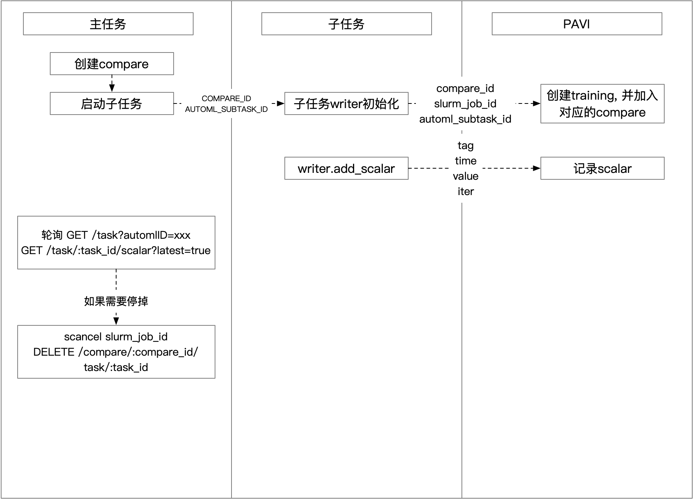

# Start Algorithm with Configs Modified Only

# 1. HPO
## 1.1 初始化任务环境
在使用本工具之前需要先在项目根目录下运行`search-init`初始化程序的运行环境，由于`search-init`会在当前目录下创建一个缓存目录，并且会做一定的拷贝，所以在使用HPO之前，代码的组织结构需满足下面的条件：
1. 用先对路径去获取文件时，所有用到的文件需放到search-init初始化时所在的目录下(或递归子目录)；
2. 用绝对路径获取文件时没有限制；
3. 实验过程中需要存文件时，需要用相对路径，且相对路径现在只支持放在`search-init`初始化时所在的目录下(递归子目录)或者上一层目录，使用绝对路径时跑多个子任务会有覆盖。
4. 本工具的scheduler调度控制器依赖于pavi作为监控和交互，整个监控交互的过程可以概括为下图：

如果要使用pavi来监测任务，则还需要执行`pavi login`来登录pavi账号。（需要pavi2.5.4及以上版本）

## 1.2 创建和运行任务
在开始使用之前，需要首先在项目根目录下运行`search-init`，这会在当前目录下创建`.search-run`文件夹并做简单的初始化工作(注意该文件夹为隐藏文件，需要用`ls -al`才能显示)，之后使用`search-run`创建的任务相关的所有文件都将在这个文件夹中。

要创建一个任务，首先需要使用一个配置文件定义该任务的各项参数，配置文件为yaml格式，在`task`参数中需要包含`template`和`search_args`参数，`template`为训练使用的命令的模板，`search_args`定义了模板中各个参数的搜索空间，示例如下：
```yaml
# Required
task:
  template: "srun -p pat_dev -n1 --gres gpu:1 python mnist.py \
            --lr {lr} --batch-size {batch-size} --epochs {epochs} \
            --gamma {gamma} --pavi"
  # Required
  search_args:
      - type: Categorical
        name: epochs
        value: [3, 5]
      - type: Categorical
        name: gamma
        value: [0.7, 0.8]
      - type: Nested
        value: [
                  {lr: 0.5, batch-size: 512},
                  {lr: 1, batch-size: 1024}
              ]
```
`search-run`的使用格式为`search-run --task <task_name> <config_file>`，默认会将当前目录下的文件拷贝到新的位置运行，如果有些数据太大不想拷贝可以使用`--symlinks`创建软链接。其中，`<task_name>`为你想为运行该任务所取的名字，不加`--task`选项时，默认名为`default；<config_file>`为该搜索任务需要用到的配置文件，如上所示。

在运行之后可以在`.search-run`文件夹中找到各个`task`中的`job`运行的信息，下面是default task中，搜索参数为a (搜索选项为1, 2, 3, 4, 5, 6)时，`.search-run`下的目录结构, `jobs/all`中为所有的job的文件夹，`jobs/tree`的目录对应了各个参数的值，可以较为方便的找到某个参数配置对应的job的文件夹。
```
.search-run
├── summary.yaml
└── tasks
    └── default
        ├── jobs
        │   ├── all
        │   │   ├── 0
        │   │   │   └── log
        │   │   ├── 1
        │   │   │   └── log
        │   │   ├── 2
        │   │   │   └── log
        │   │   ├── 3
        │   │   │   └── log
        │   │   ├── 4
        │   │   │   └── log
        │   │   └── 5
        │   │       └── log
        │   └── tree
        │       └── a
        │           ├── 1 -> /mnt/lustre/dengjitian/searchspace_component/test/test_autolink/.search-run/tasks/default/jobs/all/5
        │           ├── 2 -> /mnt/lustre/dengjitian/searchspace_component/test/test_autolink/.search-run/tasks/default/jobs/all/4
        │           ├── 3 -> /mnt/lustre/dengjitian/searchspace_component/test/test_autolink/.search-run/tasks/default/jobs/all/3
        │           ├── 4 -> /mnt/lustre/dengjitian/searchspace_component/test/test_autolink/.search-run/tasks/default/jobs/all/2
        │           ├── 5 -> /mnt/lustre/dengjitian/searchspace_component/test/test_autolink/.search-run/tasks/default/jobs/all/1
        │           └── 6 -> /mnt/lustre/dengjitian/searchspace_component/test/test_autolink/.search-run/tasks/default/jobs/all/0
        ├── run_config.yaml
        ├── task.yaml
        └── tmp
```

### 1.2.1 使用pavi
由于更高级的一些算法依赖训练任务往PAVI中report一些自己的reward数据，所以需要在当训练任务中使用pavi，并且report。同时需要在search_config.yaml中通过对pavi项进行配置开启相关功能。
```
pavi:
    compare:
        name: compare_new
        # id: xxxxxxxxxxxxx
    # reward_attribute would add to scalars by default
    scalars: ['acc', 'top1']
```
程序将自动将所有启动的Training加到一个Compare中，并从pavi得到scalar信息。

## 1.3 管理任务

### 1.3.1 在终端查看
`search-ctl`可以用于查看任务信息、删除任务、重新启动任务。 查看所有任务：
```
$ search-ctl show

All tasks:
default
        status: finished
        update_time: 2020/04/14 15:12:32.220510
test1
        status: error
        update_time: 2020/04/14 18:13:31.121230
test2
        status: finished
        update_time: 2020/04/15 12:22:21.522540
```
查看某一个任务的具体信息：
```
$ search-ctl show --task <task_name>

##############################
Task Name  : default
config file: /mnt/lustre/dengjitian/searchspace_component/test/test_pavi/.search-run/tasks/default/run_config.yaml
pavi_compare_url: http://dev.pavi.parrots.gux.space/#/compare/2c2e7358-9d98-4930-b4ba-f039afea609e
##############################

Jobs:
#Job Name: 0
  status        : error
  command       : python pavi_run.py
  run_path      : /mnt/lustre/dengjitian/searchspace_component/test/test_pavi/.search-run/tasks/default/jobs/all/0
  log_path      : /mnt/lustre/dengjitian/searchspace_component/test/test_pavi/.search-run/tasks/default/jobs/all/0/log
  start_time    : 2020/04/21 20:28:00.810541
  end_time      : 2020/04/21 20:28:10.924559
  callback_path : /mnt/lustre/dengjitian/searchspace_component/test/test_pavi/.search-run/tasks/default/jobs/all/0/callback
  pavi_training_url : http://dev.pavi.parrots.gux.space/#/task/8c0350d2-4de0-4d32-ac2a-b783c5436d38

#Job Name: 1
  status        : finished
  command       : python pavi_run.py
  run_path      : /mnt/lustre/dengjitian/searchspace_component/test/test_pavi/.search-run/tasks/default/jobs/all/1
  log_path      : /mnt/lustre/dengjitian/searchspace_component/test/test_pavi/.search-run/tasks/default/jobs/all/1/log
  start_time    : 2020/04/21 20:28:00.310342
  end_time      : 2020/04/21 20:28:10.844352
  callback_path : /mnt/lustre/dengjitian/searchspace_component/test/test_pavi/.search-run/tasks/default/jobs/all/1/callback
  pavi_training_url : http://dev.pavi.parrots.gux.space/#/task/8c0350d2-4de0-4d32-ac2a-b783c5436d38
```
或者查看某一任务的某些Job
```
$ search-ctl show --task <task_name> --jobs <job1,job2>
```
查看某个任务的scalar信息，并根据reward_attribute返回最高的k个job信息. +k:非升序，-k：非降序
```
$ search-ctl show-scalar --task <task_name> -rt +k

##############################
Task Name  : grid-test
config file: /mnt/lustre/maojianguo1/sensetime/parrots.gml/demo/.search-run/tasks/grid-test/run_config.yaml
pavi_compare_url: http://pavi.parrots.sensetime.com/#/compare/6c81eafe-79b9-466e-97f1-2443d83308cc
##############################

Jobs:
#Job Name: 2
  scalar_info   : {'Test Acc': {1: 97.66, 2: 98.27, 3: 98.54, 4: 98.64, 5: 98.74}}
  pavi_training_url : http://pavi.parrots.sensetime.com/#/task/f14342bd-84cb-4806-9167-18ffcf78a19d
  pre_callback_result:
    __benchmark_total_time(h): [0.5, 'xxx']
  after_callback_result:
    Loss          : 0.1
    Test Acc      : 0.95
    Test Loss     : 0.15
    pavi_Loss     : 0.028640544041991234
    pavi_Test Acc : 98.74
    pavi_Test Loss: 0.0369114351272583

#Job Name: 8
  scalar_info   : {'Test Acc': {1: 96.39, 2: 98.2, 3: 98.47, 4: 98.7, 5: 98.72}}
  pavi_training_url : http://pavi.parrots.sensetime.com/#/task/ddcb2b03-d069-4905-8070-e42b00ba2300
  pre_callback_result:
    __benchmark_total_time(h): [0.5, 'xxx']
  after_callback_result:
    Loss          : 0.1
    Test Acc      : 0.95
    Test Loss     : 0.15
    pavi_Loss     : 0.020779624581336975
    pavi_Test Acc : 98.72
    pavi_Test Loss: 0.03698853511810303
```
### 1.3.2 在网页查看、监控任务
在search-ctl show之后，可以查看task对应的Compare的url和jobs对应的Training的url,点击即可查看。

任务的配置信息通过session_text上传到了pavi服务器上，可以配置Column字段来方便的查看每个job的配置或者scalar信息，详细操作方法见[PAVI](http://parrots.sensetime.com/doc/sensetime/zhayp4/ckspa1)，[一个可视化的例子参见](./understand_gml/understand_hpo.md#432-在网页查看监控任务)

### 更多命令
更多管理方式，如停止任务、删除任务、恢复任务请参考[understand_hpo](./understand_gml/understand_hpo.md#4-hpo命令详解)

# NAS

> 以SPOS算法为例，介绍通过修改配置文件执行NAS算法的流程

以[configs/nas/spos/spos_shufflenetv2_supernet_8xb128_in1k.py](../configs/nas/spos/spos_shufflenetv2_supernet_8xb128_in1k.py)为基础配置，其基础依赖配置分为如下几部分：

```python
_base_ = [
    '../../_base_/datasets/mmcls/imagenet_bs128_colorjittor.py', # 数据相关基础配置
    '../../_base_/schedules/mmcls/imagenet_bs1024_spos.py', # 运行策略基础配置
    '../../_base_/mmcls_runtime.py' # 运行参数基础配置
]
```

一般地，改动config文件时，除dataset/mmcls_runtime一般不做改动，其余model部分均会定向改造为algorithm的嵌套。相应地，schedules也会根据算法的不同而改变，改动均写入config对应字段中。

```python
norm_cfg = dict(type='BN')
model = dict(
    type='mmcls.ImageClassifier',
    backbone=dict(
        type='gml.ShuffleNetV2_OneShot', widen_factor=1.0, norm_cfg=norm_cfg),
    neck=dict(type='GlobalAveragePooling'),
    head=dict(
        type='LinearClsHead',
        num_classes=1000,
        in_channels=1024,
        loss=dict(
            type='LabelSmoothLoss',
            num_classes=1000,
            label_smooth_val=0.1,
            mode='original',
            loss_weight=1.0),
        topk=(1, 5),
    ),
)

mutator = dict(type='gml.StateslessMutator')
algorithm = dict(type='gml.SPOS', model=model, mutator=mutator)
runner = dict(max_iters=150000)
evaluation = dict(interval=1000, metric='accuracy', by_epoch=False)
# checkpoint saving
checkpoint_config = dict(interval=1000)
find_unused_parameters = True
```

SPOS的bash脚本执行步骤如下：
#### Step1: Supernet pre-training on ImageNet

```bash
sh tools/slurm_train.sh $PARTION $JOB_NAME \
  configs/nas/spos/spos_shufflenetv2_supernet_8xb128_in1k.py \
  $WORK_DIR
```

#### Step2: Search for subnet on the trained supernet
注：GML库提供了多种子网搜索算法，包括随机搜索、遗传算法等，具体可见[understand_model_searcher](understand_gml/understand_model_searcher.md)。同时，GML支持在搜索过程中使用函数级调度，并行调度搜索函数，达到加速搜索和利用闲时资源的目的，具体可见[understand_functional_scheduling](understand_gml/understand_functional_scheduling.md)
```bash
sh tools/slurm_search.sh $PARTION $JOB_NAME \
  configs/nas/spos/spos_shufflenetv2_evolution_search_8xb2048_in1k.py \
  $STEP1_CKPT \
  --work-dir $WORK_DIR
```

#### Step3: [Optional] Subnet retraining on ImageNet
注：在GML库的有些算法中，子网络的重训练是非必要的，具体可查看算法对应的README文档了解算法原理及实现细节。
```bash
sh tools/slurm_train.sh $PARTION $JOB_NAME \
  configs/nas/spos/spos_shufflenetv2_subnet_8xb128_in1k.py \
  $WORK_DIR \
  --cfg-options algorithm.mutable_cfg=$STEP2_SUBNET_YAML
```

#### Step4: Subnet test on ImageNet
```bash
sh tools/slurm_test.sh $PARTION $JOB_NAME \
  configs/nas/spos/spos_shufflenetv2_subnet_8xb128_in1k.py \
  $STEP3_CKPT --work-dir $WORK_DIR --eval accuracy \
  --cfg-options algorithm.mutable_cfg=$STEP2_SUBNET_YAML
```
# KD

> 在本环节中，我们以FTLoss在检测任务上应用为例。

在蒸馏的训练过程中，可以分为两个阶段:

## 1. Connectors pre-training.

  **注意：** 这一步不一定是必须的，着取决于算法的pipeline，你可以查看每个算法下的README了解更多。

### 1.1 启动命令

    ```bash
    bash tools/slurm_train.sh $PARTITION $JOB_NAME \
    configs/kd/factor_transfer/detection/yolov3/ftloss_yolov3_mobilenetv2_320_300e_coco_teacher_d53_neck_pretrain.py \
    $PRETRAIN_WORK_DIR
    ```

### 1.2 自定义config

在FTLoss算法中，蒸馏头所监督的位置为中间层的输出，我们可以在原模型的`neck`处feed FTLoss的知识信息

<details>

<summary> 蒸馏头设置 </summary>

```python
dict(
    student_module='neck.detect3.conv5.conv',
    teacher_module='neck.detect3.conv5.conv',
    head=dict(
        type='FTDistillationHead',
        loss=dict(type='FTLoss', loss_weight=10.),
        name='neck_FTdis_stage3',
        stu_connector=dict(
            type='Translator', in_channel=96, out_channel=128),
        tea_connector=dict(
            type='Paraphraser',
            in_channel=128,
            out_channel=128,
            pretrain_criterion=dict(
                type='MSELoss', loss_weight=10.0)))),
```

</details>

**注意：** `pretrain_criterion`字段是识别是否需要pretrain的关键字，当其为空时，程序讲不会进行pretrain的训练，而是直接进行正式训练

## 2. Distillation training.


### 2.1 启动命令

    ```bash
    bash tools/slurm_train.sh $PARTITION $JOB_NAME \
    configs/kd/factor_transfer/classification/configs/kd/factor_transfer/detection/yolov3/ftloss_yolov3_mobilenetv2_320_300e_coco_teacher_d53_neck_train.py \
    $DISTILLATION_WORK_DIR --cfg-options algorithm.pretrained=$PRETRAIN_WORK_DIR/latest.pth
    ```

### 2.2 自定义config

正式进行训练的config与pretrain基本一致，但有如下不同：

1. LR不一定一致
2. epoch数量不一定一致，一般pretrain的epoch小于正式训练的epoch
3. 需要给`distiller`中传入pretrain的ckpt，如下

<details>

<summary>config传入pretrian ckpt</summary>

```python
algorithm = dict(
    type='TeacherStudentDistillation',
    model={{_base_.model}},
    distiller=dict(
        type='TeacherDistiller',
        distill_cfg=teacher,
        use_meal=True,
    ),
    pretrained='${PRETRAIN_WORK_DIR}/latest.pth',
    init_cfg=dict(
        type='Pretrained', checkpoint='${PRETRAIN_WORK_DIR}/latest.pth')
)
```

</details>

以及最终的模型测试

## 3. Model testing.

    ```bash
    sh tools/slurm_test.sh $PARTITION $JOB_NAME \
    configs/kd/factor_transfer/classification/configs/kd/factor_transfer/detection/yolov3/ftloss_yolov3_mobilenetv2_320_300e_coco_teacher_d53_neck_train.py \
    $DISTILLATION_WORK_DIR/latest.sh --eval $EVAL_SETTING
    ```

# Purn
这部分，我们以DMCP剪枝MObileNet_V2网络作为实例：

第一步，我们在config中定义预加载的MobileNet_V2模型， 并调用算法库中的DMCP算法，
<details>

<summary>在config中进行参数设置</summary>

```python
model = dict(
    type='gml.ImageClassifierSearch',
    backbone=dict(
        type='gml.MobileNetV2Slice',
        # Note: set search_space=dict() for standard MobileNetV2
        search_space=dict()),
    neck=dict(type='GlobalAveragePooling'),
    head=dict(
        type='gml.LinearClsHead_WithFLOPs',
        num_classes=1000,
        in_channels=1280,
        floss_cfg=dict(
            input_size=(3, 224, 224),
            target_flops=150,
            floss_type='log_l1',
            flop_loss_weight=0.1),
        distill_cfg=dict(
            temperature=1,
            distill_weight=1,
            distill_softlable=False),
        topk=(1, 5),
        cal_acc=True,
    )
    )

algorithm = dict(
    type='gml.DMCP',
    model=model,
    algorithm_cfg=dict(
        arch_start_train=None,
        arch_train_freq=1,
        arch_sample_num=5,
    ),
    mutator=customed_mutator,
    distill_iter=2000,
    )
```

</details>


第二步：准备image net数据并训练

```bash
# make sure you in $GML_ROOT
cd /path/to/workspace
# quick start
sh tools/slurm_train.sh $PARTION $JOB_NAME configs/pruning/dmcp/dmcp_mobilenetv2_imagenet_8xb256_f150.py --work-dir $WORK_DIR
```

第三步：基于第二步得到的剪枝结构重新定义模型结构并训练至收敛

```bash
# modify the 'algorithm。mutable_cfg' segment in 'configs/pruning/dmcp/dmcp_mobilenetv2_imagenet_8xb256_retrain.py' based on the
# structure file 'WORK_DIR/model_sample/subnet.npy', which generated in the training stage, and set 'algorithm.retraining' to True.
sh tools/slurm_train.sh $PARTION $JOB_NAME configs/pruning/dmcp/dmcp_mobilenetv2_imagenet_8xb256_retrain.py --work-dir $WORK_DIR
```

# QAT

# Appendix
## Dataset prepare
1. prepare imagenet
```bash
# make sure you in $GML_ROOT
mkdir -p data && cd data
ln -sf /mnt/lustre/share/image imagenet
```
2. prepare cifar

3. prepare mnist

Go to [link](http://yann.lecun.com/exdb/mnist/) and download the `train-images-idx3-ubyte.gz`, `train-labels-idx1-ubyte.gz`, `t10k-images-idx3-ubyte.gz`, `t10k-labels-idx1-ubyte.gz`. Upload the four files to `gml/demo/data/MNIST/raw`.

```bash
cd path-to-gml/demo/data/MNIST/raw
find . -name "*.gz" | xargs gunzip
cd ../../..
python process.py
```

## downstream repo prepare
1. mmcls
```bash
cd /path/to/workspace
git clone https://github.com/open-mmlab/mmclassification.git
# OR optional for inner user
git clone git@gitlab.sz.sensetime.com:parrotsDL-sz/mmclassification.git && git checkout -b master-opensource
cd mmclassification && pip install -e .
```
2. mmdet
```bash
cd /path/to/workspace
git clone https://github.com/open-mmlab/mmdetection.git
# OR optional: for inner user
git clone git@gitlab.sz.sensetime.com:parrotsDL-sz/mmdetection.git && git checkout -b master-opensource
cd mmdetection && pip install -e .
```
