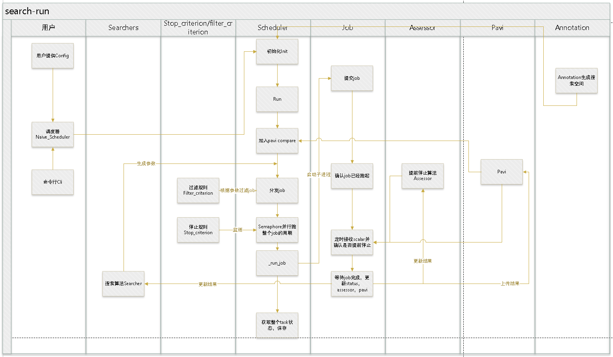
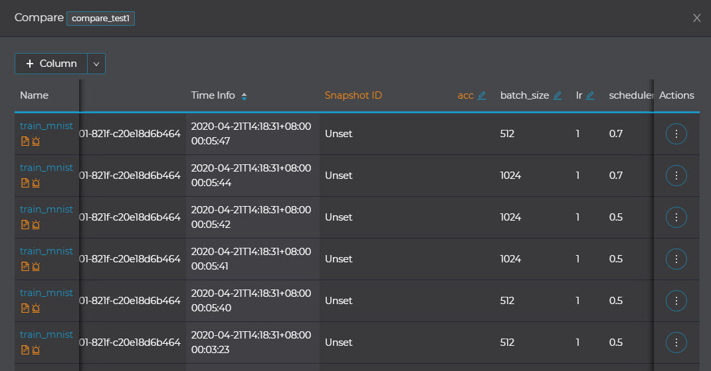
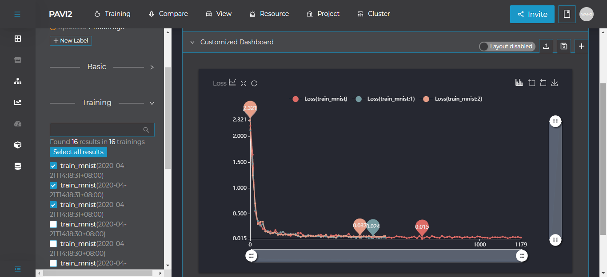

# 1. HPO背景
## 1.1 超参搜索HPO
随着卷积神经网络的发展，网络模型变得更加大而复杂，随之带来的是参数量的规模变大，参数调优变得更加困难。这就需要一些自动调优的方法，如超参搜索。超参搜索的原理不难理解，它将每个参数的不同取值进行组合，配合搜索算法和提前停止算法，实现了最优参数的自动搜索。

## 1.2 HPO pipeline
使用HPO进行训练的主流程图如下：

用户想要运行HPO超参搜索任务，只需要准备一个config文件search_config.yaml，开启了[pavi](http://parrots.sensetime.com/doc/sensetime/zhayp4/my15s1)并上传需要的数据即可。[HPO配置文件](#HPO配置文件)将会描述config文件所需的内容。可能还需要准备一个待搜索程序，如下面示例中的mnist.py；一个yaml或python文件类型的搜索参数，如下面示例中的config.yaml。

HPO中的Scheduler负责整个搜索过程的管理，会先解析search_config.yaml，然后构建好Searcher、Criterion、Assessor组件。搜索开始后，Searcher组件将从搜索空间挑选参数组合，参数组合如果通过Filter_criterion组件的筛选条件，Scheduler就会根据此组参数生成子任务Job。Assessor组件(细粒度，比如每个epoch的精度)和Stop_criterion组件(粗粒度，比如单个job的运行时长，总运行时长等)负责监控主任务及其所有的Job，决定何时停止主任务和子任务。主任务停止后，超参搜索任务便完成了。

# 2. HPO配置文件字段解析
## 2.1 一个典型的配置文件
一个典型的配置文件如下：

```yaml
task:
    # Required
    template: "srun -p pat_dev -n1 --gres gpu:1 python mnist.py \
            --config '{config}' --batch-size {batch-size} \
            --log-interval {log-interval} --pavi"
    # Required
    search_args:
        # Supported type: Categorical, Nested, Int, File
        - type: Categorical
          name: batch-size
          data: [1024, 512]
        # default: 5
        - type: Categorical
          name: log-interval
          data: [10, 20]
        - type: File
          name: config
          file: config.yaml
          place_holder: 'file_art'
          search_args:
            - type: Categorical
              name: epochs
              data: [3, 4, 5]
            - type: Nested
              data:  [
                          {scheduler.step_size: 1, scheduler.gamma: 0.5},
                          {scheduler.step_size: 2, scheduler.gamma: 0.7}
                      ]

searcher:
    # Support GridSearcher, RandomSearcher, SkoptSearcher
    type: GridSearcher
    # Required
    reward_attribute: Test Acc
    # ckpt_save_path
    #ckpt_save_path: pavi:/MnistNet

scheduler:
    type: FIFO
    parallel_size: 1
    stop_criterion:
        max_tries: 2
        time_limits: 1  # hours
        max_reward: inf
        time_limits_per_job: 1

# Required
pavi:
    compare:
        name: compare_new
        # id: xxxxxxxxxxxxx
    # reward_attribute would add to scalars by default
    scalars: ['Test Acc']

use_spe: False
generate_log: True
```
其中，各字段的意义和配置方法会在下面说明。
## 2.2 task
### 2.2.1 template
`template`是一个必选参数，后面跟的是怎么跑单个任务。
```yaml
template: "srun -p pat_dev -n1 --gres gpu:1 python mnist.py \
           --config '{config}' --batch-size {batch-size} \
           --log-interval {log-interval} --pavi"
```
其中`{}`内的参数即需要搜索的这些参数，具体的可以在下面的`search_args`中进行配置。
### 2.2.2 search_args
`search_args`是一个必选参数，用于为`template`中需要搜索的参数提供搜索空间，具体支持`Categorical`,`Real`,`Int`,`Nested`,`File`五种类型的搜索空间。然后解析引擎会根据每个arg的搜索空间做笛卡尔组合得到所有的搜索配置。
```yaml
# Required
search_args:
    - type: Categorical
      name: batch-size
      data: [1024, 512]
    - type: Categorical
      name: log-interval
      data: [10, 20]
    - type: Nested
      data: [
                {lr: 0.5, batch-size: 512},
                {lr: 1, batch-size: 1024}
             ]
    - type: File
      name: config
      file: config.yaml
      args:
        - type: Categorical
          name: epochs
          data: [5, 10]
        - type: Nested
          data:  [
                      {scheduler.step_size: 1, scheduler.gamma: 0.5},
                      {scheduler.step_size: 2, scheduler.gamma: 0.7}
                  ]
```
## 2.3 searcher
`searcher`中定义搜索使用的策略，其中各个参数的作用如下。

`type`: 使用的搜索策略，支持`GridSearcher`, `BatchSearcher`, `RandomSearcher`，`SkoptSearcher`和`EvolutionSearcher`，默认为`GridSearcher`。当策略为`BatchSearcher`时，搜索参数只能为`Nested`,并且`Nested`中包含的参数只能为普通类型,如`int`,`str`等。

`reward_attribute`： 要最大化的scalar名字，默认为`acc`。
### 2.3.1 BatchSearcher
批优化算法，仅支持`Nested`类型，无优化计算，按序返回`Nested`中的每组配置
```yaml
searcher:
    # Support BatchSearcher， GridSearcher, RandomSearcher, SkoptSearcher, EvolutionSearhcer. Default to `GridSearcher`
    type: BatchSearcher
    # Optional, default to `acc`
    reward_attribute: acc
```
### 2.3.2 GridSearcher
网格搜索优化算法，计算搜索空间笛卡尔积，无差别的选取配置用于训练
```yaml
searcher:
    # Support BatchSearcher， GridSearcher, RandomSearcher, SkoptSearcher, EvolutionSearhcer. Default to `GridSearcher`
    type: GridSearcher
    optimize_mode: 'maximize' # 'maximize','minimize'
    # Optional, default to `acc`
    reward_attribute: acc
```
### 2.3.3 RandomSearcher
随机搜索优化算法，在搜索空间里随机搜索配置进行训练
```yaml
searcher:
    # Support BatchSearcher， GridSearcher, RandomSearcher, SkoptSearcher, EvolutionSearhcer. Default to `GridSearcher`
    type: RandomSearcher
    optimize_mode: 'maximize' # 'maximize','minimize'
    # Optional, default to `acc`
    reward_attribute: acc
```
### 2.3.4 SKoptSearcher
贝叶斯优化搜索算法，获取配置时，会根据已完成训练的历史结果进行优化，在搜索空间里寻找较优配置
```yaml
# 贝叶斯优化有丰富的参数可以设置，包括
#            'base_estimator', 'n_random_starts', 'n_initial_points',
#            'acq_func', 'acq_optimizer', 'random_state', 'model_queue_size',
#            'acq_func_kwargs', 'acq_optimizer_kwargs'
#具体的设置可以参考skopt.Optimizer的文档 https://scikit-optimize.github.io/stable/modules/classes.html#module-skopt.optimizer

searcher:
    # Support BatchSearcher， GridSearcher, RandomSearcher, SkoptSearcher, EvolutionSearhcer. Default to `GridSearcher`
    type: SkoptSearcher
    optimize_mode: 'maximize' # 'maximize','minimize'
    random_state: 1
    # Optional, default to `acc`
    reward_attribute: acc
```
### 2.3.5 EvolutionSearcher
遗传变异优化算法。基于搜索空间随机生成种群，种群中包含population_size个初代个体。在每一代中随机选择两个父体进行交叉、变异产生新的个体。 调用get_config()获取个体时，优先选择初代个体，若无初代个体，会通过交叉变异产生新的下一代个体，所有个体都确保只生成一次，返回一次。

交叉：模拟染色体交叉操作，对两组父体配置进行部分段交换 变异：随机对配置进行改变（如增大学习率，减小Batch_size）
```yaml
searcher:
    # Support BatchSearcher， GridSearcher, RandomSearcher, SkoptSearcher, EvolutionSearhcer. Default to `GridSearcher`
    type: EvolutionSearhcer
    optimize_mode: 'maximize'
    # Optional, default to `acc`
    population_size: 32
    mutate_prob: 0.1
    reward_attribute: acc
    gen_trial_limit: 100
    seed: 2021
```
## 2.4 scheduler
```yaml
scheduler:
    type: FIFO # 目前没有作用
    parallel_size: 4  # 同时运行的job的最大数量
    stop_criterion:
        max_tries: 10 # 最多运行的迭代数
        time_limits: 1h
        max_reward: inf
        time_limits_per_job: 1
    assessor:
        type: CurveFittingAssessor
        epoch_num: 24
        optimize_mode: 'maximize'
        start_step: 4
```
## 2.5 assessor
`assessor中定义超参数搜索提前停止策略，该项设置不是必须的，但使用后可以提前终止掉表现较差的训练任务，节省训练时间，其中各个参数的作用如下。

`type`: 使用的提前停止策略，支持`CurveFittingAssessor`, `MedianStopAssessor`。当策略为`CurveFittingAssessor`时，只能用于极大化优化场景（optimize_mode: ‘maximize’) ，如Accuracy

`optimize_mode`: 优化目标类型，极大化或极小化，[’maximize’, ‘minimize’]

`start_step`: 启动提前停止评估的步数（每上传一次训练指标为一步，如每轮Epoch结束后上传一次，则一个Epoch为一步）

`epoch_num`: 仅对`CurveFittingAssessor`生效，该参数设置为总训练步数
## 2.6 pavi
```yaml
pavi:
    compare:
        name: compare_test1
        # id: xxxxxxxxxxxx
```
GML的前端显示和信息交互依赖于`pavi`，所以为了更好的享受自动记录和调参带来的快感，开启。提供了name和id两种模式，name模式下会在pavi中新建一个compare，id模式会在已有的compare中添加job。 在子任务使用了pavi的情况下，其创建的Training将自动被加入Compare之中，对应的Compare的地址会在标准输出中打印出来，也可以通过`search-ctl show -t <task_name>`的方式去获取。 另外，需要在训练代码中添加pavi对应的代码，如下：
```
from pavi import SummaryWriter
# pavi初始化
writer = SummaryWriter('ResNet18')
for n_iter in range(100):
    reward_attr = torch.rand(1)
    # 往pavi后端reporter数据，GML的HPO.scheduler将会接收到这些数据，然后可以做一些提前停止等控制。
    writer.add_scalar('acc', reward_attr, n_iter)
    ....
```
当然，由于PAVI是一个client-server模式，依赖于网络，当网络不稳定时，PAVI也会不稳定。有时，我们仅需要借用HPO来批量的启动任务，不需要对其进行提前停止。为此，我们提供了MOCK_PAVI模式，(使用方式为在命令前加上MOCK_PAVI环境变量即可。)具体见下表：

| MOCK_PAVI模式取值 | 说明 |
| ----          | ---- |
| 0          | (默认值) 使用([PAVI](http://parrots.sensetime.com/doc/sensetime/zhayp4/my15s1)) |
| 1          | 使用GML内部基于sql实现的PAVI, 里面实现了PAVI里的大部分API，但是没有前端的可视化     |
| 2          | 使用GML内部的假PAVI，仅仅做了API兼容，该模式下，不能使用基于`scalar`的功能，比如基于reward做提前停止 |

# 3. HPO组件解析
## 3.1 Scheduler
`Scheduler`类是HPO中的调度器，负责接收搜索参数，并分发任务，主要使用继承自`BaseScheduler`的`NaiveScheduler`类。下面是完整运行一个HPO任务的方法。

### 3.1.1 使用方法
```python
from gml.schedulers import NaiveScheduler

scheduler = NaiveScheduler(workdir, config, symlink_paths)
scheduler.run()
```
| 参数 | 说明 |
| ---- | ---- |
| `work_dir` | 调度器的工作路径 |
| `config` | 转换为`dict`类型的配置文件 |
| `symlink_paths` | 指定的数个路径，它们在被复制到工作路径下时，会被符号链接替代。 |

## 3.2 Job
`Job`是HPO中的子任务，通过`Scheduler`进行分发。目前实现了三种类型，分别为`SlurmJob`、`AutolinkJob`、`ContainerJob`。
### 3.2.1 Usage
#### 3.2.1.1 初始化
```python
from gml.schedulers.job import SlurmJob

job = SlurmJob(command, name, arg_dict, pavi_compare_id, symlink_paths)
```
| 参数 | 说明 |
| ---- | ---- |
| `command` | 用户配置文件中的`command`字段，代入生成的参数`arg_dict`得到 |
| `name` | 子任务名字 |
| `arg_dict` | 由`searcher`生成，并且解析之后得到(对`Nested`需要单独处理) |
| `pavi_compare_id` | `Scheduler`内部生成的`pavi compare`序号 |
| `symlink_paths` | 指定的数个路径，它们在被复制到工作路径下时，会被符号链接替代。|

#### 3.2.1.2 运行`Job`
```python
# 启动job
job.start(**kwargs)
# 等待job运行完成
job.wait(**kwags)
```
#### 3.2.1.3 停止`Job`
```python
job.kill()
```
#### 3.2.1.4 获取`Job`状态
```python
status = job.status
```
## 3.3 StopCriterion
启动一个监控线程，根据传入的`Scheduler`和用户配置信息中的停止规则，监控`Job`判断是否需要停止任务。
### 3.3.1 Usage
```python
from gml.schedulers import build_stop_criterion

stop_criterion = build_stop_criterion(stop_criterion_cfg)
# before scheduler begins
stop_criterion.before_run(scheduler)
# before adding a job
stop_criterion.before_iter(scheduler)
# after adding a job
stop_criterion.after_iter(scheduler)
# after scheduler finishes
stop_criterion.after_run(scheduler)
```

## 3.4 FilterCriterion
对传入的`Job`，获取其配置等信息，自定义规则来判断是否过滤掉该`Job`

### 3.4.1 Usage
```python
from gml.schedulers import build_filter_criterion

filter_criterion = build_filter_criterion(filter_criterion_cfg)
if_filter = filter_criterion.filter(job)
```
## 3.5 Assessor
在每个子任务运行过程中，使用`Assessor`提前停止算法判断是否提前停止该子任务。
### 3.5.1 Usage
```python
from gml.assessors import build_assessor

assessor = build_assessor(assessor_cfg)
```
Assesses whether the job should be stopped early.
```python
early_stop_flag = assessor.assess_job(job_id, scalars)
```
其中，`assess_job`接收的`scalars`参数由`pavi.get_latest_scalar()`获得，其格式如下：
```python
[{
    'iteration': 0,
    'value': 0.9,
    'created': 1640238929992
},
{
    'iteration': 1,
    'value': 0.92,
    'created': 1640238951211
},
{
    'iteration': 2,
    'value': 0.93,
    'created': 1640238989978
}]
```
Finish the assessing by updating rewards.
```python
assessor.job_end(job_id)
```

# 4. HPO命令详解

## 4.1 初始化任务环境
```bash
search-init
```
## 4.2 创建和运行任务
```bash
search-run --task <task_name> <config_file> <--symlinks=...>
```
## 4.2.1 resume之前的任务
当已有的任务由于某些原因断掉之后，可以使用resume来继续，重启之后会先重跑所有状态为ERROR的job，然后再提交新的job。值得注意的是，这里的resume是针对job级别的，如果有一个job共有100个epoch，跑到50个epoch之后断了，resume之后会从头开始跑。如果想融50个epoch继续，得用户在代码中实现自动断点恢复的功能。
```
search-run --task <task_name> <config_file> <--symlinks=...> --resume
```
## 4.3 查看任务

### 4.3.1 在终端查看
`search-ctl`可以用于查看任务信息、删除任务、重新启动任务。 查看所有任务：
```bash
search-ctl show
```
查看某一个任务的具体信息：
```bash
search-ctl show --task <task_name>
```
或者查看某一任务的某些Job
```bash
search-ctl show --task <task_name> --jobs <job1,job2>
```
导出需要查看的任务(只支持导出为yaml格式, –out后跟指定路径)
```bash
search-ctl show --task <task_name> --out task.yaml
search-ctl show --task <task_name> --jobs <job1,job2> --out task.yaml
```
查看某个任务的scalar信息
```bash
 search-ctl show -t <task_name> --scalar
```
### 4.3.2 在网页查看、监控任务
在search-ctl show之后，可以查看task对应的Compare的url和jobs对应的Training的url,点击即可查看。

任务的配置信息通过session_text上传到了pavi服务器上，可以配置Column字段来方便的查看每个job的配置或者scalar信息，详细操作方法见这里以及这里。

查看配置

查看Compare内训练任务情况

### 4.4 删除任务

`search-ctl rm --task <task_name>` 用于删除任务，删除任务所产生的文件以及任务相关的summary，同时将已产生的summary导出至summary.yaml。

### 4.5 取消任务
#### 4.5.1 取消task及全部子任务
1. `search-ctl stop -t <task_name>`，该模式下，原本状态为PENDING或RUNNING的，取消任务后，会变为KILLED
2. 直接ctrl+c（或scancel，kill -9等），该模式下，原本状态为PENDING或RUNNING的，取消任务后，状态会变为ERROR


## 4.6 导入导出任务
### 4.6.1 导出某个任务
`search-ctl export --task <task_name> --tar-path <tar's path>`

其中`tar-path`为可选项，如果不设置的话，默认保存在`archive/${task_name}.{xxxxxxxxxxxxxx}.tar.gz`

### 4.6.2 导入某个任务
`search-ctl import --task <task_name>(可选) --tar-path <tar's path> --force`

加上--force参数，为强制覆盖，--task如果不选的话，会从tar中进行获取。


# 5. 自定义策略
## 5.1 自定义停止规则
GML开放自定义停止规则的接口给用户，用户需要准备自定义的停止规则类（例如custom_stop_criterion.py）以及相关的配置信息。
```python
@STOP_CRITERIONS.register_module()
class MyStopCriterion(BaseStopCriterion):

    def __init__(self, *args, **kwargs):
        pass

    def before_run(self, scheduler):
        """ run something before dispatch all jobs in naive_scheduler.py

        If want to stop dispatch jobs, please set \
            scheduler.is_stop = True

        Args:
            scheduler: gml scheduler
        """
        self.start_task_time = get_current_time()
        scheduler.step = 0

    def after_run(self, scheduler):
        """ run something after dispatch all jobs in naive_scheduler.py

        If want to stop dispatch jobs, please set \
            scheduler.is_stop = True

        Args:
            scheduler: gml scheduler
        """
        pass

    def before_iter(self, scheduler):
        """ run something before dispatch one job in naive_scheduler.py

        If want to stop dispatch jobs, please set \
            scheduler.is_stop = True

        Args:
            scheduler: gml scheduler
        """
        scheduler.step += 1

    def after_iter(self, scheduler):
        """ run something after dispatch one job in naive_scheduler.py

        If want to stop dispatch jobs, please set \
            scheduler.is_stop = True

        Args:
            scheduler: gml scheduler
        """
        pass
```
对传入的用户配置信息中的停止规则，在每个子任务运行前后判断是否停止父任务。用户需要继承`BaseStopCriterion`类, 重载`before_run`、`after_run`、`before_iter`、`after_iter`方法, 并对类添加装饰器`@STOP_CRITERIONS.register_module()`以注册自定义的算法类。
## 5.2 自定义超参数过滤规则
GML开放自定义超参数过滤规则的接口给用户，用户需要准备自定义的过滤规则类（例如custom_filter_criterion.py）以及相关的配置信息。
```python
@FILTER_CRITERIONS.register_module()
class MyFilterCriterion(BaseFilterCriterion):

    def __init__(self, *args, **kwargs):
        pass

    def filter(self, job):
    “""
    通过job.arg_dict可以获取当前job的超参数配置
    下列所示为根据search_config_custom.yaml生成的job之一，其超参数格式为dict
    job.arg_dict:{
        'batch-size': 512,
        'config(epochs)': 4,
        'config(scheduler.gamma)': 0.5,
        'config(scheduler.step_size)': 1,
        'log-interval': 20
    }
    当batch_size 大于512时，我们希望epochs不超过4，则可以通过下列逻辑进行过滤
    "”"
    arg_dict = job.arg_dict
    batch_size = arg_dict['batch-size’]
    epochs = arg_dict['config(epochs)’]
    needFilter = batch_size >= 512 and epochs >= 4
    return needFilter
```
对传入的Job，获取其配置等信息，自定义规则来判断是否过滤掉该Job。用户需要继承`BaseFilterCriterion`类，重载方法`filter`，并对类添加装饰器`@FILTER_CRITERIONS.register_module()`以注册自定义的算法类。
## 5.3 自定义超参搜索优化算法
GML开放自定义超参数搜索优化算法的接口给用户，用户需要准备自定义的超参搜索优化算法类（例如custom_searcher.py）以及相关的配置信息。
```python
import pickle
from itertools import product
from gml.space import Categorical, Dict, Int, List, Real, Space
from gml.searchers.base_searcher import BaseSearcher
from gml.searchers.builder import SEARCHERS

@SEARCHERS.register_module()
class MySearcher(BaseSearcher):
    """
    Args:
        （required）search_space: 用户配置的超参数搜索空间
    kwargs:
        （required）reward_attribute: 反馈指标

    """
    def __init__(self, search_space, reward_attribute='acc'):
        for key, value in search_space.kwspaces.items():
            if not isinstance(value, Categorical) and \
                  not isinstance(value, Int) and \
                  not (isinstance(value, Real) and value.step is not None):
                raise TypeError(
                    'Only Categorical, Int and Real(step is not None) is \
                        supported, but {} is {}'.format(
                        key,
                        type(value).__name__))
        super(MySearcher, self).__init__(search_space, reward_attribute)
        self._configs = self._build_configs()

    def _build_configs(self):

        def build_configs_recur(s):
            if isinstance(s, (Categorical, Int, Real)):
                return s.data
            elif isinstance(s, List):
                item_configs = map(build_configs_recur, s)
                list_combs = product(*item_configs)
                # convert tuple and generator to list
                list_combs = list(map(list, list_combs))
                return list_combs
            elif isinstance(s, Dict):
                keys = list(s)
                item_configs = [build_configs_recur(s[k]) for k in keys]
                value_combs = product(*item_configs)
                ret = [dict(zip(keys, values)) for values in value_combs]
                return ret
            elif isinstance(s, Space):
                raise ValueError(
                    'GridSearcher does not support type {}'.format(type(s)))
            else:
                return [s]

        return build_configs_recur(self.space)

    def get_config(self):
        if self._configs:
            new_config = self._configs.pop()
            new_config_s = pickle.dumps(new_config)
            if new_config_s not in self._results:
                self._results[new_config_s] = self._reward_while_pending()
            return new_config
        else:
            return None

    def __len__(self):
        return len(self._configs)
```
用户需要继承`BaseSearcher`类, 重载`get_config`方法,并对类添加装饰器`@SEARCHERS.register_module()`以注册自定义的算法类。 调度器创建新的Job时，会调用`get_config`方法获取一组新的超参配置。

### 5.4 自定义提前停止算法
在每个子任务运行过程中，使用提前停止算法判断是否提前停止该子任务。自定义的assessor中可以定义超参数搜索提前停止策略，该项设置不是必须的，但使用后可以提前终止掉表现较差的训练任务，节省训练时间。
```python
@ASSESSORS.register_module()
class MyAssessor:

    def __init__(self, optimize_mode='maximize'):
        pass

    def assess_job(self, trial_job_id, latest_trial_history):
        """Assesses whether the job should be stopped early

        Args:
            trial_job_id: unique id
            latest_trial_history: get from pavi.get_latest_scalar()
            example:
                [{
                    'iteration': 0,
                    'value': 0.9,
                    'created': 1640238929992
                },
                {
                    'iteration': 1,
                    'value': 0.92,
                    'created': 1640238951211
                },
                {
                    'iteration': 2,
                    'value': 0.93,
                    'created': 1640238989978
                }]

        Returns:
            EarlyStop flag: AssessResult.Good or AssessResult.Bad
        """
        return AssessResult.Good

    def job_end(self, trial_job_id):
        """Finish the assessing by updating rewards.

        Use this method only when the status of job is finished
        """
        pass
```
用户需要继承`BaseAssessor`类, 重载`assess_job`、`job_end`方法，并对类添加装饰器`@ASSESSORS.register_module()`以注册自定义的算法类。

# 5. HPO服务化

## 5.1 在Autolink上运行Automl任务
文档见：http://parrots.sensetime.com/doc/sensetime/zhayp4/fkksn6_ttmp8f

## 5.2 在spe中运行HPO
文档见：https://confluence.sensetime.com/pages/viewpage.action?pageId=361568736

## 5.3 HPO与其它算法结合
使用方法见[understand_hpo_combine](./understand_hpo_combine.md)

# 6. HPO mujoco benchmark
## 6.1 Mujoco任务介绍
https://github.com/openai/mujoco-py

## 6.2 Mujoco环境配置
安装[Mujoco](https://github.com/openai/mujoco-py)
如果安装报错可能需要安装[patchelf](https://github.com/NixOS/patchelf)
安装libosmesa
```bash
sudo yum install mesa*
```
使用gcc7.3.0（1984上有）
```bash
GCC_ROOT=/mnt/cache/share/gcc/gcc-7.3.0
LD_LIBRARY_PATH=${GCC_ROOT}/lib64:$LD_LIBRARY_PATH）
```
在准备运行任务的节点上运行指令替换libffi.so文件：
```bash
srun -p pat_test -n 1 ln -s /usr/lib64/libffi.so.6 /usr/lib64/libffi.so.7
```
最后，在命令行中执行如下命令添加环境变量，将其路径换成自己安装mujoco的路径（默认为~/.mujoco/mujoco210）
```bash
export LD_LIBRARY_PATH=$LD_LIBRARY_PATH:PATH/TO/MUJOCO210/bin
```
验证Mujoco是否成功安装，可以在python中执行
```bash
import mujoco_py
```
如果无报错，则为安装成功。

## 6.3 Mujoco benchmark任务启动方法
Mujoco任务使用的组件是MujocoScheduler和MujocoJob，启动方法如下：
### 6.3.1 准备配置文件
Mujoco benchmark所使用的配置文件如下：
```yaml
task:
    template: ""
    search_args:
        - type: Real
          name: a0
          data: [-1, 1]
        - type: Real
          name: a1
          data: [-1, 1]
        - type: Real
          name: a2
          data: [-1, 1]
        - type: Real
          name: a3
          data: [-1, 1]
        - type: Real
          name: a4
          data: [-1, 1]
        - type: Real
          name: a5
          data: [-1, 1]
        - type: Real
          name: a6
          data: [-1, 1]
        - type: Real
          name: a7
          data: [-1, 1]
        - type: Real
          name: a8
          data: [-1, 1]
        - type: Real
          name: a9
          data: [-1, 1]
        - type: Real
          name: a10
          data: [-1, 1]
        - type: Real
          name: a11
          data: [-1, 1]
        - type: Real
          name: a12
          data: [-1, 1]
        - type: Real
          name: a13
          data: [-1, 1]
        - type: Real
          name: a14
          data: [-1, 1]
        - type: Real
          name: a15
          data: [-1, 1]

searcher:
    # Mujoco benchmark supports RandomSearcher, SkoptSearcher, LamctsSearcher
    type: LamctsSearcher
    reward_attribute: default
    # dims of search arg len
    dims: 16
    # searcher args
    # Cp: 10
    # leaf_size: 100
    # kernel_type: "poly"
    # gamma_type: "auto"
    # ninits: 150

scheduler:
    type: FIFO
    parallel_size: 1
    stop_criterion:
        max_tries: 10000
        time_limits: 100  # hours
        max_reward: 325
        time_limits_per_job: 100
```
其中，运行三个benchmark任务所需要的参数如下：
<table>
<tr>
<th>任务</th>
<th>Swimmer-V2</th>
<th>Hopper-V2</th>
</tr>
<tr>
<th>参数数量</th>
<th>16</th>
<th>33</th>
</tr>
<tr>
<th>searcher配置</th>
<th>ninits:30, Cp:1, leaf_size:20: kernel_type:"rbf", gamma_type="auto", dims=16</th>
<th>ninits:30, Cp:10, leaf_size:100, kernel_type:"rbf", gamma_type:"auto", dims=33</th>
</tr>
<tr>
<th>scheduler配置</th>
<th>stop_criterion.max_reward=325, func_type='swimmer'</th>
<th>stop_criterion.max_reward=3120, func_type='hopper'</th>
</tr>
<tr>
<th>目标reward（scheduler.stop_criterion.max_reward）</th>
<th>325</th>
<th>3120</th>
</tr>
</table>

### 6.3.2 启动任务
#### 使用CPU在管理节点运行
```bash
search-run -t taskname search_config.yaml --benchmark
```
#### 使用GPU在计算节点运行
使用cuda加速：将配置文件中'searcher'字段下加入
```yaml
enable_cuda: True
```
并在命令行中执行如下命令添加环境变量
```
export LD_LIBRARY_PATH=$LD_LIBRARY_PATH:/usr/lib/nvidia
```
最后，运行任务命令即可。
```bash
srun -p ${partition} --gres gpu:8 -n 1 search-run -t taskname search_config.yaml --benchmark
```
