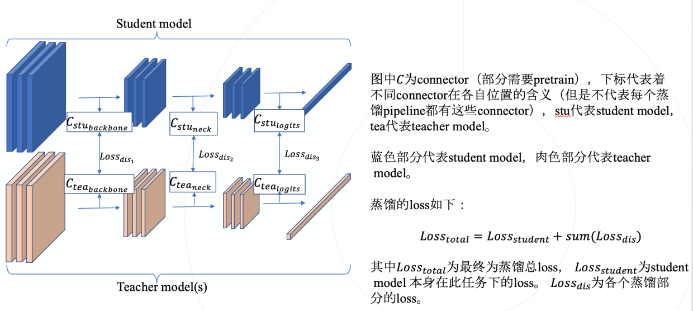
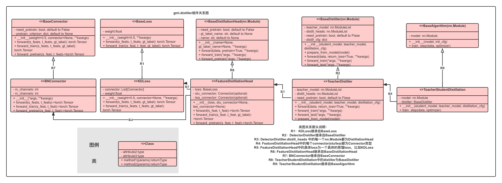

# Understand Knowledge Distillation


#  1. Overview

## 1.1 Introducting GML KD toolbox

GML蒸馏工具箱是一个满足**M**odel **D**evelopment **S**tandard - MDS 协议的通用知识蒸馏工具箱。对于任何一个满足MDS协议的模型都可以使用本工具箱实现快速涨点。

## 1.2 KD Pipelines

[由Hinton最早提出的KD方法](https://arxiv.org/abs/1503.02531)是知识蒸馏的开山之作，在DL社区后续的研究中，蒸馏也发展出了非常多种的pipeline(仅列出本工具箱里目前包含的pipeline)：

### 1.2.1 Teacher Student Distillation

Teacher Student Distillation是经典的知识蒸馏架构，pipline如下图

其中：

  - 蓝色的部分代表Student Model，也就是待提升的模型
  - 土色的部分代表着Teacher Model，一般为模型精度不低于student model的模型
  - C为Connector，其主要作用是为了调整Feature大小，让来自Teacher Model和Student Model的feature能够满足Loss的输入要求
  - 图片中的Loss_student即为Student Model自身训练Loss
  - 图片中由Teacher、Student的Feature或Logits计算得来的所有的Loss即为图中的Loss_dis

可以从上面注意到，在蒸馏算法中，可以按照Knowledge来源位置的不同分为如下三类：

  1. Response-Based Knowledge Distillation 来自Logits的知识<sup>[注1]<sup>
  2. Feature-Based Knowledge Distillation 即对除了输出层之外的Feature的监督
  3. Relation-Based Knowledge Distillation 基于关系的知识蒸馏

#### 1.2.1.1 Response-Based Knowledge Distillation 来自Logits的知识<sup>[注1]<sup>
[Hinton提出的KD方法](https://arxiv.org/abs/1503.02531)就是最典型的Response-Based Knowledge Distillation，其主要思想是将Teacher模型中学习到的负样本知识也传递给学生，在**分类任务**中有着非常显著的提升效果。而在其他的下游任务中也有着对应的KD方案：

<div align="center">
  <b>Response-Based Knowledge Distillation</b><br>
  <b>grouped by downsteam tasks</b>
</div>
<table align="center">
  <tbody>
    <tr align="center" valign="top">
      <td>
        <b>Classification</b>
      </td>
      <td>
        <b>Object Detection</b>
      </td>
      <td>
        <b>Segmentation</b>
      </td>
    </tr>
    <tr valign="top">
      <td>
        <ul>
            <li><a href="../../configs/kd/ofd">Overhaul (ICCV'2019)</a></li>
            <li><a href="../../models/losses/kd_loss.py">KDLoss (NIPS'2014)</a></li>
        </ul>
      </td>
      <td>
        <ul>
          <li><a href="../../models/heads/unique_heads/yolo_head.py">Object detection at 200 Frames Per Second (ECCV'2018)</a></li>
        </ul>
      </td>
      <td>
        <ul>
          <li><a href="../../configs/kd/cwd">Channel Wise Distillation (ICCV'2020)</a></li>
        </ul>
      </td>
    </tr>
</td>
    </tr>
  </tbody>
</table>

#### 1.2.1.2 Feature-Based Knowledge Distillation 来自中间层Feature的知识

有很多方案在模型的中间层做了监督，期望让Teacher的中间层输出也能指导Student的中间层训练。在实际的实验中，这类方案也能得到不错的精度提升，并且downstream agnostic。GML中符合此类方案的算法包括：
 - [FITNET](../../configs/kd/fitnet/)
 - [Factor Transfer](../../configs/kd/factor_transfer/)
 - [ABLoss](../../configs/kd/ab_loss/)

#### 1.2.1.3 Relation-Based Knowledge Disitllation

样本之间的关系知识也在最近的研究中被发掘，其主要思想是：通过比较样本间（或layer特征间）的关系，得到相应的知识并且指导学生训练。在实际实验中，此类方案亦获得了不错效果，一般是downstream agnostic。GML中符合此类方案的算法包括：
 - [RKD](../../configs/kd/rkd/)
 - [CRD](../../configs/kd/crd_loss/)<sup>[注2]<sup>

### 1.2.2 Self-distillation

自蒸馏一般指[BYOT](../../configs/kd/be_your_own_teacher/)，其将来自深层的特征用以监督浅层的特征，在**分类任务**得到了不错的效果。

### 1.2.3 Data-free Distillation

Working In Progress

## 1.3组件关系图

我们基于经典的teacher-student架构的蒸馏pipeline进行了模块化设计，将所有的蒸馏算法里面涉及到的组件统一整合了起来

工具的组件关系可见下图


**NOTE:** 组件的详细解释可见[文档](https://confluence.sensetime.com/pages/viewpage.action?pageId=337868695)

# 2. Customize KD Algorithm

从上图可以看出，KD算法中存在如下几类组件：

1. Algorithm
2. Distiller
3. DistillationHead
3. Connector
3. Loss

在实现一个新的算法时，我们可能会有如上的一些自定义组件，在多数情况下，我们一般只需要修改Loss即可。

## 2.1 Customize Losses

### 1. 实现MyLoss类
在`workspace/gml/my_project/packagkes/losses/`下，新建一个`my_class.py`文件，并写入：

```python
import torch.nn.functional as F

from gml.models.builder import LOSSES
from gml.models.losses.base_loss import BaseLoss


@LOSSES.register_module()
class MyLoss(BaseLoss):
    """
    MyLoss, a customized loss object.
    """

    def __init__(self, T=6, reduction='mean', **kwargs):
        super(MyLoss, self).__init__(**kwargs)
        self.t = T
        assert reduction in ('sum', 'mean', 'none')
        self.reduction = reduction

    def forward_train(self, s_pred, t_pred, **kwargs):
        s = F.log_softmax(s_pred / self.t, dim=1)
        t = F.softmax(t_pred / self.t, dim=1)

        loss = F.kl_div(
            s, t, reduction=self.reduction) * (self.t**2) / s_pred.shape[0]
        return loss
```
### 2. 在蒸馏算法中调用MyLoss
- 在`/path/to/workspace/gml/my_project/configs/`中编写一个新的config，取名为`my_config.py`

<details>

<summary> my_config.py </summary>

```python
# import 自定义的Loss
custom_imports = dict(
    imports=[
        'my_projects.packages.my_loss',
    ])
# 这里是模型原来的配置，包括runtime，dataset，model设置等
_base_ = [
    './_base_/dataset/cifar10_bs16.py',
    './_base_/cifar10_bs128_scheduler_runtime.py'
]

# model settings
model = dict(
    type='mmcls.ImageClassifier',
    ...,
    head=dict(
        ...,
    ))

# 从这里到文件尾，都是蒸馏相关的设置
# teacher字段里面包含了蒸馏所用到的相关的配置，包括teacher模型的结构配置，还有每个监督层的配置
teacher = [
    dict(
        ckpt_path='./work_dirs/resnet50_b16x8_cifar10_best.pth',

        # model settings
        model=dict(
            type='mmcls.ImageClassifier',
            ...
            )),
        distill_cfg=[
            dict(
                student_module='backbone.layer4.1.conv2',
                teacher_module='backbone.layer4.2.conv3',
                head=dict(
                    type='FeatureDistillationHead',
                    loss=dict(
                        # 在这里改
                        type='MyLoss',
                        loss_weight=0.05,
                    ),
                ))
        ])
]

```
</details>

## 2.2 Customize Distiller

### 2.2.1 Distiller的初始化

**NOTE:** 在整个KD toolbox中，teacher/student模型的某一层输出均通过[forward_hook](https://pytorch.org/tutorials/beginner/former_torchies/nnft_tutorial.html)机制进行控制。

<details>
<summary>Distiller初始化相关函数</summary>


```python
from ..builder import DISTILLERS
from .base_distiller import BaseDistiller


@DISTILLERS.register_module()
class MyDistiller(BaseDistiller):
    """It typically consists of teacher_model(s) and one student_model.

    Args:
        distill_cfg (List[dict], optional): Distillation configurations.
            Defaults to None.
        stu_pretrain (str, optional): PATH to pretrained student model
            ckpt. Defaults to None.
        use_meal (bool, optional): Use MEALv2 strategy or not.
            https://arxiv.org/abs/2009.08453
            Defaults to True.
        pretrained (str, optional): PATH to pretrained Distiller model
            ckpt. Usually used when Distiller has connectors which needs
            to be pretrained.
            Defaults to None.
    """

    def __init__(self,
                 distill_cfg=None,
                 **kwargs):
        super().__init__(**kwargs)

        # initilize internal variables
        self.distill_heads = nn.ModuleDict()
        self.distill_cfg = []
        self.student_outputs = dict()
        self.teacher_outputs = dict()

        self._parse_distill_cfg(distill_cfg)

    def _parse_distill_cfg(self, distill_cfg):
        # 解析distill_cfg
        if distill_cfg:
            if isinstance(distill_cfg, dict):
                distill_cfg = [distill_cfg]
            self.distill_cfg = distill_cfg
            self.teacher_num = len(self.distill_cfg)

            # initalize internal CNN modules.
            self._init_teacher()
            self._init_distillation_heads()

    def _init_distillation_heads(self):
        pass

    def _init_teacher(self):
        pass

    def prepare_from_model(self, model):
        # 根据个head的student_module和teacher_module，regiter对应的forward_hook
        pass

```

</details>

### 2.2.2 foward 函数

在此函数内实现distiller的数据流逻辑。[参考](../../gml/models/distillers/teacher_distiller.py)

## 2.3 Customize DistillationAlgorithm

KD Algorithm中包含：
1. model 即student
2. distiller 包含此蒸馏算法的相关组件，包括distiller、head等

[参考](../../gml/models/algorithms/knowledge_distillation/teacher_student_distillation.py)

## 2.4 Customize DistillationHead

`DistillationHead`与MDS的其他repo中的`Head`定义类似，即Loss计算头。

里面包含一个/数个loss，以及数个connector。

**注意：** 每个DistillationHead默认传入参数必须两个：
1. feature from student
2. feature from teacher

<details>

<summary>demo</summary>

```python
from ...builder import HEADS
from .base_distillation_head import BaseDistillationHead


@HEADS.register_module()
class MyDistillationHead(BaseDistillationHead):

    def __init__(self,
                 loss,
                 stu_connector=None,
                 tea_connector=None,
                 dim_select=None,
                 **kwargs):
        super(MyDistillationHead, self).__init__(**kwargs)
        self.loss = build_loss(loss)
        self.stu_connector = None
        self.tea_connector = None

    def forward_train(self, s_feat, t_feat, **kwarg):
        pass

```

</details>

## 2.5 Customize Connector

Connector在不同蒸馏算法中会有很大差异，但他们的定义都是一致的，即：
调整feature的尺寸。

> ## **注释:** <br>
> [1] 在KD的论文中，一般将模型最后一层的输出称之为Logits，比如在MMClassification中模型的`head.fc`层的输出。<br>
> [2] CRD一般认为不属于Relation-Based-Distillation，而是属于多模态蒸馏方案，但是其又与RKD有着比较相似的理论，为了维护方便，暂时将CRD归类在此处
