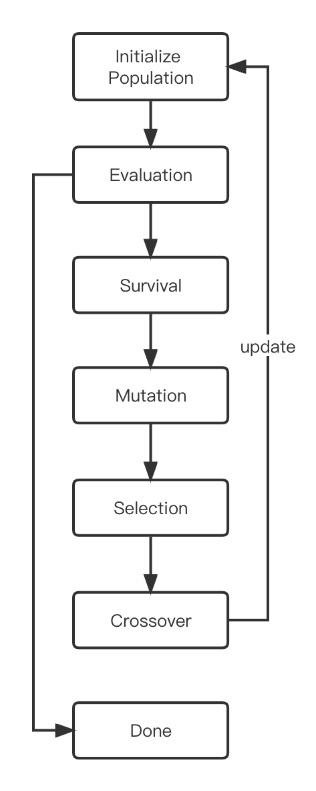
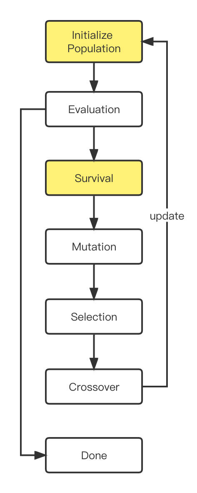
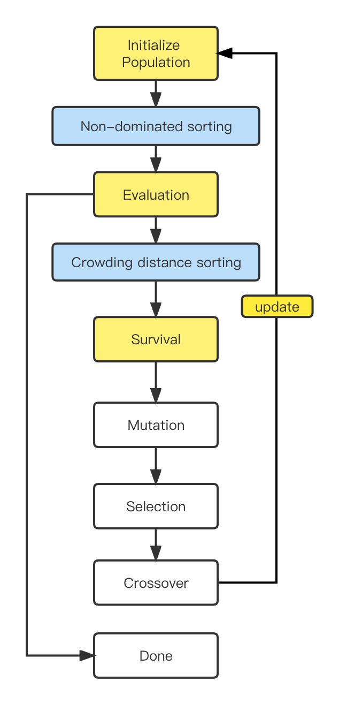

# Unstandand_Model_Searcher

## Model Searcher Overview

常规神经网络由于其结构的非线性，其损失函数非凸，因而可使用基于梯度的方法进行参数优化求解。然而，在网络结构搜索任务中，建模后的多目标优化函数，其具体表达式与参数的梯度信息均未知，通常不可微，无法直接通过反向传播算法进行优化，此类目标函数的优化方法通常被称为黑盒优化。

GML可提供的基础搜索算法的基础是进化算法的多目标优化，其中包括`EvolutionModelSearcher`、`AttentiveModelSearcher`、`NSGA2ModelSearcher`等, 在网络结构搜索的背景下需要明确以下几点，这是我们构造搜索算法需要考虑的。

- 搜索空间(`Search Space`)，一般来说，指的是网络结构的超参数，在构建`algorithm`时，我们可以通过`mutator`控制，通过`algo.mutator.sample_search()`接口, 每一次可以获取采样的网络配置。其中搜索空间的变量类型可以是`Categorical`、`Int`，也可以是嵌套的`NestedSpace`搜索空间。
- 搜索目标或奖励(`Reward`), 具体可指的是网络验证集的精度，其中`metrics`代表一种度量的方式，包括`accuracy`直接构造验证集精度的评估函数`AccTestFn`; `zero_shot_score`可用于直接对网络结构的表达能力，增加深度网络的表达能力意味着更小的偏差误差; `anticipate_accuracy`通过构造预测器`predictor`对验证集评估结果进行建模等，而`score_key`用于在验证集评价具体指标，具体包括`nas_score`、`accuracy_top-1`、`accuracy_top-5`等。
- 限制条件或约束(`Constraints`), 在该项，我们通过一个字典来管理限制条件, 例如`constraints=dict(flops=600)`，在搜索过程flops做一定的规约即只有在小于`flops600M`的情况下，才能放入初始化的候选池中。同时约束条件也支持`latency`、`capacity`等, 具体计算参看[flops_params_counter.py](https://gitlab.sz.sensetime.com/parrotsDL-sz/gml/-/blob/master/gml/evaluators/flops_params_counter.py)。
- 评估时间与资源(`Evaluation Time`), 评估器`evaluator`是搜索任务中**每次调用后返回奖励以及限制资源**的独立的类，使用`evaluator`来标准化性能评估流程。负责估计模型的性能评估。`Performance Predictor`性能预测器(精度预测器)用于预测任意模型结构的真实性能，并且可以在多种视觉任务中起到**准确预测最优模型结构**的作用。

**Tips**
1. 搜索目标方面: `trade_off`权衡字段可以用于指定第二优化目标, 例如`trade_off=dict(sec_obj='flops', max_score_key=100, ratio=0.1)`,第二优化目标`sec_obj`可与`score_key`共同作用于搜索任务。
2. 评价一个好的搜索算法除了关注搜索结果的精度`Accuracy`以及`the consistence issue`搜索一致性问题, 也更关注于`sample efficiency`采样有效性, 即表示在目标约束下搜索过程中需要多少样本来找到最佳模型。
3. GML内建了多种性能评估器，在不同维度给出了模型优化的方向。评估器在试验(`trials`)中运行，可以通过函数级调度将试验分发到训练平台上进行闲时搜索。更详细的参看[文档](https://gitlab.sz.sensetime.com/parrotsDL-sz/gml/-/blob/master/docs/understand_gml/understand_evaluators.md)。

## Model Searcher Comparison

除了以上通用的几点说明外，下面将详细介绍每个`model_searcher`配置的参数以及搜索的过程，如下表所示。

<table>
<thead>
  <tr>
    <th>Model Searcher</th>
    <th>Algorithms</th>
    <th>Code Snippet</th>
  </tr>
</thead>
<tbody>
  <tr>
    <td>EvolutionModelSearcher</td>
    <td></td>
    <td>Initialize Population 在开始时对初始搜索空间进行抽样，可以支持定义了不同的初始采样策略，  1. 构建满足限制条件的候选池，初始化一般是随机生成网络结构。由 self.candidate_pool_size 控制候选网络数量, 由self.candidate_pool保留，build candidate pool candidate=self.algorithm.mutator.sample_search(kind='random', searching=True)  Evaluation 评估候选网络 2. 评估子网evaluate candidate pool(without function scheduling) self.evaluate_subnet(model, candidate, test_args)  Survival 指的是我们定义个体排序的逻辑，在这个环节是支持按照某个sorce_key进行排序，除此之外，还可以定义 pareto_mode，trade_off相关选项 3. update 按照sorce_key 排序 self.top_k_candidates_with_score.update(candidate_pool_with_score) self.top_k_candidates_with_score=dict(sorted(self.top_k_candidates_with_score.items(), key=lambda x: x[0], reverse=True))  Mutation 指在通过交叉创建后代之后执行。通常，突变是以预定义的概率执行的。该运算有助于增加种群的多样性。 4. Mutation mutation = self.algorithm.mutator.sample_search(kind='mutate', candidate=candidate, prob=self.mutate_prob)  Selection 指在重组过程开始时，需要选择个体参与交配。根据交叉，需要选择不同数量的父母。不同种类的选择可以增加算法的收敛性。目前默认是top-K的候选作为cross-over的父母 5. Selection random_candidate1 = random.choice(list(self.top_k_candidates_with_score.values())) random_candidate2 = random.choice(list(self.top_k_candidates_with_score.values()))  Crossover 指选择父母后，实际交配完成。交叉算子将父母组合成一个或几个后代。 6.Crossover crossover_candidate = self.algorithm.mutator.sample_search(kind='crossover', candidate=random_candidate1, target=random_candidate2)</td>
  </tr>
  <tr>
    <td><a href="https://arxiv.org/pdf/2011.09011.pdf" target="_blank" rel="noopener noreferrer">AttentiveModelSearcher</a></td>
    <td></td>
    <td>参考 AttentiveNAS: Improving Neural Architecture Search via Attentive Sampling，与通用性的基线 EvolutionModelSearcher 不同的是，AttentiveModelSearcher 对于全局范围(例如200M～1200MFlops)的网络进行更高效率的采样，保证得到一系列帕累托最优的模型。 具体来说分为 1. 构建采样概率表，最开始通常会消耗一定的时间。build_prob_map()  2. 采样空间切分 pareto_mode=dict(discretize_step=25) . (在EvolutionModelSearcher中也可以指定)  3. 所在空间单独采样排序 self.pareto_candidates[step] = candidates  目的是全局采样，保证每个间隔都可以同时得到最优的模型并且得到更新。  从配置文件来看，我们需要提前 build_prob_map，生成尽量多的参考网络结构，从而获得目标限制与网络结构的概率关系，默认为 arch_res_num = self.approximate_prob.get('arch_res_num', 10000)。 由于构造超网的flops分布很不均匀(每个维度的参数决定的)，如果想得到在某个具体flops范围的子网，random_sample很难采到，在每轮采样时会有一定失败的概率，于是考虑蒙特卡罗方案对某个flops范围下，每个搜索维度的概率分布进行建模，采样的时候按照这个概率分布进行采样，这样更容易采样到该范围的子网。   于是利用查表的方法，在确定采样间隔后，通过采样概率对特定区间进行采样，极大地提升了整网的采样效率。  算法分别在 1 Initialize Population 以及 3 Survival 步骤做了针对性的改进。</td>
  </tr>
    <td><a href="https://arxiv.org/abs/2007.10396" target="_blank" rel="noopener noreferrer">NSGA2ModelSearcher</a></td>
    <td></td>
    <td>参考 NSGANetV2: Evolutionary Multi-Objective Surrogate-Assisted Neural Architecture Search 以及 NSGA-II: Non-dominated Sorting Genetic Algorithm，NSGA2ModelSearcher 用于权衡多目标优化场景，不同于基线 EvolutionModelSearcher 对单一目标排序进行筛选，针对多目标的优化往往不是优化一个单一模型，而是一个帕累托最优的边界集合(Pareto front)。 具体来说算法额外包含了 Non-dominated sorting、Crowding distance sorting 两个步骤，如左图所示。  其中 Non-dominated sorting，指的是 在非支配排序在支配序列（non_donminated front）上进行的淘汰原则，一般分为随机选择或者 拥挤距离的评估(Crowding distance sorting)。 潜在思想是 如果在帕累托最优曲线的采样过于密集，即对求解空间的不充分，因此计算曼哈顿距离(Manhatten Distance)用来表征个体间的拥挤程度，越拥挤其实采样越不合理。因此通过排序过滤。  在与网络结构搜索场景结合的时候，我们需要一个预测器不断训练用于预测模型的性能，例如 predictor=dict(predictor_type='GP', train_samples=2, encoding_type='normal')，并且对预测器预测的结果进行 一致性指标的评估(Spearmans Rho、Kendalls Tau)。  从配置文件来看，首先我们需要权衡第二目标的参数 trade_off=dict(sec_obj='flops', max_accuracy=100, ratio=0.1)，其次制定 metrics='anticipate_accuracy'，用于评估器对其评估。   </td>
  </tr>
</tbody>
</table>
