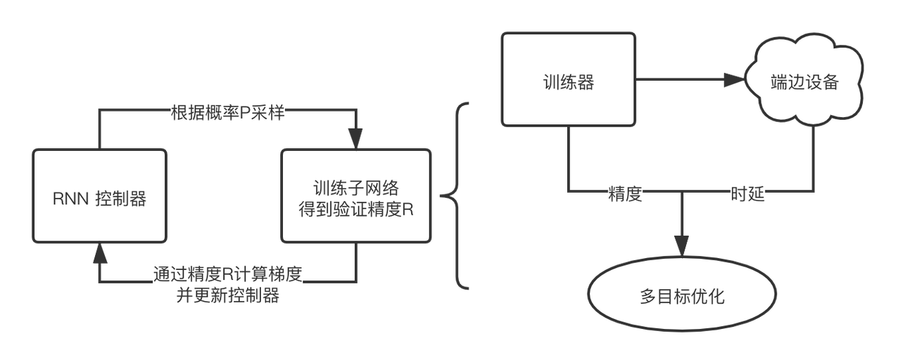
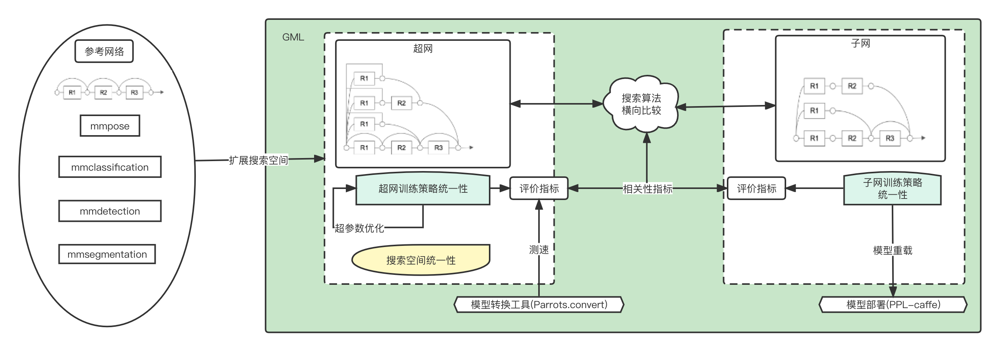
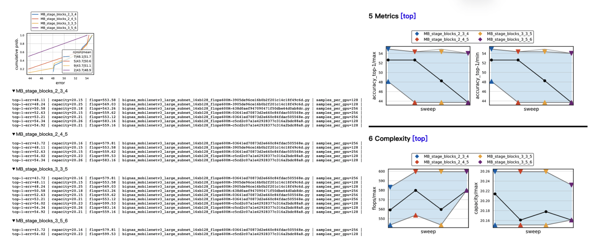

# Unstandand_NAS

- [Unstandand_NAS](#unstandand-nas)
  * [NAS总览](#一、NAS总览)
    + [背景](#1.背景)
    + [NAS及其在GML中的设计思路](#2.NAS及其在GML中的设计思路)
  * [使用GML实现自定义NAS算法](#二、使用GML实现自定义NAS算法)
    + [设计一个超网](#1.设计一个超网)
    + [修改超网训练逻辑](#2.修改超网训练逻辑)
    + [修改子网搜索逻辑](#3.修改子网搜索逻辑)
    + [修改mutator与mutable](#4.修改mutator与mutable)
    + [GML搜索空间分析工具](#5.GML搜索空间分析工具)

## 一、NAS总览

### 1.背景

神经网络结构设计（Neural Architecture Design）是深度学习领域中最重要的研究方向之一。针对特定任务或场景的定制化深度网络通常需要研究员进行繁琐的针对性设计，耗时较长。在工业界，模型上线后需通过数据回流进行网络的迭代更新，而人工设计网络会极大拖延交付周期，影响算法在应用场景的最终收益。

有鉴于此，以 Quoc V. Le 为首的 Google Brain 团队于2016年在文章《NEURAL ARCHITECTURE SEARCH WITH REINFORCEMENT LEARNING》中首次提出了深度学习时代的网络结构搜索 (Neural Architecture Search, NAS)方法，并给出了基于强化学习的搜索框架。

NAS的设计初衷为，高效地搜索得到在参数量、计算量或推理时延等方面表现优秀的神经网络，因而NAS需兼顾搜索效率与适用范围。NAS通常会在预定义的搜索空间中，通过各类优化算法进行自动搜索，因而NAS技术的研究重点为搜索空间的设计与优化范式的迭代。

### 2.NAS及其在GML中的设计思路

NAS方法自提出以来，其范式一直在不断演进，结构搜索的效率和性能也在不断提升。

最早期，研究人员采用“离散空间采样，强化学习/贝叶斯网络/进化算法指导采样方向”的模式进行结构搜索，其整体框架如下图所示。网络结构被编码为字符串，使用RNN等网络更新字符串序列，以模拟网络结构迭代优化过程。该模式的问题在于，算法直接在离散空间进行网络采样后，每个所得网络均需通过相当程度的训练以进行性能评估，产生的时间与计算开销较大。

<p>
    <div align="center">
        
        <br>
        <span style='font-weight: bold'>图 1.</span> Neural Architecture Search 领域早期框架
    </div>
</p>

有鉴于此，研究人员进一步提出“权重共享（Weight-sharing）”的设计思路，构建并训练一个超网络，而算法采样所得的子网络可直接继承超网络训练后的权重而无需从头开始训练，性能评估阶段所用时间大幅减少，搜索效率因而大幅提高。在后续的发展中，权重共享成为了NAS的基础设计。

目前，基于Weight-sharing机制的One-Shot NAS 逐渐成为NAS主流设计范式。在实际生产环境中，该类方法可在性能上展现出更多的优势，本节主要分析 One-Shot NAS 系列方法的设计思路以及其在GML实现的具体方案。

在权重共享的基础上，One-Shot NAS方法中的超网络被进一步设计为包含搜索空间中所有候选子网络，其本身表征了搜索空间（NOTE：One-Shot NAS方法中，超网络的设计即为搜索空间的设计）。超网络本身的构造方式有很多种，如基于线性结构、基于有向无环图（DAG）等（TODO）。超网络包含了架构搜索需要的模块与连接方式等信息，而其中的子网络数量极多，为简化搜索，通常需结合任务相关的先验知识，以减小搜索规模。然而，这会引入研究员的偏见，且超网络的设计对于缺乏领域知识的研究员而言是个挑战。

GML提供了[基础的backbone](../../gml/models/__init__.py)用于构建常见的超网络，其大多由主流的backbone网络拓展而来，例如`MobileNetV3Slice`、`ResNetSlice`等。同时，GML也提供了搜索空间分析工具[sweep tools](../../configs/hpo/sweeps)。

在One-shot方法中，超网络首先需要被充分训练。超网训练的方式有多种，包括直接训练与采样N个子网络训练等，而后者的采样策略也在不断更新。当前，GML支持超网络直接训练，及子网络的随机采样、均匀采样、公平采样、帕累托最优采样等策略。在GML中，提供一个`mutator`变异器类用于支持不同算法的单次采样逻辑, 并且提供`ALGORITHMS`用于统一接口提供训练策略，研究员可以通过`train_step()`轻松对比符合需求的超网优化策略。

除超网络训练外，One-shot方法还需进行子网络搜索过程。当前，GML支持[随机搜索](../../gml/searchers/random_searcher.py)、[网格搜索](../../gml/searchers/grid_searcher.py)、[遗传算法](../../gml/searchers/evolution_searcher.py)、[贝叶斯优化](../../gml/searchers/skopt_searcher.py)等子网搜索策略。

在子网搜索阶段，需要进行评估验证集的精度来评价候选网络结构的优劣，但是由于候选子结构数量的限制，往往在搜索阶段需要大量的时间和资源，因此搜索算法的改进策略以及针对代理任务的评估逐渐成为搜索阶段的重要研究方向。在GML中`MODEL_SEARCHER`可以通过反复试验找到特定场景的“最佳”模型。于此同时，使用`EVALUATOR`来标准化性能评估流程。负责估计模型的性能评估。GML内建了多种性能评估器，在不同维度给出了模型优化的方向。评估器在试验(trials)中运行，可以通过函数级调度将试验分发到训练平台上进行闲时搜索。

当前主流的 One-Shot NAS 方法主要分为两种，第一种为单阶段（One-Stage）搜索，第二种为双阶段（Two-Stage）搜索。单阶段搜索方法在超网训练过程中同时进行子网络的搜索（常见做法为交替优化超网算子权重与超网架构参数），而双阶段搜索方法则将超网训练和子网络搜索过程解耦（开篇作为SPOS）。

针对超网络是否应该充分训练的问题，Two-Stage One-Shot NAS的方法在后续有进一步细化为两个发展方向：

第一种方向主要关注超网采样子网精度与子网重训排序的一致性，认为构建超网络的核心目的是为了进行高效的子网排序与搜索，超网训练过程在子网络排序明显时可执行early-stop操作，搜索所得的最优子网络需在最后进行重训练以获得真实性能；

第二种方向则专注于对超网络进行高效、完全、充分的优化，使得子网络的权重在超网络训练阶段达到局部乃至全局最优，这样在子网搜索阶段可直接获得对应网络的真实性能，无需后续重训练。

在上述两个发展方向中，前者需寻找超网训练过程中可快速判断子网优劣的参数或特征，后者需设计特别的超网络训练技巧。GML库中同时包含了上述各类One-Shot NAS方法，如下表所示：

| Algorithm | 超网训练阶段 | 子网搜索阶段+评估 | 是否重训 | 训练资源 <br> Epoch_GPUS_Hours <br> (超网训练 / 子网搜索 / 子网重训练) |
|---	|---	|---	|---	|---	|
|SPOS	|随机采样路径	|遗传算法迭代	| 是 | 150000(iters)_8_16/20_8_11/300000(iters)_8_31 |
|Cream	|优先路径蒸馏	|无须搜索	| 是 |120_16_49/_ /530_16_62	|
|Zero-Shot NAS	|无超网训练	|Zen-Score作为指标进行搜索	| 是 | _ /_ /480_16_52|
|Once for All	|渐进收缩+超网蒸馏子网 Progressive Shrinking	|精度预测器	|否	| -- |
|BigNAS	| 三明治训练策略 + 就地蒸馏	| 从粗到细的结构选择 <br> Coarse-to-fine Architecture Selection. | 否 | 360_32_84/20_8_96/_	|


我们解耦了整个 One-shot NAS 算法流水线，并将现今的主要流行的工作进行归纳，在业务框架上完成搜索空间的设计以及评估的全流程，并且结合Open-MMLab的算法框架以及Parrots.convert 模型级别的测速接口，实现搜索过程中多目标优化，可在flops、latency、actvitions等模型指标下进行帕累托最优搜索。其中具体组件分为**搜索空间、超网训练策略、搜索算法、超参数优化**等。

值得注意的包括:

- 搜索空间的统一性，大多数NAS算法都将设计具体的搜索空间，但是算法的优势是否由搜索空间限制不得而知，因此，我们将搜索空间独立为统一格式的配置文件，在超网训练过程中，即时加载并替换原有的网络结构。具体可查看[understand_space.md](./understand_space.md)
- 参考模型与可搜索模型的互相转换、可变异类具体可查看 [understand_mutator.md](./understand_mutator.md)
- 超网训练策略的统一性，NAS算法中超网的训练至关重要，在超网训练过程中，统一超参数有助于对超网训练更好的监控管理。
- 子网搜索算法横向比较，再搜索空间限定的情况下，Evolution Search的搜索方法可为基线，判断具体算法的效用提升，同时对于不同的子网进行评估也可支持在线测速，与查表以及代理指标的估计相比，更加准确稳定。

<p>
    <div align="center">
        
        <br>
        <span style='font-weight: bold'>图 2.</span> GML-NAS Pipeline
    </div>
</p>

网络结构搜索流程 类似于超参数优化，只不过目标是最佳网络结构而不是最优超参数。具体来说，探索策略从预定义的搜索空间中选择架构。该架构被传递给性能评估以获得评分，该评分表示这个网络结构在特定任务上的表现。重复此过程，直到搜索过程能够找到最优的网络结构。


## 二、使用GML实现自定义NAS算法

本节主要介绍使用GML实现自定义NAS算法的整个流程。

### 1.设计一个超网

在GML中，设计一个超网主要包含两个步骤：自定义搜索空间与自定义超网络整体结构。
在搜索空间的设计方面，GML支持对算子类型和算子参数的搜索，包括输出通道数（channels）、模块个数（stage_blocks）、卷积核尺寸（kernel size）、卷积模块扩张系数（expand ratio）以及输入分辨率（resolution）等，搜索空间的配置通过在config中传入`search_space`字典来实现，其中key为可搜索项，value则为具体的搜索参数范围，如下所示：

```python
    search_space=dict(
        MB_stage_blocks=[ # 模块个数
            dict(type='Categorical', data=[1], default=1),
            dict(type='Categorical', data=[1, 2], default=1),
            dict(type='Categorical', data=[3, 4, 5], default=3),
        ],
        MB_kernel_size=[ # 卷积核尺寸
            dict(type='Categorical', data=[3, 5], default=3),
            dict(type='Categorical', data=[3, 5], default=3),
            dict(type='Categorical', data=[1], default=1),
        ],
        MB_expand_ratio=[ # 卷积模块扩张系数
            dict(type='Categorical', data=[1], default=1),
            dict(type='Categorical', data=[4, 5, 6], default=4),
            dict(type='Categorical', data=[6], default=6),
        ],
        MB_out_channels=[ # 输出通道数
            dict(type='Categorical', data=[24, 32], default=24),
            dict(type='Categorical', data=[32, 40], default=32),
            dict(type='Categorical', data=[112, 120, 128], default=112),
        ])
```

GML库也提供了一些基础的可搜索网络结构的范式:

|architecture |gml.models.backbones	| 应用场景|
|---	|---	|---	|
|Cell based	|darts_origin.py	|模块化	|
|mobile_series	|mobilenetv3_slice.py	|移动端网络	|
|gpu_efficient	|genet_slice.py	|服务器端	|

搭建网络结构的基本单元如`Conv2d`、`Linear`等，在GML中构建可搜索模型要将对应的可搜索类型`Mutable`进行注册(如下表所示)，在训练中如果我们要动态地调整可搜索类型的参数，可在forward过程通过`mutator`实现真正的操作。常用的`Mutable`有`MixedOp`和`SliceOp`。在将基础类变为可搜索类的过程，需要提前区分该op的类型为`SliceOP`/`MixedOP`，再将其用来构建超网络。

|nn.module	| sliceOP(gml.mutable)	|
|---	|---	|
|conv2d	|Conv2dSlice	|
|SyncBatchNorm	|SyncBatchNormSlice	|
|ConvModule	|ConvModuleSlice	|
|Linear	|DynamicLinearSlice	|

transformer相关的搜索空间会指定新的基本搜索类型进行实现，例如 `multi-head-attention` / `patch-embeding` / `layer-norm`。以下例子以`qkv_Slice`为例。

```python
# base_Op 为基本类，在基本类的基础上构造传入的搜索空间
@MUTABLES.register_module()
class qkv_Slice(nn.Linear, SliceOp):
    def __init__(self,
                 dimension，
                 key=None):
        super(XXXXSlice, self).__init__(key=key)
        if isinstance(dimension, dict):
            dimension = build_search_space(dimension)

    def forward_inner(self, x):
        pass

    def export(self, **kwargs):
        pass
```

如果某一个block中有多个搜索维度的嵌套，我们可以重新根据`multi-head-attention`的已有类来覆写`AttentionSlice`，其中export可以将基础类进行赋值导出。

在超网络的整体结构构建方面，用户拥有较大自由度，除搜索空间包含的网络结构外，其余网络模块均可自定义，用户可根据Open-MMLab系列仓库的代码编写规范，自行添加自定义的超网类型，也可在现有的多个超网类上（如[ResNet_Slice.py](../../gml/models/backbones/resnet_slice.py)）自由替换除搜索空间之外的其他模块，GML库中也引入并复现了多个经典算子模块以供调用。

### 2.修改超网训练逻辑

在GML中，用户可通过修改config文件更改超网络的训练逻辑。以[bignas_mobilenetv3_large_supernet_32xb64.py](../../configs/nas/bignas/bignas_mobilenetv3_large_supernet_32xb64.py)为例，超网中可修改的逻辑较多，主要字段如下：

```python
# model settings
model = dict(
    type='gml.ImageClassifierSearch',
    backbone=dict(
        type='gml.MobileNetV3Slice',
        conv_cfg=dict(type='Conv2dSlice'),
        search_space={{_base_.search_space}}),
    head=dict(
        type='gml.LinearClsHead',
        num_classes=1000,
        in_channels=1984,
        linear_type='LinearSlice',
        loss=dict(
            type='mmcls.LabelSmoothLoss',
            mode='original',
            loss_weight=1.0,
            label_smooth_val=0.1,
            num_classes=1000),
        topk=(1, 5),
    ),
    resize_process=dict(
        type='ResizeSlice',
        mode='bicubic',
        resolution=dict(
            type='Int',
            lower=192,
            upper=289,
            step=32,
            default=224,
            key='resolution')),
    connect_head=dict(in_channels='backbone.feat_dim'))

# 新增algorithm字段，原来的build_model变为build_algorithm
algorithm = dict(
    type='gml.BigNAS',
    model=model,
    strategy='sandwish4',
    drop_ratio=0.2,
    drop_path_ratio=0.2,
    grad_clip=dict(clip_type='by_value', clip_value=1.0),
    mutator=dict(type='gml.StateslessMutator', fixed_mutable_cfg=None),
    distiller=dict(type='gml.InplaceDistiller', distill_cfg=distillation))
```

在上述config的`algorithm`字段中，用户可通过更改`strategy`及`mutator`类型以改变超网训练过程中的子网采样逻辑，如上述`sandwish4`即代表同时采样四个子网络的三明治采样法。`mutator`字段相关教程可见[understand_mutator_mutable](understand_mutator_mutable.md)。进一步地，用户可深度修改各个算法的`train_step()`逻辑，以修改超网训练的具体逻辑，如[bignas::train_step](../../gml/models/algorithms/nas/bignas.py)

### 3.修改子网搜索逻辑
> 详细文档见：[understand_model_searcher](understand_gml/understand_model_searcher.md)

在GML中，子网搜索逻辑同样可通过修改config文件实现，以[bignas_mobilenetv3_large_evolution_search_8xb256.py](../../configs/nas/bignas/bignas_mobilenetv3_large_evolution_search_8xb256.py)为例，主要字段如下：

```python
searcher = dict(
    type='EvolutionModelSearcher',
    pareto_mode=dict(discretize_step=25),
    evaluator=dict(
        type='NaiveEvaluator', units='M', default_shape=(1, 3, 224, 224)),
    bn_stats_calib_kwargs=dict(
        dataset=dict(
            type={{_base_.dataset_type}},
            data_prefix='data/imagenet/train',
            ann_file='/mnt/lustre/share_data/wangshiguang/train_4k.txt',
            pipeline={{_base_.train_pipeline}}),
        dataloader=dict(
            shuffle=True,
            round_up=True,
            samples_per_gpu={{_base_.data.samples_per_gpu}},
            workers_per_gpu={{_base_.data.workers_per_gpu}}),
        num_iters=-1,
        sync_params=True),
    candidate_pool_size=256,
    candidate_top_k=128,
    constraints=dict(flops=(200, 1200)),
    metrics='accuracy',
    score_key='accuracy_top-1',
    max_epoch=20,
    num_mutation=128,
    num_crossover=128,
    mutate_prob=0.2)

```

其中搜索目标可以配置`constraints`,例如对latency、flops等限制。根据`metrics`的不同，可在`evaluator`中针对任务进行不同维度的评估、
`score_key`为每次候选排序的参考依据，`trade_off`可以权衡其他目标进行协同搜索。

### 4.修改mutator与mutable
> 详细文档见：[understand_mutator_mutable](./understand_mutator_mutable.md)

Mutator字段在上述`algorithm`字典中，支持的Mutator类型见[gml/models/mutators/__init__.py](../../gml/models/mutators/__init__.py)

GML当前支持的Mutable类型见[gml/models/mutables/__init__.py](../../gml/models/mutables/__init__.py)


### 5.GML搜索空间分析工具

在海量业务数据集情况下，每次模型训练迭代都是比较大的资源消耗，GML提供搜索空间分析工具sweep_tools，以mobilenetV3的搜索空间为例，通过对若干个采样模型的验证精度统计分析，可以得到当前搜索空间在不同维度的误差经验分布EDF(empirical distribution function)。对网络结构搜索空间的设计提供一定指导。

<p>
    <div align="center">
        
        <br>
        <span style='font-weight: bold'>图 3.</span> a 当前搜索空间在不同维度的EDF b 具体Metric/Compiexity的分析
    </div>
</p>

详细的搜索空间扫描配置可以查看[sweeps](../../configs/hpo/sweeps), 通过配置搜索空间以及`PRE_FILTERS`、`SPLIT_FILTERS`过滤指标的设计, 我们可以对感兴趣的网络设计维度进行分析。进而辅助研究员设计网络结构。
