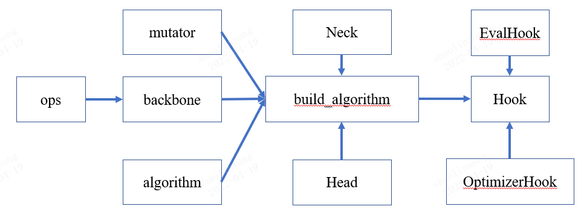

# Understand Pruing

  [Unstandand Pruning]
  * [总览剪枝](#jump1)
  * [剪枝算法流程](#jump2)
    + [基于不同粒度的剪枝](#jump21)
    + [基于不同度量标准的剪枝](#jump22)
    + [一次剪枝&迭代剪枝](#jump23)
    + [连接剪枝&通道剪枝](#jump24)
  * [剪枝组件介绍](#jump3)
    + [网络结构组件](#jump31)
    + [算法构建组件](#jump32)
    + [训练控制组件](#jump33)
    + [结构变化组件](#jump34)
  * [剪枝应用下游任务](#jump4)
    + [DCFF应用](#jump41)
    + [DMCP应用](#jump42)

# 1 <span id = "jump1">总览剪枝</span>
随着深度学习发展，卷积神经网络在视觉领域取得广泛地发展和巨大的成功，比如目标分类，检测，分割等。但卷积神经网络的参数量和计算量越来越巨大，会带来巨大的计算负担和能源消耗，使得在边缘设备上完成实时推理部署很困难。而模型压缩技术在性能下降较小的情况时能有效减少模型的冗余，使得参数量和计算量减少，容易在资源有限的设备上完成推理加速。模型剪枝作为模型压缩技术中的一种，在学术界和工业界得到广泛的关注。

# 2 <span id = "jump2">剪枝算法流程</span>
剪枝算法的应用可以体现在深度神经网络训练的所有流程中的每个细节，依据不同的标准在训练流程中的不同阶段应用剪枝是一个多分类的任务：

根据剪枝粒度，可以从粗到细分为分为非结构化剪枝和结构化剪枝；

根据剪枝度量标准，可以分为基于稀疏性的剪枝，基于特征图关系的剪枝和基于权重的剪枝；

根据剪枝的轮次与幅度，可以分为一次性剪枝与迭代剪枝；

根据需要预训练模型与否，可以分为离线剪枝和在线剪枝。

在GML中，我们将把剪枝按照以上的分类标准进行解析，并给出对应的分析与介绍

## 2.1 <span id = "jump21">基于不同粒度的剪枝</span>
如图1所示，剪枝粒度从粗到细可以分为滤波器级剪枝（filter level）、组级剪枝（group level）和连接级剪枝（kernel level & vector level）。这些剪枝方法中，除了滤波器剪枝之外，都属于非结构化剪枝。

<p>
    <div align="center">
        
        <br>
        <span style='font-weight: bold'>图 1.</span> 剪枝粒度分类
    </div>
</p>

### 非结构化剪枝
非结构化剪枝指的是权重剪枝(weight pruning)，以权重值作为研究对象，能够完成细粒度剪枝，但是剪枝后模型的kernel或filter呈现不规则形状，无法在通用软硬件在部署，需要使用特定的软硬件来支持稀疏filter或kernel推理。

非结构化剪枝的优势在于：剪枝效率高，剪枝率高，而且在特定任务上有加速效果。

非结构化剪枝的劣势在于：依赖于定制化的硬件支持。

### 滤波器剪枝
通道剪枝一般又叫做滤波器剪枝、神经元剪枝等，指的是对滤波器或通道进行剪枝, 以filter或kernel整体进行研究，实现粗粒度剪枝。由于剪掉的是filer/channel整体，网络结构还是完整的，在通用软硬件上就能推理部署。

结构化剪枝的优势在于：操作简单，能保持网络的结构分布，拓展性强。

结构化剪枝的劣势在于：剪枝效率较低，往往需要其他技术辅助提升效率。

### GML中的剪枝流程控制

在gml里目前只支持滤波器层级的剪枝，其中通道数的变化和网络权重的改变主要通过GML中的结构变化组件（mutables）实现。具体实例如[3.4 结构变化组件](#jump34)中`_set_layer_width`和`forward_slice_op`函数所示，进行滤波器剪枝。


## 2.2 <span id = "jump22">基于不同度量标准的剪枝</span>

基于不同的度量标准可以说是剪枝中最核心、影响最大的问题，常见的度量标准有[基于稀疏度的剪枝](https://openaccess.thecvf.com/content_cvpr_2017_workshops/w29/papers/Mao_Exploring_the_Granularity_CVPR_2017_paper.pdf)、[基于权重的剪枝](https://openaccess.thecvf.com/content_CVPR_2020/html/Guo_DMCP_Differentiable_Markov_Channel_Pruning_for_Neural_Networks_CVPR_2020_paper.html)和[基于特征图的剪枝](https://openaccess.thecvf.com/content_CVPR_2020/html/Lin_HRank_Filter_Pruning_Using_High-Rank_Feature_Map_CVPR_2020_paper.html)

<p>
    <div align="center">
        
        <br>
        <span style='font-weight: bold'>图 2.</span> 剪枝度量分类
    </div>
</p>

在GML中实现基于不同度量的剪枝，主要在于对模型进行计算并得到参数的重要性得分排序，之后再通过mutator对模型进行改变。在[3.4 结构变化组件](#jump34)部分，我们就展示了用`direct_sampling`函数基于权重确定mobilenet_v2剪枝的实现

## 2.3 <span id = "jump23">一次剪枝&迭代剪枝</span>
一次性剪枝就是只剪枝一次，一次性得到剪枝后的紧凑网络。而迭代剪枝就是重复剪枝多次，多轮剪枝之间可能会有训练和结构的调整。

### 一次性剪枝
GML中的DCFF就是典型的一次性剪枝方法，其只需要对原始模型进行一次剪枝，如[3.3 网络结构组件](#jump33)中的EvalHooks所示。

### 迭代剪枝
GML中的DMCP借鉴了迭代剪枝的思路，通过[3.2 算法构建组件](#jump32)中介绍的algorithm中的`train_step`函数，进行重复多次的剪枝控制。

## 2.4 <span id = "jump25">离线剪枝&在线剪枝</span>

### 离线剪枝流程

<p>
    <div align="center">
        
        <br>
        <span style='font-weight: bold'>图 3.</span> 离线剪枝流程示意图
    </div>
</p>

离线剪枝就是在已有的模型上进行剪枝的方法，其步骤如下：

* 1.原始模型进行预训练，得到预训练权重

* 2.利用剪枝算法的评估准则筛选出重要的filters，将预训练权重对应的值保留下来

* 3.以保留的权重作为剪枝后网络的权重初始化，然后进行微调，使其恢复性能

* 4.以上步骤可以重复使用(对应的是一次性（one-shot）剪枝，不需要重复以上步骤)。

离线剪枝的优势在于：速度快、无需额外的训练时间、对原始网络的结构特性保存较好、剪枝结果稳定。

离线剪枝的劣势在于：由于网络结构的特性，剪枝的误差较大，剪枝效率有限。

### 在线剪枝流程

<p>
    <div align="center">
        
        <br>
        <span style='font-weight: bold'>图 4.</span> 在线剪枝流程示意图
    </div>
</p>

在线剪枝就是在原始网络的训练上进行调整，使得经过训练之后可以直接得到紧凑的网络结构或者易于剪枝的原始网络，其步骤如下：

* 1.获得原始网络的结构

* 2.基于剪枝算法对原始网路的结构或者训练流程进行定制

* 2.从头开始训练网络

* 3.网络可以在训练时，根据设置的评估重要性方法，动态选择filters

* 4.紧凑的网络在训练时是动态的，直到训练结果才会得到固定的紧凑网络和权重值

在线剪枝的优势在于：不会受到原始网络的影响，性能更强。

在线剪枝的劣势在于：需要大量的人工与时间成本、由于需要训练，剪枝效果不够稳定。

### GML中的剪枝流程控制

在gml里的DMCP和DCFF剪枝方法都是在线剪枝方法，其与离线剪枝最大的区别在于：需要重新定义网络结构并训练，具体实现如[3.1 网络结构组件](#jump31)

# 3 <span id = "jump3">剪枝组件介绍</span>
在GML中，剪枝算法的应用涉及网络结构组件（ops组件，backbone组件）、创建网络组件(algorithmz组件)、训练组件(Hook组件)等

<p>
    <div align="center">
        
        <br>
        <span style='font-weight: bold'>图 5.</span> 剪枝组件关系图
    </div>
</p>

根个组件内容（如果是常规组件就不介绍），其中按照层级可分为**网络结构组件（ops、backbone）**、**算法构建组件（algorithm）**、**训练控制组件（hook）** 和 **结构变化组件（mutator）**。

## 3.1 <span id = "jump31">网络结构组件</span>
在线剪枝算法中，需要对模型进行改变或者增加限制并重新训练，当需要进行结构上的改变时，可能需要新建组件，包括operator、block以及backbone等。
在本节中将会结合实际案例进行解释。

### 3.1.1 DCFF剪枝算法
#### 3.1.1.1 卷积OPs组件
创建新的卷积层gml.models.ops:FuseConv2d，其中real_cont为剪枝保留得filters个数。为了训练后动态的更新real_cout个filter的权重值，该卷积层关键是利用重要性评估方法计算出重要性概率分布，然后将其计算出新的权重值。代码如下：

<details>
  <summary>FuseConv2d</summary>

    @CONV_LAYERS.register_module()
    class FuseConv2d(nn.Conv2d):
        def __init__(self,
                        in_channels,
                        out_channels,
                        kernel_size,
                        real_cout,
                        stride=1,
                        padding=0,
                        dilation=1,
                        groups=1,
                        bias=True):
            super(FuseConv2d, self).__init__(
                in_channels=in_channels,
                out_channels=out_channels,
                kernel_size=kernel_size,
                stride=stride,
                padding=padding,
                dilation=dilation,
                groups=groups,
                bias=bias,
            )

            cout, cin, k, _ = self.weight.shape

            # 初始化
            layeri_softmaxP = torch.zeros(real_cout, cout)
            self.register_buffer('layeri_softmaxP', layeri_softmaxP)

            fused_weight = torch.zeros(real_cout, cin, k, k)
            self.register_buffer('fused_weight', fused_weight)

            if self.bias is not None:
                fused_bias = torch.zeros(real_cout)
                self.register_buffer('fused_bias', fused_bias)

        def forward(self, inputs):
            """Forward function."""
            cout, cin, k, _ = self.weight.shape

            self.fused_weight = torch.mm(self.layeri_softmaxP,
                                            self.weight.reshape(cout, -1)).reshape(
                                                -1, cin, k, k)
            if self.bias is not None:
                self.fused_bias = torch.mm(self.layeri_softmaxP,
                                            self.bias.unsqueeze(1)).squeeze(1)
            else:
                self.fused_bias = self.bias

            output = F.conv2d(
                input=inputs,
                weight=self.fused_weight,
                bias=self.fused_bias,
                stride=self.stride,
                padding=self.padding,
                dilation=self.dilation,
                groups=self.groups)
            return output
</details>

#### 3.1.1.2 块组件
将残差块的常规卷积层替换成FuseConv2d卷积层，形成gml.models.ops:DCFFBasicBlock和gml.models.ops:DCFFBottleneck，代码如下：
* cprate为卷积层的层剪枝率，是通过在config文件来手动配置
* cur_convid:当前卷积层所占的索引值


<details>
  <summary>DCFFBasicBlock</summary>

    class DCFFBasicBlock(BasicBlockSlice):
        def __init__(self,
                    inplanes,
                    planes,
                    cprate,
                    cur_convid,
                    stride=1,
                    downsample=None,
                    conv_cfg=dict(type='FuseConv2d'),
                    norm_cfg=dict(type='BN')):
            super().__init__(inplanes, planes)
            last_cout = int(inplanes * (1 - cprate[cur_convid - 1]))
            cur_cout = int(planes * (1 - cprate[cur_convid]))

            if conv_cfg == dict(type='FuseConv2d'):
                self.conv1 = build_conv_layer(
                    conv_cfg,
                    in_channels=last_cout,
                    out_channels=planes,
                    kernel_size=3,
                    stride=stride,
                    padding=1,
                    bias=False,
                    real_cout=cur_cout)
            else:
                self.conv1 = build_conv_layer(
                    conv_cfg,
                    last_cout,
                    cur_cout,
                    kernel_size=3,
                    stride=stride,
                    padding=1,
                    bias=False)
            self.bn1 = build_norm_layer(norm_cfg, cur_cout)[1]
            self.relu = nn.ReLU(inplace=True)

            cur_convid = cur_convid + 1

            last_cout = cur_cout
            cur_cout = int(planes * (1 - cprate[cur_convid]))

            if conv_cfg == dict(type='FuseConv2d'):
                self.conv2 = build_conv_layer(
                    conv_cfg,
                    in_channels=last_cout,
                    out_channels=planes,
                    kernel_size=3,
                    stride=1,
                    padding=1,
                    bias=False,
                    real_cout=cur_cout)
            else:
                self.conv2 = build_conv_layer(
                    conv_cfg,
                    last_cout,
                    cur_cout,
                    kernel_size=3,
                    stride=1,
                    padding=1,
                    bias=False)
            self.bn2 = build_norm_layer(norm_cfg, cur_cout)[1]

            self.downsample = downsample
            self.stride = stride
</details>

<details>
  <summary>DCFFBottleneck</summary>

    class DCFFBottleneck(BottleneckSlice):
        expansion = 4
        def __init__(self,
                    inplanes,
                    planes,
                    cprate,
                    cur_convid,
                    stride=1,
                    expansion=4,
                    downsample=None,
                    conv_cfg=dict(type='FuseConv2d'),
                    norm_cfg=dict(type='BN')):
            """FusedBottleneck block for ResNet."""
            super().__init__(inplanes, planes, expansion=expansion)
            self.expansion = expansion
            last_cout = int(inplanes * (1 - cprate[cur_convid - 1]))
            cur_cout = int(planes * (1 - cprate[cur_convid]))

            if conv_cfg == dict(type='FuseConv2d'):
                self.conv1 = build_conv_layer(
                    conv_cfg,
                    in_channels=last_cout,
                    out_channels=planes,
                    kernel_size=1,
                    stride=1,
                    bias=False,
                    real_cout=cur_cout)
            else:
                self.conv1 = build_conv_layer(
                    conv_cfg,
                    last_cout,
                    cur_cout,
                    kernel_size=1,
                    stride=1,
                    bias=False)
            self.bn1 = build_norm_layer(norm_cfg, cur_cout)[1]

            cur_convid = cur_convid + 1

            last_cout = cur_cout
            cur_cout = int(planes * (1 - cprate[cur_convid]))

            if conv_cfg == dict(type='FuseConv2d'):
                self.conv2 = build_conv_layer(
                    conv_cfg,
                    in_channels=last_cout,
                    out_channels=planes,
                    kernel_size=3,
                    stride=stride,
                    bias=False,
                    padding=1,
                    real_cout=cur_cout)
            else:
                self.conv2 = build_conv_layer(
                    conv_cfg,
                    last_cout,
                    cur_cout,
                    kernel_size=3,
                    stride=stride,
                    padding=1,
                    bias=False)
            self.bn2 = build_norm_layer(norm_cfg, cur_cout)[1]

            cur_convid = cur_convid + 1

            last_cout = cur_cout
            cur_cout = int(self.expansion * planes * (1 - cprate[cur_convid]))
            if conv_cfg == dict(type='FuseConv2d'):
                self.conv3 = build_conv_layer(
                    conv_cfg,
                    in_channels=last_cout,
                    out_channels=self.expansion * planes,
                    kernel_size=1,
                    stride=1,
                    bias=False,
                    real_cout=cur_cout)
            else:
                self.conv3 = build_conv_layer(
                    conv_cfg,
                    last_cout,
                    cur_cout,
                    kernel_size=1,
                    stride=1,
                    bias=False)
            self.bn3 = build_norm_layer(norm_cfg, cur_cout)[1]
            self.relu = nn.ReLU(inplace=True)

            self.downsample = downsample
            self.stride = stride
</details>

#### 3.1.1.3 backbone组件

由新的残差块DCFFBasicBlock和DCFFBottleneck构建新的backbone：gml.models.backbones.DCFFResNet
* cprate：卷积层的层剪枝率，在config文件中手动配置，否则默认层剪枝率为0。
* conv_cfg:默认是dict(type='FuseConv2d')调用FuseConv2d卷积层；如果设置为dict(type='Conv2d')，就是普通的卷积层。


<details>
  <summary>DCFFResNet</summary>

    @BACKBONES.register_module()
    class DCFFResNet(BaseModule):
        """FusedResNet backbone.
        Args:
            depth (int): Depth of resnet, from {18, 34, 50, 101, 152}.
            num_stages (int): Resnet stages. Default: 4.
            strides (Sequence[int]): Strides of the first block of each stage.
                Default: ``(1, 2, 2, 2)``.
            out_indices (Sequence[int]): Output from which stages.
                Default: ``(0, 1, 2, 3)``.
            cprate (list): Cprate of layers. Default: None
            conv_cfg (dict | None): The config dict for conv layers. Default: None.
            norm_cfg (dict): The config dict for norm layers.
            deep_stem (bool): Replace 7x7 conv in input stem with 3 3x3 conv.
                Default: False.
            init_cfg (dict): Init config dict for ``BaseModule``.
        """
        arch_settings = {
            18: (DCFFBasicBlock, (2, 2, 2, 2), [0] * 17),
            34: (DCFFBasicBlock, (3, 4, 6, 3), [0] * 33),
            50: (DCFFBottleneck, (3, 4, 6, 3), [0] * 49),
            101: (DCFFBottleneck, (3, 4, 23, 3), [0] * 100),
            152: (DCFFBottleneck, (3, 8, 36, 3), [0] * 151)
        }
        def __init__(self,
                    depth,
                    num_stages=4,
                    strides=(1, 2, 2, 2),
                    out_indices=(0, 1, 2, 3),
                    cprate=None,
                    conv_cfg=dict(type='FuseConv2d'),
                    norm_cfg=dict(type='BN'),
                    deep_stem=False,
                    init_cfg=None):
            super(DCFFResNet, self).__init__(init_cfg)
            if depth not in self.arch_settings:
                raise KeyError(f'invalid depth {depth} for resnet')

            self.num_stages = num_stages
            assert num_stages >= 1 and num_stages <= 4
            block, stage_blocks, layer_cprate = self.arch_settings[depth]
            if cprate is None:
                self.cprate = layer_cprate
            else:
                self.cprate = cprate
            self.cur_convid = 0
            assert max(out_indices) < num_stages
            self.stage_out_channel = (64, 128, 256, 512)
            if block == DCFFBasicBlock:
                self.block_conv_num = 2
            elif block == DCFFBottleneck:
                self.block_conv_num = 3
            self.deep_stem = deep_stem
            self.out_indices = out_indices
            self.inplanes = 64

            if self.deep_stem:
                cur_cout1 = int(32 * (1 - self.cprate[self.cur_convid]))
                self.cur_convid += 1
                cur_cout2 = int(32 * (1 - self.cprate[self.cur_convid]))
                self.cur_convid += 1
                cur_cout = int(64 * (1 - self.cprate[self.cur_convid]))
                if conv_cfg == dict(type='FuseConv2d'):
                    self.stem = nn.Sequential(
                        build_conv_layer(
                            conv_cfg,
                            in_channels=3,
                            out_channels=32,
                            kernel_size=3,
                            stride=2,
                            padding=1,
                            bias=False,
                            real_cout=cur_cout1),
                        build_norm_layer(norm_cfg, cur_cout1)[1],
                        nn.ReLU(inplace=True),
                        build_conv_layer(
                            conv_cfg,
                            in_channels=32,
                            out_channels=32,
                            kernel_size=3,
                            stride=1,
                            padding=1,
                            bias=False,
                            real_cout=cur_cout2),
                        build_norm_layer(norm_cfg, cur_cout2)[1],
                        nn.ReLU(inplace=True),
                        build_conv_layer(
                            conv_cfg,
                            in_channels=32,
                            out_channels=64,
                            kernel_size=3,
                            stride=1,
                            padding=1,
                            bias=False,
                            real_cout=cur_cout),
                        build_norm_layer(norm_cfg, cur_cout)[1],
                        nn.ReLU(inplace=True))
                else:
                    self.stem = nn.Sequential(
                        ConvModule(
                            3,
                            cur_cout1,
                            kernel_size=3,
                            stride=2,
                            padding=1,
                            conv_cfg=conv_cfg,
                            norm_cfg=norm_cfg,
                            inplace=True),
                        ConvModule(
                            cur_cout1,
                            cur_cout2,
                            kernel_size=3,
                            stride=1,
                            padding=1,
                            conv_cfg=conv_cfg,
                            norm_cfg=norm_cfg,
                            inplace=True),
                        ConvModule(
                            cur_cout2,
                            cur_cout,
                            kernel_size=3,
                            stride=1,
                            padding=1,
                            conv_cfg=conv_cfg,
                            norm_cfg=norm_cfg,
                            inplace=True))
            else:
                cur_cout = int(64 * (1 - self.cprate[self.cur_convid]))
                if conv_cfg == dict(type='FuseConv2d'):
                    self.conv1 = build_conv_layer(
                        conv_cfg,
                        in_channels=3,
                        out_channels=64,
                        kernel_size=7,
                        stride=2,
                        padding=3,
                        bias=False,
                        real_cout=cur_cout)
                else:
                    self.conv1 = build_conv_layer(
                        conv_cfg,
                        3,
                        cur_cout,
                        kernel_size=7,
                        stride=2,
                        padding=3,
                        bias=False)

            self.bn1 = build_norm_layer(norm_cfg, cur_cout)[1]
            self.relu = nn.ReLU(inplace=True)

            self.cur_convid += 1

            self.maxpool = nn.MaxPool2d(kernel_size=3, stride=2, padding=1)

            self.res_layers = []
            for i, num_blocks in enumerate(stage_blocks):
                stride = strides[i]
                planes = self.stage_out_channel[i]  # 64 * 2**i
                res_layer, cur_index = make_res_layer(
                    block,
                    self.inplanes,
                    planes,
                    num_blocks,
                    cprate=self.cprate,
                    cur_convid=self.cur_convid,
                    block_conv_num=self.block_conv_num,
                    conv_cfg=conv_cfg,
                    norm_cfg=norm_cfg,
                    stride=stride)
                self.cur_convid = cur_index
                self.inplanes = planes * block.expansion
                layer_name = f'layer{i + 1}'
                self.add_module(layer_name, res_layer)
                self.res_layers.append(layer_name)

        def init_weights(self, pretrained=None):
            super(DCFFResNet, self).init_weights()

            if (isinstance(self.init_cfg, dict)
                    and self.init_cfg['type'] == 'Pretrained'):
                # Suppress default init if use pretrained model.
                return
            if isinstance(pretrained, str):
                logger = logging.getLogger()
                from mmcv.runner import load_checkpoint
                load_checkpoint(self, pretrained, strict=False, logger=logger)
            for m in self.modules():
                if isinstance(m, (nn.Conv1d, nn.Conv2d, FuseConv2d)):
                    kaiming_init(m)
                elif isinstance(m,
                                (nn.BatchNorm2d, nn.SyncBatchNorm, nn.GroupNorm)):
                    constant_init(m, 1)

        def forward(self, x):
            """Forward function."""
            if self.deep_stem:
                x = self.stem(x)
            else:
                x = self.relu(self.bn1(self.conv1(x)))
            x = self.maxpool(x)

            outs = []
            for i, layer_name in enumerate(self.res_layers):
                res_layer = getattr(self, layer_name)
                x = res_layer(x)
                if i in self.out_indices:
                    outs.append(x)
            if len(outs) == 1:
                return outs[0]
            else:
                return tuple(outs)
</details>

在gml中使用DCFFResNet网络，需在config中调用

```bash
backbone=dict(
    type='gml.DCFFResNet',
    depth=50,
    num_stages=4,
    out_indices=(3, ),
    cprate=[0.0] + [0.35, 0.4, 0.1] * 10 + [0.3, 0.3, 0.1] * 6,
    conv_cfg=dict(type='FuseConv2d')),
```

### 3.1.2 DMCP剪枝算法
#### 3.1.2.1 块组件

gml.models.ops:DMCPBasicBlockSlice

<details>
  <summary>DMCPBasicBlockSlice</summary>

    class DMCPBasicBlockSlice(BasicBlockSlice):
        expansion = 1
        def __init__(self,
                    in_channels,
                    out_channels,
                    mid_channel=None,
                    kernel_size=3,
                    stride=1,
                    dilation=1,
                    downsample=None,
                    skip_connection=True,
                    style='pytorch',
                    conv_cfg=dict(type='Conv2dSlice'),
                    norm_cfg=dict(type='BatchNorm2dSlice', momentum=0.0),
                    act_cfg=dict(type='ReLU'),
                    inplace=True,
                    with_cp=False,
                    expansion=1):
            """BasicBlockSlice block.

            If style is "pytorch", the stride-two layer is the 3x3 conv layer, if
            it is "caffe", the stride-two layer is the first 1x1 conv layer.
            """
            super(BasicBlockSlice, self).__init__()
            assert style in ['pytorch', 'caffe']
            self.in_channels = in_channels
            self.out_channels = out_channels
            self.stride = stride

            self.act_cfg = act_cfg
            self.with_activation = act_cfg is not None
            mid_channels = (
                mid_channel if mid_channel else out_channels // expansion)

            layers = []
            layers.extend([
                ConvModuleSlice(
                    in_channels=in_channels,
                    out_channels=mid_channels,
                    kernel_size=1,
                    stride=stride,
                    padding=0,
                    norm_cfg=norm_cfg,
                    act_cfg=act_cfg),
                ConvModuleSlice(
                    in_channels=mid_channels,
                    out_channels=out_channels,
                    kernel_size=kernel_size,
                    stride=1,
                    padding=kernel_size // 2,
                    norm_cfg=norm_cfg,
                    act_cfg=None),
            ])
            self.conv = nn.Sequential(*layers)
            self.downsample = downsample
            self.stride = stride
            self.dilation = dilation
            self.skip_connection = skip_connection

            # build activation layer
            if self.with_activation:
                act_cfg_ = act_cfg.copy()
                # nn.Tanh has no 'inplace' argument
                if act_cfg_['type'] not in [
                        'Tanh', 'PReLU', 'Sigmoid', 'HSigmoid', 'Swish'
                ]:
                    act_cfg_.setdefault('inplace', inplace)
                self.activate = build_activation_layer(act_cfg_)
            assert not with_cp

        def forward(self, x):
            residual = x

            out = self.conv(x)

            if self.downsample is not None:
                residual = self.downsample(x)

            if self.skip_connection:
                out += residual

            if self.with_activation:
                out = self.activate(out)

            return out
</details>

gml.models.ops.DMCPBottleneckSlice

<details>
  <summary>DMCPBottleneckSlice</summary>

    class DMCPBottleneckSlice(BottleneckSlice):
        expansion = 4
        def __init__(self,
                    in_channels,
                    out_channels,
                    mid_channel=None,
                    kernel_size=3,
                    stride=1,
                    dilation=1,
                    expansion=4,
                    downsample=None,
                    skip_connection=True,
                    style='pytorch',
                    conv_cfg=dict(type='Conv2dSlice'),
                    norm_cfg=dict(type='BatchNorm2dSlice', momentum=0.0),
                    act_cfg=dict(type='ReLU'),
                    inplace=True,
                    with_cp=False):
            """BottleneckSlice block.

            If style is "pytorch", the stride-two layer is the 3x3 conv layer, if
            it is "caffe", the stride-two layer is the first 1x1 conv layer.
            """
            super(BottleneckSlice, self).__init__()
            self.in_channels = in_channels
            self.out_channels = out_channels
            self.stride = stride

            assert style in ['pytorch', 'caffe']
            self.act_cfg = act_cfg
            self.with_activation = act_cfg is not None
            if style == 'pytorch':
                conv1_stride = 1
                conv2_stride = stride
            else:
                conv1_stride = stride
                conv2_stride = 1
            self.expansion = expansion

            mid_channels = (
                mid_channel if mid_channel else out_channels // expansion)

            layers = []
            layers.extend([
                ConvModuleSlice(
                    in_channels=in_channels,
                    out_channels=mid_channels,
                    kernel_size=1,
                    stride=conv1_stride,
                    padding=0,
                    norm_cfg=norm_cfg,
                    act_cfg=act_cfg),
                ConvModuleSlice(
                    in_channels=mid_channels,
                    out_channels=mid_channels,
                    kernel_size=kernel_size,
                    stride=conv2_stride,
                    padding=kernel_size // 2,
                    dilation=dilation,
                    norm_cfg=norm_cfg,
                    act_cfg=act_cfg),
                ConvModuleSlice(
                    in_channels=mid_channels,
                    out_channels=out_channels,
                    kernel_size=1,
                    padding=0,
                    norm_cfg=norm_cfg,
                    act_cfg=None)
            ])
            self.conv = nn.Sequential(*layers)

            self.downsample = downsample
            self.stride = stride
            self.dilation = dilation
            self.skip_connection = skip_connection
            self.with_cp = with_cp

            # build activation layer
            if self.with_activation:
                act_cfg_ = act_cfg.copy()
                # nn.Tanh has no 'inplace' argument
                if act_cfg_['type'] not in [
                        'Tanh', 'PReLU', 'Sigmoid', 'HSigmoid', 'Swish'
                ]:
                    act_cfg_.setdefault('inplace', inplace)
                self.activate = build_activation_layer(act_cfg_)
            assert not with_cp

        def forward(self, x):

            def _inner_forward(x):
                residual = x
                out = self.conv(x)
                if self.downsample is not None:
                    residual = self.downsample(x)

                if self.skip_connection:
                    out += residual

                return out

            if self.with_cp and x.requires_grad:
                out = cp.checkpoint(_inner_forward, x)
            else:
                out = _inner_forward(x)

            if self.with_activation:
                out = self.activate(out)

            return out
</details>

#### 3.1.2.2 Head组件

gml.models.head.classification:LinearClsHead_WithFLOPs

<details>
  <summary>LinearClsHead_WithFLOPs</summary>

    @HEADS.register_module()
    class LinearClsHead_WithFLOPs(LinearClsHead):
        """Linear classifier head v3 With flops constraints.

        Args:
            num_classes (int): Number of categories excluding the background
                category.
            in_channels (int): Number of channels in the input feature map.
            arch_cfg (dict): Config used to calculate flops loss.
            init_cfg (dict | optional): The extra init config of layers.
                Defaults to use dict(type='Normal', layer='Linear', std=0.01).
        """
        def __init__(self,
                    floss_cfg,
                    distill_cfg=None,
                    linear_type='LinearSlice',
                    *args,
                    **kwargs):
            super(LinearClsHead_WithFLOPs, self).__init__(
                linear_type=linear_type, *args, **kwargs)

            # hyper-params for computing flops_loss
            self.input_size = floss_cfg['input_size']
            self.target_flops = floss_cfg['target_flops']
            self.floss_type = floss_cfg['floss_type']
            self.flop_loss_weight = floss_cfg['flop_loss_weight']
            # whether to use self distillation
            if distill_cfg is not None:
                self.distill_loss = build_loss(
                    dict(
                        type='KDLoss', T=distill_cfg.pop('distill_temperature',
                                                        1)))
                self.distill_weight = distill_cfg.pop('distill_weight', 1)
                self.distill_softlable = distill_cfg.pop('distill_softlable', True)

        def loss(self,
                cls_score,
                gt_label,
                expected_flops=None,
                distill_label=None,
                **kwargs):
            losses = super().loss(cls_score, gt_label, **kwargs)

            self.cls_score = cls_score
            if distill_label is not None:
                distill_loss = self.distill_weight *\
                    self.distill_loss(cls_score, distill_label)
                if self.distill_softlable:
                    losses['loss'] = distill_loss
                    return losses
                else:
                    losses['distill_loss'] = distill_loss
            elif expected_flops is not None:
                floss = self._compute_expected_flops_loss(expected_flops)
                losses['floss'] = floss.to(losses['loss'].device) *\
                    self.flop_loss_weight
                losses['excepted_flops'] = expected_flops

            return losses

        def _compute_expected_flops_loss(self, expected_flops):
            # to tensor
            expected_flops /= 1e6
            flops_error = expected_flops - self.target_flops

            if self.floss_type == 'l2':
                floss = torch.pow(flops_error, 2)
            elif self.floss_type == 'inverted_log_l1':
                floss = -torch.log(1 / (flops_error + 1e-5))
            elif self.floss_type == 'log_l1':
                if abs(flops_error) > 200:
                    ratio = 0.1
                else:
                    ratio = 1.0

                # piecewise log function
                if expected_flops < self.target_flops * 0.95:
                    floss = torch.log(ratio * abs(flops_error))
                elif (self.target_flops * 0.95 <= expected_flops <
                    self.target_flops):
                    floss = expected_flops * 0
                else:
                    floss = (
                        torch.log(ratio * abs(expected_flops -
                                            (self.target_flops * 0.95))))
            elif self.floss_type == 'l1':
                floss = abs(flops_error)
            else:
                raise NotImplementedError
            return floss
</details>


## 3.2 <span id = "jump32">算法构建组件</span>

gml中采用build_algorithm来获取网络，故需要定义algorithm组件

### 3.2.1 DCFF创建网络组件
gml.model.algorithms.prune:DCFF

<details>
  <summary>DCFF</summary>

    @ALGORITHMS.register_module()
    class DCFF(BaseAlgorithm):
        def _parse_losses(self, losses):
            """Parse the raw outputs (losses) of the network.

            Args:
                losses (dict): Raw output of the network, which usually contain
                    losses and other necessary information.

            Returns:
                tuple[Tensor, dict]: (loss, log_vars), loss is the loss tensor \
                    which may be a weighted sum of all losses, log_vars \
                    contains all the variables to be sent to the logger.
            """
            log_vars = OrderedDict()
            for loss_name, loss_value in losses.items():
                if isinstance(loss_value, torch.Tensor):
                    log_vars[loss_name] = loss_value.mean()
                elif isinstance(loss_value, float):
                    log_vars[loss_name] = loss_value
                elif isinstance(loss_value, list):
                    log_vars[loss_name] = sum(_loss.mean() for _loss in loss_value)
                elif isinstance(loss_value, dict):
                    for name, value in loss_value.items():
                        log_vars[name] = value
                else:
                    raise TypeError(
                        f'{loss_name} is not a tensor or list of tensors or float')

            loss = sum(_value for _key, _value in log_vars.items()
                    if 'loss' in _key)

            log_vars['loss'] = loss
            for loss_name, loss_value in log_vars.items():
                # reduce loss when distributed training
                if not isinstance(loss_value, float):
                    if dist.is_available() and dist.is_initialized():
                        loss_value = loss_value.data.clone()
                        dist.all_reduce(loss_value.div_(dist.get_world_size()))
                    log_vars[loss_name] = loss_value.item()
                else:
                    log_vars[loss_name] = loss_value

            return loss, log_vars

        def train_step(self, data, optimizer):
            """The iteration step during training.

            This method defines an iteration step during training.
            TODO(sensecore): Note that each downstream task may also overide
            `train_step`, which may cause confused. We except a architecture rule
            for different downstream task, to regularize behavior they realized.
            Such as forward propagation, back propagation and optimizer updating.

            Args:
                data (dict): The output of dataloader.
                optimizer (:obj:`torch.optim.Optimizer` | dict): The optimizer of
                    runner is passed to ``train_step()``. This argument is unused
                    and reserved.

            Returns:
                dict: Dict of outputs. The following fields are contained.
                    - loss (torch.Tensor): A tensor for back propagation, which \
                        can be a weighted sum of multiple losses.
                    - log_vars (dict): Dict contains all the variables to be sent \
                        to the logger.
                    - num_samples (int): Indicates the batch size (when the model \

                        is DDP, it means the batch size on each GPU), which is \
                        used for averaging the logs.
            """
            losses = self(**data)
            loss, log_vars = self._parse_losses(losses)

            outputs = dict(
                loss=loss, log_vars=log_vars, num_samples=len(data['img'].data))

            return outputs

        def val_step(self, data, optimizer):
            """The iteration step during validation.

            This method shares the same signature as :func:`train_step`, but used
            during val epochs. Note that the evaluation after training epochs may
            not implemented with this method, but an evaluation hook.
            """
            pass
</details>

在gml的config文件中，使用以下代码调用：
```bash
algorithm = dict(
    type='gml.DCFF',
    model=model,
)
```

### 3.2.2 DMCP创建算法组件

gml.models.algorithms.prune:DMCP

<details>
  <summary>DCMP</summary>

    @ALGORITHMS.register_module()
    class DMCP(BaseMutableAlgorithm):
        ConvModule_attr = [
            'in_channels', 'out_channels', 'kernel_size', 'stride', 'padding',
            'dilation', 'groups'
        ]
        def __init__(self, model, algorithm_cfg, distill_iter=-1, **kwargs):
            super(DMCP, self).__init__(model, **kwargs)
            self._iter = torch.Tensor([0])
            self.arch_start_train = algorithm_cfg['arch_start_train']
            self.arch_train_freq = algorithm_cfg['arch_train_freq']
            self.arch_sample_num = algorithm_cfg['arch_sample_num']
            self.distill_iter = distill_iter

        def _parse_losses(self, losses, mode=None):
            if mode is None:
                return self.model._parse_losses(losses)
            loss, log_vars = self.model._parse_losses(losses)
            for key, value in log_vars.items():
                self.log_vars.update({mode + '_' + key: round(value, 2)})
            return loss, log_vars

        def train_step(self, data, optimizer, **kwargs):
            """The iteration step during training.

                DMCP training scheme. Including how to sample
                subnets, compute gradients, controll iter training and so on.
                Delete OptimizerHook when using this algorithm.

                For sampling subnets. It use the subnets_sampler proxy.

                For computing gradients.
                The steps of accumulating gradients optimizer is as follows.

                1. Forward and compute the subnet loss
                2. Backward the subnet (accumulate grads)
                3. Optimizer make a step
                4. Clear grads

            Args:
                data (dict): The output of dataloader.
                optimizer (:obj:`torch.optim.Optimizer` | dict): The optimizer of
                    runner is passed to ``train_step()``. This argument is unused
                    and reserved.

            Returns:
                dict: Dict of outputs. The following fields are contained.
                    - loss (torch.Tensor): A tensor for back propagation, which \
                        can be a weighted sum of multiple losses.
                    - log_vars (dict): Dict contains all the variables to be sent \
                        to the logger.
                    - num_samples (int): Indicates the batch size (when the model \
                        is DDP, it means the batch size on each GPU), which is \
                        used for averaging the logs.
            """
            if hasattr(self, 'mutable_cfg'):
                losses = self(**data)
                loss, log_vars = self._parse_losses(losses)
                outputs = dict(
                    loss=loss,
                    log_vars=log_vars,
                    num_samples=len(data['img'].data))
                return outputs

            arch_train = False
            if self._iter == 0:
                self.mutator._init_model()
            elif self._iter >= self.arch_start_train:
                arch_train = True

            self.model.zero_grad()
            optimizer.zero_grad()
            self.mutator.set_alpha_training(False)

            self.log_vars = collections.OrderedDict()
            for idx, mode in enumerate(self.mutator.arch_sample_type):
                _, _ = self.mutator.sample_search(mode, self._iter, arch_train)
                losses = self(**data)
                if idx == 0:
                    if self.distill_iter >= 0 and self._iter > self.distill_iter:
                        if hasattr(self.model, 'module'):
                            max_pred = self.model.module.head.cls_score.detach()
                        else:
                            max_pred = self.model.head.cls_score.detach()
                        data.update(distill_label=max_pred)
                loss, log_vars = self._parse_losses(losses, mode)
                loss.backward()
            optimizer.step()

            # architecture training
            if arch_train and self._iter % self.arch_train_freq == 0:
                _, expected_flops = self.mutator.sample_search(
                    'max', self._iter, True)
                _ = data.pop('distill_label', None)

                data.update(expected_flops=expected_flops)
                self.model.zero_grad()
                self.mutator.arch_optim.zero_grad()
                self.mutator.set_alpha_training(True)

                losses = self(**data)
                arch_loss, log_vars = self._parse_losses(losses, mode='arch')
                arch_loss.backward()
                self.mutator.arch_optim.step()
            outputs = dict(
                loss=loss,
                log_vars=self.log_vars,
                num_samples=len(data['img'].data))
            self._iter += 1
            return outputs

        def val_step(self, data, optimizer):
            """The iteration step during validation.

            This method shares the same signature as :func:`train_step`, but used
            during val epochs. Note that the evaluation after training epochs may
            not implemented with this method, but an evaluation hook.
            """
            pass

        def load_subnet(self, subnet_path):
            if subnet_path is None:
                return
            elif isinstance(subnet_path, str):
                if subnet_path[-4:] == '.npy':
                    self.mutator._cache =\
                        np.load(subnet_path, allow_pickle=True).item()
                else:
                    raise NotImplementedError
                return self.mutator._cache
            else:
                raise NotImplementedError

        def _export_mutables(self,
                            module,
                            export_cfg,
                            human_export_cfg,
                            verbose=False,
                            **kwargs):
            for name, mutable in module.items():
                if isinstance(mutable, ConvModuleSlice):
                    chosen = export_cfg[mutable.key]
                    if verbose:
                        logger.info(f'Export mutable name: "{mutable.name}", '
                                    f'key: {mutable.key} with {chosen}')
                    # update 'space_attr' according space.
                    space_attr = dict()
                    for attr in self.ConvModule_attr:
                        if attr in chosen.keys():
                            space_attr[attr] = chosen[attr]
                        else:
                            space_attr[attr] =\
                                mutable.get_value(getattr(mutable, attr))
                    setattr(mutable, 'order', ('conv', 'norm', 'act'))
                    # update current attr space according 'export_cfg'.
                    for attr_name in ['conv', 'bn']:
                        if hasattr(mutable, attr_name):
                            attr_item = getattr(mutable, attr_name)
                            self.mutator.change_attr(attr_item, export_cfg)
                    export_mutable = mutable.export(**space_attr)

                    module[name] = export_mutable
                    human_export_cfg[mutable.name] = chosen
                elif isinstance(mutable, LinearSlice):
                    chosen = export_cfg[mutable.key]
                    if verbose:
                        logger.info(f'Export mutable name: "{mutable.name}", '
                                    f'key: {mutable.key} with {chosen}')
                    # update space_attr according space.
                    space_attr = {'in_features': chosen['in_features']}
                    export_mutable = mutable.export(**space_attr)

                    module[name] = export_mutable
                    human_export_cfg[mutable.name] = chosen
                elif hasattr(mutable, '_modules'):
                    self._export_mutables(
                        mutable._modules,
                        export_cfg,
                        human_export_cfg,
                        verbose=verbose)
</details>

在gml的config文件中，使用以下代码调用：
```bash
algorithm = dict(
    type='gml.DCMP',
    model=model,
)
```

## 3.3 <span id = "jump33">训练控制组件</span>
在剪枝中需要对整个训练流程进行控制时，可以通过自定义Hook的方式进行，如evalhook和optimizerhook。

### 3.3.1 EvalHooK组件
剪枝算法的剪枝操作常在训练阶段中进行，自定义EvalHook组件来实现剪枝算法的裁剪以及紧凑网络的训练测试。

#### 3.3.1.1 DCFFEvalHook组件

* save_model_name：保持性能最好的紧凑模型权重的名称
* dcff_count：重要性计算频率，就是每隔多少epochs或iters计算一次剪枝重要性，默认为1

<details>
  <summary>DCFFEvalHook</summary>

    @HOOKS.register_module()
    class DCFFEvalHook(_EvalHook):
        """DCFF EvalHook using MME unified EvalHook with single and multi GPU test.
        Args:
            save_model_name (str): Save the file name of the compactmodel.
            dcff_count (int): Every dcff_cout epochs or iters calculates
                the importance of filters. Default: 1
        """
        def __init__(self,
                    save_model_name='model_best_compact.pth',
                    dcff_count=1,
                    **kwargs):
            super().__init__(**kwargs)
            self.save_model_name = save_model_name
            self.dcff_count = dcff_count

        def _generate_model(self, runner, layers_m):
            """Resnet with FuseConv2d to resnet with Conv2d."""
            if hasattr(runner.model, 'module'):
                if hasattr(runner.model.module, 'model'):
                    cmodel = copy.deepcopy(runner.model.module.model)
                else:
                    cmodel = copy.deepcopy(runner.model.module)
            else:
                if hasattr(runner.model, 'model'):
                    cmodel = copy.deepcopy(runner.model.model)
                else:
                    cmodel = copy.deepcopy(runner.model)
            convert_conv = ConvertConv()
            convert_conv.convert_fused_to_conv(cmodel, layers_m)
            return cmodel

        def before_run(self, runner):
            super().before_run(runner)
            # Get the layers compression rate.
            if hasattr(runner.model, 'module'):
                if hasattr(runner.model.module, 'model'):
                    self.layer_wise_cprate = \
                        runner.model.module.model.backbone.cprate
                else:
                    self.layer_wise_cprate = \
                        runner.model.module.backbone.cprate
            else:
                if hasattr(runner.model, 'model'):
                    self.layer_wise_cprate = \
                        runner.model.model.backbone.cprate
                else:
                    self.layer_wise_cprate = \
                        runner.model.backbone.cprate
            # resume layers importance score.
            if runner.meta is not None:
                if 'layers_iScore_resume' in runner.meta.keys():
                    self.layers_iScore_resume = runner.meta.pop(
                        'layers_iScore_resume')

            # setup fused_conv_modules conv_module.layerid, layers_cout.
            if hasattr(runner.model, 'module'):
                if hasattr(runner.model.module, 'model'):
                    model = runner.model.module.model
                else:
                    model = runner.model.module
            else:
                if hasattr(runner.model, 'model'):
                    model = runner.model.model
                else:
                    model = runner.model

            self.fused_conv_modules = []
            layers_cout = []
            for name, module in model.named_modules():
                if str(module).startswith('FuseConv2d'):
                    self.fused_conv_modules.append(module)
                    layers_cout.append(module.out_channels)

            # Compute the reserved number of layer filters: layers_m.
            layers_cout = np.asarray(layers_cout)
            layers_cprate = np.asarray(self.layer_wise_cprate)
            self.layers_m = (layers_cout * (1 - layers_cprate)).astype(int)
            # start epoch and iter before train.
            self.start_epoch = runner.epoch
            self.start_iter = runner.iter

            self.layers_iScore = []
            # Get current device: GPU or CPU.
            self.device = torch.device(
                'cuda' if torch.cuda.is_available() else 'cpu')
            # Set Compact model.
            self.compact_model = self._generate_model(runner, self.layers_m)

        def before_train_iter(self, runner):
            if not self.by_epoch and runner.iter % self.dcff_count == 0:
                runner.logger.info(
                    f"Computing iter {runner.iter+1}'s all fused layer...")
                stime = time.time()
                t = self.temperature_calculation(runner.iter, runner.max_iters)
                self.information_calculation(runner, self.fused_conv_modules,
                                            self.layers_m, t, runner.iter,
                                            self.start_iter)
                runner.logger.info(
                    f'Iter {runner.iter+1}' +
                    f' fuse all layers cost: {time.time()-stime:.2f}s')
            super().before_train_iter(runner)

        def before_train_epoch(self, runner):
            """Evaluate the model only at the start of training by epoch."""
            if self.by_epoch and runner.iter % self.dcff_count == 0:
                runner.logger.info(
                    f"Computing epoch {runner.epoch+1}'s all fused layer...")
                stime = time.time()
                t = self.temperature_calculation(runner.epoch, runner.max_epochs)
                self.information_calculation(runner, self.fused_conv_modules,
                                            self.layers_m, t, runner.epoch,
                                            self.start_epoch)
                runner.logger.info(
                    f'Epoch {runner.epoch+1}' +
                    f' fuse all layers cost: {time.time()-stime:.2f}s')
            super().before_train_epoch(runner)

        def temperature_calculation(self, cur_num, max_num):
            """Calculate temperature param."""
            # Set the fixed parameters required to calculate the temperature t
            Ts, Te, k = 1, 10000, 1
            # e is the current training epoch
            # E is the total number of training epochs
            e = cur_num
            E = max_num

            A = 2 * (Te - Ts) * (1 + math.exp(-k * E)) / (1 - math.exp(-k * E))
            T = A / (1 + math.exp(-k * e)) + Ts - A / 2
            t = 1 / T
            return t

        def information_calculation(self, runner, fused_conv_modules, layers_m, t,
                                    cur_num, start_num):
            """Calculate the filter importance of the current epoch."""
            for layerid, module in enumerate(fused_conv_modules):
                param = module.weight

                # Compute layeri_param.
                layeri_param = torch.reshape(param.detach(), (param.shape[0], -1))

                # Compute layeri_Eudist.
                layeri_Eudist = cdist(
                    layeri_param.cpu(), layeri_param.cpu(),
                    metric='euclidean').astype(np.float32)

                # Compute layeri_negaEudist.
                layeri_negaEudist = -torch.from_numpy(layeri_Eudist).to(
                    self.device)
                softmax = nn.Softmax(dim=1)

                layeri_softmaxP = softmax(layeri_negaEudist / t)

                # Compute layeri_KL.
                try:
                    # layeri_KL.shape=[cout, cout],
                    # layeri_KL[j, k] means KL divergence
                    # between filterj and filterk.
                    layeri_KL = torch.mean(
                        layeri_softmaxP[:, None, :] *
                        (layeri_softmaxP[:, None, :] /
                        (layeri_softmaxP + 1e-7)).log(),
                        dim=2)
                # exception: RuntimeError: CUDA out of memory.
                except RuntimeError:
                    layeri_softmaxP = layeri_softmaxP.cpu()
                    # layeri_KL.shape=[cout, cout],
                    # layeri_KL[j, k] means KL divergence
                    # between filterj and filterk.
                    layeri_KL = torch.sum(
                        layeri_softmaxP[:, None, :] *
                        (layeri_softmaxP[:, None, :] / layeri_softmaxP).log(),
                        dim=2)
                    layeri_softmaxP = layeri_softmaxP.to(self.device)
                    layeri_KL = layeri_KL.to(self.device)

                softmaxP = self.softmaxP_culcalation(layeri_KL, layeri_softmaxP,
                                                    layerid, layers_m, cur_num,
                                                    start_num)
                # setup conv_module.layeri_softmaxP.
                module.layeri_softmaxP = softmaxP
                del param, layeri_param, layeri_negaEudist, layeri_KL
            self.save_layers_iScore_state(runner)

        def save_layers_iScore_state(self, runner):
            # Save layers_iScore to checkpoint.
            if runner.meta is None:
                runner.meta = dict()
                runner.meta['layers_iScore_resume'] = self.layers_iScore
            else:
                runner.meta['layers_iScore_resume'] = self.layers_iScore

        def softmaxP_culcalation(self, layeri_KL, layeri_softmaxP, layerid,
                                layers_m, cur_num, start_num):
            layeri_iScore_kl = torch.sum(layeri_KL, dim=1)
            if cur_num == start_num:
                if cur_num == 0:
                    self.layers_iScore.append(layeri_iScore_kl)
                else:
                    self.layers_iScore = self.layers_iScore_resume
            else:
                if False not in torch.isfinite(layeri_iScore_kl):
                    self.layers_iScore[layerid] = layeri_iScore_kl
                else:
                    pass

            # Gets the index value of the max k scores
            # in the layerid fusecov2d layer.
            _, topm_ids_order = torch.topk(
                self.layers_iScore[layerid], int(layers_m[layerid]), sorted=False)

            softmaxP = layeri_softmaxP[topm_ids_order, :]
            return softmaxP

        def save_compact_model(self, runner, compactmodel):
            """Compute best compact_state_dict and Save best compact_state_dict."""
            compact_state_dict = OrderedDict()
            if hasattr(runner.model, 'module'):
                if hasattr(runner.model.module, 'model'):
                    model = runner.model.module.model
                else:
                    model = runner.model.module
            else:
                if hasattr(runner.model, 'model'):
                    model = runner.model.model
                else:
                    model = runner.model
            for name, module in model.named_modules():
                if isinstance(module, (nn.Conv2d, nn.Conv1d)):
                    if str(module).startswith('FuseConv2d'):
                        compact_state_dict[name + '.weight'] = module.fused_weight
                        if module.bias is not None:
                            compact_state_dict[name + '.bias'] = module.fused_bias
                    else:
                        compact_state_dict[name + '.weight'] = module.weight
                        if module.bias is not None:
                            compact_state_dict[name + '.bias'] = module.bias
                if isinstance(module, (nn.BatchNorm2d, nn.SyncBatchNorm)):
                    compact_state_dict[name + '.weight'] = module.weight
                    compact_state_dict[name + '.bias'] = module.bias
                    compact_state_dict[name +
                                    '.running_mean'] = module.running_mean
                    compact_state_dict[name + '.running_var'] = module.running_var
                    compact_state_dict[
                        name + '.num_batches_tracked'] = module.num_batches_tracked
                if isinstance(module, nn.LayerNorm):
                    compact_state_dict[name + '.weight'] = module.weight
                    compact_state_dict[name + '.bias'] = module.bias
                if isinstance(module, nn.Linear):
                    compact_state_dict[name + '.weight'] = module.weight
                    compact_state_dict[name + '.bias'] = module.bias
                if str(module).startswith('Scale'):
                    compact_state_dict[name + '.scale'] = module.scale
                if isinstance(module, nn.ConvTranspose2d):
                    compact_state_dict[name + '.weight'] = module.weight

            compactmodel.load_state_dict(compact_state_dict)
            save_checkpoint(compactmodel,
                            runner.work_dir + '/' + self.save_model_name,
                            runner.optimizer, runner.meta)

        def evaluate(self, runner, results):
            """Evaluate the results.

            Args:
                runner (:obj:`mmcv.Runner`): The underlined training runner.
                results (list): Output results.
            """
            if 'priority' in self.eval_kwargs.keys():
                self.eval_kwargs.pop('priority')
            eval_res = self.dataloader.dataset.evaluate(
                results, logger=runner.logger, **self.eval_kwargs)

            for name, val in eval_res.items():
                runner.log_buffer.output[name] = val
            runner.log_buffer.ready = True

            if self.save_best is not None:
                # If the performance of model is pool, the `eval_res` may be an
                # empty dict and it will raise exception when `self.save_best` is
                # not None. More details at
                # https://github.com/open-mmlab/mmdetection/issues/6265.
                if not eval_res:
                    warnings.warn(
                        'Since `eval_res` is an empty dict, the behavior to save '
                        'the best checkpoint will be skipped in this evaluation.')
                    return None

                if self.key_indicator == 'auto':
                    # infer from eval_results
                    self._init_rule(self.rule, list(eval_res.keys())[0])
                return eval_res[self.key_indicator]

            return None

        def _save_ckpt(self, runner, key_score):
            """Save the best checkpoint.

            It will compare the score according to the compare function, write
            related information (best score, best checkpoint path) and save the
            best checkpoint into ``work_dir``.
            """
            if self.by_epoch:
                current = f'epoch_{runner.epoch + 1}'
                cur_type, cur_time = 'epoch', runner.epoch + 1
            else:
                current = f'iter_{runner.iter + 1}'
                cur_type, cur_time = 'iter', runner.iter + 1

            best_score = runner.meta['hook_msgs'].get(
                'best_score', self.init_value_map[self.rule])
            if self.compare_func(key_score, best_score):
                best_score = key_score
                runner.meta['hook_msgs']['best_score'] = best_score

                if self.best_ckpt_path and self.file_client.isfile(
                        self.best_ckpt_path):
                    self.file_client.remove(self.best_ckpt_path)
                    runner.logger.info(
                        (f'The previous best checkpoint {self.best_ckpt_path} was '
                        'removed'))

                best_ckpt_name = f'best_{self.key_indicator}_{current}.pth'
                self.best_ckpt_path = self.file_client.join_path(
                    self.out_dir, best_ckpt_name)
                runner.meta['hook_msgs']['best_ckpt'] = self.best_ckpt_path

                runner.save_checkpoint(
                    self.out_dir, best_ckpt_name, create_symlink=False)
                runner.logger.info(
                    f'Now best checkpoint is saved as {best_ckpt_name}.')
                runner.logger.info(
                    f'Best {self.key_indicator} is {best_score:0.4f} '
                    f'at {cur_time} {cur_type}.')

                self.save_compact_model(runner, self.compact_model)

</details>


其中DCFFEvalHook中剪枝核心代码内容：剪枝重要性值评估计算

<details>
  <summary>DCFF重要性计算核心代码</summary>

    # 温度参数计算
    def temperature_calculation(self, cur_num, max_num):
        """Calculate temperature param."""
        # Set the fixed parameters required to calculate the temperature t
        Ts, Te, k = 1, 10000, 1
        # e is the current training epoch
        # E is the total number of training epochs
        e = cur_num
        E = max_num
        A = 2 * (Te - Ts) * (1 + math.exp(-k * E)) / (1 - math.exp(-k * E))
        T = A / (1 + math.exp(-k * e)) + Ts - A / 2
        t = 1 / T
        return t
    # 剪枝重要性计算
    def information_calculation(self, runner, fused_conv_modules, layers_m, t,
                                cur_num, start_num):
        """Calculate the filter importance of the current epoch."""
        for layerid, module in enumerate(fused_conv_modules):
            param = module.weight

            # Compute layeri_param.
            layeri_param = torch.reshape(param.detach(), (param.shape[0], -1))

            # Compute layeri_Eudist.
            layeri_Eudist = cdist(
                    layeri_param.cpu(), layeri_param.cpu(),
                    metric='euclidean').astype(np.float32)

            # Compute layeri_negaEudist.
            layeri_negaEudist = -torch.from_numpy(layeri_Eudist).to(
                    self.device)
            softmax = nn.Softmax(dim=1)

            layeri_softmaxP = softmax(layeri_negaEudist / t)

            # Compute layeri_KL.
            try:
                # layeri_KL.shape=[cout, cout],
                # layeri_KL[j, k] means KL divergence
                # between filterj and filterk.
                layeri_KL = torch.mean(
                        layeri_softmaxP[:, None, :] *
                        (layeri_softmaxP[:, None, :] /
                        (layeri_softmaxP + 1e-7)).log(),
                        dim=2)
            # exception: RuntimeError: CUDA out of memory.
            except RuntimeError:
                layeri_softmaxP = layeri_softmaxP.cpu()
                # layeri_KL.shape=[cout, cout],
                # layeri_KL[j, k] means KL divergence
                # between filterj and filterk.
                layeri_KL = torch.sum(
                        layeri_softmaxP[:, None, :] *
                        (layeri_softmaxP[:, None, :] / layeri_softmaxP).log(),
                        dim=2)
                layeri_softmaxP = layeri_softmaxP.to(self.device)
                layeri_KL = layeri_KL.to(self.device)

            softmaxP = self.softmaxP_culcalation(layeri_KL, layeri_softmaxP,
                                                    layerid, layers_m, cur_num,
                                                    start_num)
            # setup conv_module.layeri_softmaxP.
            module.layeri_softmaxP = softmaxP
            del param, layeri_param, layeri_negaEudist, layeri_KL
        self.save_layers_iScore_state(runner)

</details>

#### 3.3.1.2 DCMPEvalHook组件

gml.core.hooks:DCMPEvalHook

<details>
  <summary>DMCPEvalHook</summary>

    @HOOKS.register_module()
    class DMCPEvalHook(_EvalHook):
        """DMCP EvalHook using MME unified EvalHook with single and multi GPU test.
        It will call single or multi_gpu_test function from different repo by the
        ``repo`` arg set in ``test_setting``. First, it will sample a subnet from
        the weight_sharing supernet, then evaluate its accuracy and resources.

        Args:
            dataset (dict): Config to build dataset.
            dataloader (dict): Config to build dataloader.
            test_setting (dict): Test setting of single_gpu_test and
                multi_gpu_test.
            evaluator (dict): Resource and accuracy evaluator cfg indicated in
                gml.models.evaluator.
            bn_stats_calib_kwargs (dict): bn_stats_calibrator. Default: (dict()).
        """
        def __init__(self,
                    dataset,
                    dataloader,
                    test_setting,
                    evaluator,
                    test_fn=None,
                    **kwargs):
            if (TORCH_VERSION != 'parrots'
                    and digit_version(TORCH_VERSION) < digit_version('1.0')):
                use_dist = dist._initialized
            else:
                if dist.is_available():
                    use_dist = dist.is_initialized()
                else:
                    use_dist = False

            if test_fn is None:
                test_fn = multi_gpu_test if use_dist else single_gpu_test
            super().__init__(dataset, dataloader, test_setting, **kwargs)

            evaluator['test_fn'] = build_testfn(
                dict(
                    type='AccTestFn',
                    test_fn=self.test_fn,
                    dataloader=self.dataloader,
                    **self.eval_kwargs))
            self.evaluator = build_evaluator(evaluator)

        def before_run(self, runner):
            super().before_run(runner)

            # set default arch_start_train
            if runner.model.module.arch_start_train is None:
                runner.model.module.arch_start_train = runner._max_iters // 2

        def before_train_epoch(self, runner):
            """Evaluate the model only at the start of training by epoch."""
            runner.logger.info('-' * 100)
            runner.logger.info('-' * 100)

            super().before_train_epoch(runner)

        def _do_evaluate(self, runner):
            """perform evaluation and save ckpt."""
            # Synchronization of BatchNorm's buffer (running_mean
            # and running_var) is not supported in the DDP of pytorch,
            # which may cause the inconsistent performance of models in
            # different ranks, so we broadcast BatchNorm's buffers
            # of rank 0 to other ranks to avoid this.
            if self.broadcast_bn_buffer:
                model = runner.model
                for name, module in model.named_modules():
                    if isinstance(module,
                                _BatchNorm) and module.track_running_stats:
                        dist.broadcast(module.running_var, 0)
                        dist.broadcast(module.running_mean, 0)

            tmpdir = self.tmpdir
            if tmpdir is None:
                tmpdir = osp.join(runner.work_dir, '.eval_hook')
            self.test_setting.multi_gpu_test.update({
                'tmpdir': tmpdir,
                'gpu_collect': self.gpu_collect
            })

            runner.logger.info('Sampling subnet ...')
            model = runner.model.module
            _, _ = model.mutator.sample_search('max', 0)
            # make sure that all the rank hold the same model.
            # subnet_cfg = broadcast_object(subnet_cfg)
            del runner.model.module.model.head.cls_score
            _, export_model = model.export(
                export_cfg=model.mutator._cache, verbose=False)
            export_model = MMDistributedDataParallel(
                export_model.cuda(),
                device_ids=[torch.cuda.current_device()],
                broadcast_buffers=False,
                find_unused_parameters=False)
            time.sleep(2)  # prevent dead lock
            runner.logger.info('evaluating...')
            eval_res = self.evaluate_subnet(export_model, self.test_setting)

            if runner.rank == 0:
                print('\n')
                runner.log_buffer.output['eval_iter_num'] = len(self.dataloader)
                for name, val in eval_res.items():
                    runner.log_buffer.output[f'{name}'] = val
                    runner.logger.info(f'{name}: {val}')
                runner.log_buffer.ready = True

        def evaluate_subnet(self, model, test_args):
            """Evaluate the a subnet."""
            input_shape = list(self.evaluator.default_shape)
            if hasattr(model.module, 'resize_process'):
                resize_process = model.module.resize_process
                if len(input_shape) == 5:
                    length = resize_process.length
                    if length is not None:
                        input_shape[2] = length
                if len(input_shape) >= 3:
                    resolution = resize_process.resolution
                    if resolution is not None:
                        if len(input_shape) >= 4:
                            input_shape[-2:] = [resolution] * 2
                        else:
                            input_shape[-1] = resolution
            resource_args = dict(input_shape=tuple(input_shape))
            results = self.evaluator.evaluate(model, resource_args, test_args)
            return results

        def after_run(self, runner):
            runner.logger.info('Sampling...')
            if hasattr(runner.model, 'module'):
                model = runner.model.module
            else:
                model = runner.model

            num_sample = model.arch_sample_num
            root_dir = os.path.join(runner.work_dir, 'model_sample')
            if not os.path.exists(root_dir):
                os.makedirs(root_dir)
            target_flops = model.model.head.target_flops * 1e6

            if runner.rank == 0:
                if not os.path.exists(root_dir):
                    os.makedirs(root_dir)
            for i in range(num_sample + 1):
                cur_flops = target_flops * 10
                while cur_flops > target_flops * 1.01 or \
                        cur_flops < target_flops * 0.99:
                    # model.mutator.direct_sampling()
                    _, _ = model.mutator.sample_search('arch_random', 0, True)
                    cur_flops = model.mutator.cal_current_flops(model.model)
                    print(cur_flops)

                if runner.rank == 0:
                    if i == num_sample:
                        model.mutator.expected_sampling()
                        save_path = os.path.join(root_dir, 'excepted_ch.npy')
                    else:
                        save_path = os.path.join(root_dir,
                                                'subnet_{}.npy'.format(i + 1))
                    np.save(save_path, model.mutator._cache)

</details>

### 3.3.2 OptimizerHook组件
在DMCP算法中使用DummyOptimizerHook组件

<details>
  <summary>DummyOptimizerHook</summary>

    @HOOKS.register_module()
    class DummyOptimizerHook(Hook):
        """DummyOptimizerHook used for callaboration with some Algorithms, when
        optimizer step is done in `train_step`."""

        def __init__(self, *args, **kwargs):
            pass

</details>

## 3.4 <span id = "jump34">结构变化组件</span>
在GML中，我们使用mutator和mutable结合实现对网络结构的改变。以DMCP为例，通过DMCPMutator获取每个卷积层的期望通道数并改变对应的mutables的属性并在forward过程中进行改变。
相关文档见：[mutables](./understand_mutables.md)和[mutator](./understand_mutator.md)

### 3.4.1 DMCP mutator组件
gml.models.mutators:DMCPMutator

<details>
  <summary>DMCPMutator</summary>

    @MUTATORS.register_module()
    class DMCPMutator(BaseMutator):
        """DMCPMutator. """
        def __init__(self, model, mutator_cfg, model_type='mbnet', **kwargs):
            ******

        def _set_layer_width(self,
                            mutables,
                            width=None,
                            specific_in_ch=None,
                            specific_out_ch=None,
                            random_sample=None):
            """ sample single convlutional module.

            Args:
                mutables (nn.Module): mutable.
                    default: ConvModuleSlice
                width (int): sample ratio, range from 0 to 1.
                specific_in_ch (int): Determined number of input channels.
                specific_out_ch (int): Determined number of output channels.
                random_sample (list): whether to choose one from a random_sample
                    list as width.
                    default: None

            Returns:
                cur_out_ch (int): expected output channel.
            """
            assert isinstance(mutables, ConvModuleSlice)
            # set input channel
            in_channels = getattr(mutables.conv, 'in_channels')
            if isinstance(in_channels, Space):
                in_channels = in_channels()
            if specific_in_ch is not None:
                cur_in_ch = specific_in_ch
            elif in_channels == 3:
                cur_in_ch = in_channels
            elif width is not None:
                cur_in_ch = int(make_divisible(in_channels * width / 1.0))
            else:
                cur_in_ch = in_channels
            if random_sample:
                width = random_sample[random.randint(0, len(random_sample) - 1)]
            # set output channel
            out_channels = getattr(mutables.conv, 'out_channels')
            if isinstance(out_channels, Space):
                out_channels = out_channels.data[-1]
            if specific_out_ch is not None:
                cur_out_ch = specific_out_ch
            elif width is not None:
                cur_out_ch = int(make_divisible(out_channels * width / 1.0))
            else:
                cur_out_ch = in_channels
            # update architecture info
            module_info = {
                mutables.key: dict(in_channels=cur_in_ch, out_channels=cur_out_ch)
            }
            conv_info = {
                mutables.conv.key:
                dict(in_channels=cur_in_ch, out_channels=cur_out_ch)
            }
            if mutables.get_value(mutables.groups) != 1:
                module_info[mutables.key].update(dict(groups=cur_in_ch))
                conv_info[mutables.conv.key].update(dict(groups=cur_in_ch))
            self._cache.update(module_info)
            self._cache.update(conv_info)
            if mutables.with_norm:
                bn_info = {mutables.norm.key: dict(num_features=cur_out_ch)}
                self._cache.update(bn_info)
            return cur_out_ch

    def direct_sampling(self):
        """ Determine the number of channels to sample based on the
            alpha layer.
        """

        def mbnet_sampling(self, mutables, cur_in_ch):
            # first conv
            if len(mutables.conv) == 2:
                cur_out_ch = cur_in_ch
            else:
                expect_out_ch = mutables.conv[0].alpha.direct_sampling()
                cur_out_ch = self._set_layer_width(
                    mutables.conv[0],
                    specific_in_ch=cur_in_ch,
                    specific_out_ch=expect_out_ch)
            # group conv
            cur_out_ch = self._set_layer_width(
                mutables.conv[-2],
                specific_in_ch=cur_out_ch,
                specific_out_ch=cur_out_ch)
            # last conv
            if mutables.stride == 1 and \
                    mutables.in_channels == mutables.out_channels:
                expect_out_ch = cur_in_ch
            else:
                expect_out_ch = mutables.conv[-1].alpha.direct_sampling()
            cur_out_ch = self._set_layer_width(
                mutables.conv[-1],
                specific_in_ch=cur_out_ch,
                specific_out_ch=expect_out_ch)
            return cur_out_ch

        for i, mutables in enumerate(self.sliceop_modules):
            if i == 0 and isinstance(mutables, ConvModuleSlice):
                cur_out_ch = mutables.alpha.direct_sampling()
                cur_out_ch = self._set_layer_width(
                    mutables, specific_out_ch=cur_out_ch)
            elif i > 0 and isinstance(mutables, ConvModuleSlice):
                expected_ch = mutables.alpha.direct_sampling()
                cur_out_ch = self._set_layer_width(
                    mutables,
                    specific_in_ch=cur_out_ch,
                    specific_out_ch=expected_ch)
            elif self.block_attr in str(type(mutables)):
                if self.model_type == 'mbnet':
                    cur_out_ch = mbnet_sampling(self, mutables, cur_out_ch)
                elif self.model_type in ['resnet_big', 'resnet_small']:
                    cur_out_ch = resnet_sampling(self, mutables, cur_out_ch)
            elif isinstance(mutables, nn.Linear):
                self._cache.update(
                    {mutables.key: dict(in_features=cur_out_ch)})
            else:
                raise TypeError('Unsurported op %s for DMCP training.' %
                                type(mutables))

        def change_attr(self, slice_op, memo):
            layer_info = memo[slice_op.key]

            for key, value in layer_info.items():
                slice_op_attr = getattr(slice_op, key)
                if isinstance(slice_op_attr, Space):
                    slice_op_attr._curr = value
                else:
                    setattr(slice_op, key, value)

        def forward_slice_op(self, mutable, *args, **kwargs):
            """ Proxy function for SliceOp.

            Args:
                mutable (SliceOp): Mutable used for choosing cache args
                    generated by sample_search.

            Returns:
                (nn.Tensor, mask): Generated tensor and its mask.
            """

            # change attr by sampled layer info
            self.change_attr(mutable, self._cache)
            # proxy function
            out = mutable.forward_inner(*args, **kwargs)
            # recover original layer
            self.change_attr(mutable, self.original_layer_info)
            return out, None

</details>

# 4 <span id = "jump4">剪枝应用下游任务(GML to your model)</span>

## 4.1 <span id = "jump41">DCFF应用</span>
### 4.1.1 分类
backbone采用DCFFResNet，训练剪枝阶段需要通过DCFFEvalHook来实现，其分类config如下：

<details>
  <summary>DCFF分类config</summary>

    _base_ = [
        # TODO: use autoaug pipeline.
        '../../_base_/datasets/mmcls/imagenet_bs64.py',
        '../../_base_/schedules/mmcls/imagenet_bs256.py',
        '../../_base_/mmcls_runtime.py'
    ]
    # model settings
    model = dict(
        type='mmcls.ImageClassifier',
        # 修改成DCFFResNet,并设置层剪枝率cprate
        backbone=dict(
            type='gml.DCFFResNet',
            depth=50,
            num_stages=4,
            out_indices=(3, ),
            cprate=[0.0] + [0.15, 0.15, 0.1] * 16,
            conv_cfg=dict(type='FuseConv2d')),
        neck=dict(type='GlobalAveragePooling'),
        head=dict(
            type='mmcls.LinearClsHead',
            num_classes=1000,
            in_channels=1843,
            loss=dict(type='mmcls.CrossEntropyLoss', loss_weight=1.0),
            topk=(1, 5),
        ))
    # 新增algorithm字段，原来的build_model变为build_algorithm
    algorithm = dict(
        type='gml.DCFF',
        model=model,
    )
    find_unused_parameters = True

    data = dict(samples_per_gpu=32)

    # learning rate update
    lr_config = dict(policy='step', step=[30, 50])

    runner = dict(type='EpochBasedRunner', max_epochs=60)

    # evalution
    # DCFFEvalHook包含训练剪枝
    evaluation = dict(
        type='gml.DCFFEvalHook',
        interval=1,
        metric='accuracy',
        save_best='accuracy_top-1',
        priority=10)

</details>

### 4.1.2 检测
配置DCC检测config核心是更改model, algorithm, evaluation

<details>
  <summary>DCFF检测config核心</summary>

    # model setting
    model = dict(
        type='mmdet.FasterRCNN',
        backbone=dict(
            type='gml.DCFFResNet',
            depth=50,
            num_stages=4,
            out_indices=(0, 1, 2, 3),
            cprate=[0.0] + [0.35, 0.4, 0.1] * 10 + [0.3, 0.3, 0.1] * 6,
            conv_cfg=dict(type='FuseConv2d')),
        neck=dict(
            type='mmdet.FPN',
            in_channels=[230, 460, 921, 1843],
            out_channels=256,
            num_outs=5),
        rpn_head=dict(
            type='mmdet.RPNHead',
            in_channels=256,
            feat_channels=256,
            anchor_generator=dict(
                type='mmdet.AnchorGenerator',
                scales=[8],
                ratios=[0.5, 1.0, 2.0],
                strides=[4, 8, 16, 32, 64]),
            bbox_coder=dict(
                type='mmdet.DeltaXYWHBBoxCoder',
                target_means=[.0, .0, .0, .0],
                target_stds=[1.0, 1.0, 1.0, 1.0]),
            loss_cls=dict(
                type='mmdet.CrossEntropyLoss', use_sigmoid=True, loss_weight=1.0),
            loss_bbox=dict(type='mmdet.L1Loss', loss_weight=1.0)),
        roi_head=dict(
            type='mmdet.StandardRoIHead',
            bbox_roi_extractor=dict(
                type='SingleRoIExtractor',
                roi_layer=dict(type='RoIAlign', output_size=7, sampling_ratio=0),
                out_channels=256,
                featmap_strides=[4, 8, 16, 32]),
            bbox_head=dict(
                type='mmdet.Shared2FCBBoxHead',
                in_channels=256,
                fc_out_channels=1024,
                roi_feat_size=7,
                num_classes=80,
                bbox_coder=dict(
                    type='mmdet.DeltaXYWHBBoxCoder',
                    target_means=[0., 0., 0., 0.],
                    target_stds=[0.1, 0.1, 0.2, 0.2]),
                reg_class_agnostic=False,
                loss_cls=dict(
                    type='mmdet.CrossEntropyLoss',
                    use_sigmoid=False,
                    loss_weight=1.0),
                loss_bbox=dict(type='mmdet.L1Loss', loss_weight=1.0))),
        # model training and testing settings
        train_cfg=dict(
            rpn=dict(
                assigner=dict(
                    type='mmdet.MaxIoUAssigner',
                    pos_iou_thr=0.7,
                    neg_iou_thr=0.3,
                    min_pos_iou=0.3,
                    match_low_quality=True,
                    ignore_iof_thr=-1),
                sampler=dict(
                    type='mmdet.RandomSampler',
                    num=256,
                    pos_fraction=0.5,
                    neg_pos_ub=-1,
                    add_gt_as_proposals=False),
                allowed_border=-1,
                pos_weight=-1,
                debug=False),
            rpn_proposal=dict(
                nms_pre=2000,
                max_per_img=1000,
                nms=dict(type='nms', iou_threshold=0.7),
                min_bbox_size=0),
            rcnn=dict(
                assigner=dict(
                    type='mmdet.MaxIoUAssigner',
                    pos_iou_thr=0.5,
                    neg_iou_thr=0.5,
                    min_pos_iou=0.5,
                    match_low_quality=False,
                    ignore_iof_thr=-1),
                sampler=dict(
                    type='mmdet.RandomSampler',
                    num=512,
                    pos_fraction=0.25,
                    neg_pos_ub=-1,
                    add_gt_as_proposals=True),
                pos_weight=-1,
                debug=False)),
        test_cfg=dict(
            rpn=dict(
                nms_pre=1000,
                max_per_img=1000,
                nms=dict(type='nms', iou_threshold=0.7),
                min_bbox_size=0),
            rcnn=dict(
                score_thr=0.05,
                nms=dict(type='nms', iou_threshold=0.5),
                max_per_img=100)
            # soft-nms is also supported for rcnn testing
            # e.g., nms=dict(type='soft_nms', iou_threshold=0.5, min_score=0.05)
        ))

    # 新增algorithm字段，原来的build_model变为build_algorithm
    algorithm = dict(
        type='gml.DCFF',
        model={{_base_.model}},
    )
    find_unused_parameters = True


    # evalution
    evaluation = dict(
        type='gml.DCFFEvalHook',
        interval=1,
        metric='bbox',
        save_best='bbox_mAP',
        priority=10)

</details>

### 4.1.3 分割
配置DCFF分割config核心是更改model, algorithm, evaluation

<details>
  <summary>DCFF分割config核心</summary>

    # model settings
    norm_cfg = dict(type='SyncBN', requires_grad=True)
    model = dict(
        type='mmseg.EncoderDecoder',
        backbone=dict(
            type='gml.DCFFResNetV1c',
            depth=18,
            num_stages=4,
            out_indices=(0, 1, 2, 3),
            cprate=[0.0, 0.0, 0.1] + [0.15, 0.1] * 8,
            conv_cfg=dict(type='FuseConv2d'),
            norm_cfg=norm_cfg),
        decode_head=dict(
            type='mmseg.DepthwiseSeparableASPPHead',
            in_channels=460,
            in_index=3,
            channels=128,
            dilations=(1, 12, 24, 36),
            c1_in_channels=57,
            c1_channels=48,
            dropout_ratio=0.1,
            num_classes=19,
            norm_cfg=norm_cfg,
            align_corners=False,
            loss_decode=dict(
                type='mmseg.CrossEntropyLoss', use_sigmoid=False,
                loss_weight=1.0)),
        auxiliary_head=dict(
            type='mmseg.FCNHead',
            in_channels=230,
            in_index=2,
            channels=64,
            num_convs=1,
            concat_input=False,
            dropout_ratio=0.1,
            num_classes=19,
            norm_cfg=norm_cfg,
            align_corners=False,
            loss_decode=dict(
                type='mmseg.CrossEntropyLoss', use_sigmoid=False,
                loss_weight=0.4)),
        # model training and testing settings
        train_cfg=dict(),
        test_cfg=dict(mode='whole'))

    # 新增algorithm字段，原来的build_model变为build_algorithm
    algorithm = dict(
        type='gml.DCFF',
        model=model,
    )

    evaluation = dict(
        type='gml.DCFFEvalHook',
        dcff_count=200,
        interval=800,
        metric='mIoU',
        save_best='mIoU',
        by_epoch=False,
        _delete_=True)

    find_unused_parameters = True

</details>

注：分割任务需要在config中加入以下内容
```bash
custom_imports = dict(imports=[
    'mmseg.models',
])
```

### 4.1.4 姿态估计pose
配置DCFF姿态config核心是更改model, algorithm, evaluation。

<details>
  <summary>DCFF姿态config核心</summary>

    evaluation = dict(
        type='gml.DCFFEvalHook',
        interval=1,
        metric='mAP',
        save_best='AP',
        rule='greater',
        _delete_=True)

    # model settings
    model = dict(
        type='mmpose.TopDown',
        backbone=dict(
            type='gml.DCFFResNet',
            depth=50,
            num_stages=4,
            out_indices=(3, ),
            cprate=[0.0] + [0.35, 0.4, 0.1] * 10 + [0.3, 0.3, 0.1] * 6,
            conv_cfg=dict(type='FuseConv2d')),
        keypoint_head=dict(
            type='TopdownHeatmapSimpleHead',
            in_channels=1843,
            out_channels=channel_cfg['num_output_channels'],
            loss_keypoint=dict(type='JointsMSELoss', use_target_weight=True)),
        train_cfg=dict(),
        test_cfg=dict(
            flip_test=True,
            post_process='default',
            shift_heatmap=True,
            modulate_kernel=11))

    # 新增algorithm字段，原来的build_model变为build_algorithm
    algorithm = dict(
        type='DCFF',
        model=model,
    )
    find_unused_parameters = True

</details>

## 4.2 <span id = "jump42">DMCP应用件</span>
### 4.2.1 分类

DMCP分类config重要部分内容

<details>
  <summary>DMCP分类</summary>

    # model settings
    model = dict(
        type='gml.ImageClassifierSearch',
        backbone=dict(
            type='gml.ResNetSlice',
            depth=50,
            out_indices=(3, ),
            customed_block='DMCPBottleneckSlice',
            ),
        neck=dict(type='GlobalAveragePooling'),
        head=dict(
            type='gml.LinearClsHead_WithFLOPs',
            num_classes=1000,
            in_channels=2048,
            floss_cfg=dict(
                input_size=(3, 224, 224),
                target_flops=2000,
                floss_type='log_l1',
                flop_loss_weight=0.1),
            distill_cfg=dict(
                temperature=1,
                distill_weight=1,
                distill_softlable=False),
            topk=(1, 5),
            cal_acc=True,
        ))
    train_cfg = dict(mixup=dict(alpha=0.2, num_classes=1000))

    # 新增algorithm字段，原来的build_model变为build_algorithm
    mutator = dict(
        type='gml.DMCPMutator',
        mutator_cfg=dict(
            sample_width=None,
            arch_sample_type=[
                'max', 'min', 'scheduled_random', 'scheduled_random'],
            input_shape=(3, 224, 224),
            width=dict(max=1, min=0.1, offset=0.05),
            arch_optimizer=dict(
                arch_lr=0.5,
                arch_momentum=0.9,
                arch_wd=0,
                arch_nesterov=True
            )),
        model_type='resnet_big'
        )

    algorithm = dict(
        type='gml.DMCP',
        model=model,
        algorithm_cfg=dict(
            arch_start_train=None,
            arch_train_freq=1,
            arch_sample_num=10,
        ),
        mutator=mutator,
        distill_iter=-1,
        )
    find_unused_parameters = True

    # optimizer
    optimizer = dict(
        type='SGD',
        lr=0.01,
        momentum=0.9,
        weight_decay=0.00004,
        nesterov=True,
        paramwise_cfg=dict(norm_decay_mult=0))
    optimizer_config = dict(type='gml.DummyOptimizerHook')

    # evalution
    evaluation = dict(
        type='gml.DMCPEvalHook',
        evaluator=dict(
            type='NaiveEvaluator', units='M', default_shape=(1, 3, 224, 224)),
        interval=1,
        metric='accuracy')

</details>
