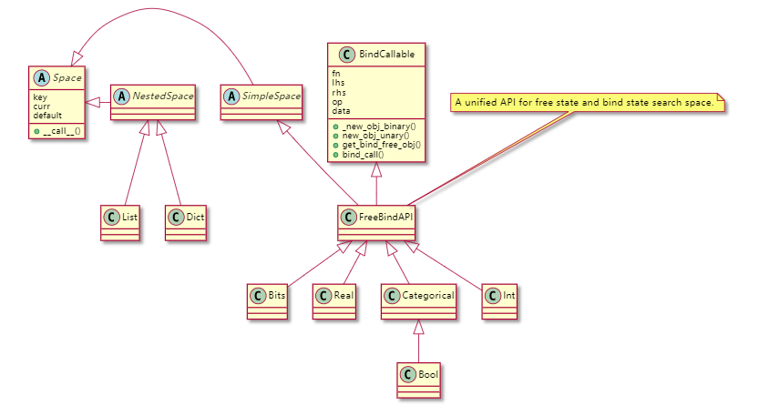

# Space
搜索空间用于表示可选的、可搜索的参数。通过合理的设计，搜索空间和搜索空间之间可以实现嵌套，甚至是运算。在我们的设计中，搜索空间如下关键的属性/方法：
- key属性, 用于标识搜索空间的唯一ID，可以手动指定，也可以自动生成。
- curr属性, 该搜索空间的当前取值。
- default属性, 该搜索空间的默认取值。
- `__call__()`方法，调用该方法后能返回搜索空间下的一个取值，支持不同的kind类型。
- `set_curr()`方法，用于指定该搜索空间的当前取值。

# 支持的搜索空间
在所支持的搜索参数中：
- Categorical、Int、Real都继承自FreeBindAPI，而FreeBindAPI继承自SimpleSpace和BindCallable。其中SimpleSpace继承自Space，Space类为基本搜索空间，描述了超参数的可能值集。BindCallable类可以在两个超参搜索空间之间进行绑定，支持的操作有加法、减法、乘法、除法等。
- Bool继承自Categorical。
- List和Dict都继承自NestedSpace，NestedSpace继承自Space，并添加了kwspaces属性。
- Nested和File比较特殊，这两个参数只能在配置文件中使用，是一种复合型的参数，通过解析得到其他类型的搜索参数。
搜索空间的类别关系可以用下面这个来表述：

## SimleSpace和NestedSpace
SimpleSpace中的元素只能是确定的常量；而NestedSpace中的元素可以是常量，也可以是一个搜索空间(包含SimpleSpace和NestedSpace)，NestedSpace的根节点一定是一个常量或者是一个SimpleSpace。
- 支持的SimpleSpace有：Bits、Int、Real、Categorical、Bool。调用`__call__()` / `set_curr()`方法时只会从当前的层级的搜索空间中返回/设置一个元素。
- 支持的NestedSpace有：List、Dict。它们都有一个kwspace属性，用于返回一个有序的、键平铺的搜索空间字典。调用`__call__()` / `set_curr()`方法时会迭代的调用其当前层级及嵌套层级的`__call__()` / `set_curr()`方法。返回值中，原来所有的可搜索变量都会返回该搜索空间的一个取值。

## BindCallable
假定有两个搜索空间A和B，当A变化的时候，B也想跟着对应的变化。比如在神经网络这种链式前后依赖的情况下,前一层的输出作为后一层的输入，两层之间的通道数得绑定的跟随着变化，我们该怎么办呢？为了支持这种场景，我们引入了绑定搜索空间的概念，并设计了BindCallable。
- 接收一个`fn`作为参数，并赋为属性，当`fn`为None时，表示该搜索空间是自由的，非绑定的。反之，表示改搜索空间是受绑定的。
- `_new_obj_binary`，接收左绑定源、右绑定源和绑定函数，并返回一个新的受绑定的搜索空间。下面的例子展示了如何使用该函数。
```python
from gml.space import Categorical, Int
x1 = Categorical(1, 2, 3, default=1)
x2 = Int(1, 10, step=2)

def binary_fn_toy(elem1, elem2):
    """ define how to handle elements in space.
    """
    return elem1 if elem1 // 2 and (elem2 // 20) else elem2

bind_x12 = x2._new_obj_binary(x1, x2, binary_fn_toy)
print(x1(kind='random'), x2(kind='random'), bind_x12())
```

- `_new_obj_unary`，接收(单个)左绑定源和绑定函数，并返回一个新的受绑定的搜索空间。下面的例子展示了如何使用该函数。
```python
from gml.space import Categorical, Int
x1 = Categorical(1, 2, 3, default=1)
x2 = Int(1, 10, step=2)

def unary_fn_toy(elem):
    """ define how to handle elements in space.
    """
    return elem * 2 + 2 if elem // 2 else elem

bind_x12 = x2._new_obj_unary(x1, x2, unary_fn_toy)
print(x1(kind='random'), x2(kind='random'), bind_x12(kind='random'))
```
- `bind_call`，绑定了的搜索空间调用`__call__`时会调用该函数，按上述绑定方案采样一个元素。
- `get_bind_free_obj`，返回所有自由的、简单的搜索空间列表。若该搜索空间是自由的，列表中只有本身。若该搜索空间是受绑定的，列表中会迭代的获取所有的绑定源。
- `operator.func`, 我们也重载了Python的内置运算符，使得对于两个搜索空间也能完成简单的数学运算，包括加、减、乘、除、乘方、取模、取余、真除等操作。
```python
import torch
import torch.nn as nn

from gml.space import Categorical
from gml.models import Conv2dSlice

space1 = Categorical(data=[16, 32, 64], default=16)
space2 = Categorical(data=[16, 32, 64], default=16)

conv1 = Conv2dSlice(16, space1, kernel_size=3)
conv2 = Conv2dSlice(16, space2, kernel_size=3)
conv3 = Conv2dSlice(space1 + space2, 32, kernel_size=3)

'''
if you want to perform forward(), you must set mutator for each mutable
before. Please refer to understand_mutator_mutable.
'''
mutator = DummyMutator()
conv1.set_mutator(mutator)
conv2.set_mutator(mutator)
conv3.set_mutator(mutator)

x1 = torch.randn(4, 16, 64, 64)
x2 = torch.randn(4, 16, 64, 64)
x3 = torch.cat((conv1(x1), conv2(x2)),dim=1)
out = conv3(x3)
print(out.shape)
```
## FreeBindAPI
为处于绑定状态(`self.fn is not None`)和自由状态的搜索空间提供一个统一的接口，继承自SimleSpace和BindCallable。
- 处于绑定状态的搜索空间，调用`__call__()`时，实际调用`bind_call()`，具体由BindCallable负责实现; 处于自由状态的搜索空间，调用`__call__()`时，实际会调用`free_call()`，具体由继承自FreeBindAPI的搜索空间进行实现(如Categorical、Bits)。

## Categorical
Categorical为枚举类型。
```python
from gml.space import Categorical
# 构建一个Categorical类型的搜索空间
space = Categorical(data=[1, 2, 3], default=2)
# 从该搜索空间中按kind类型取出一个数据，其它可选的kind有'max', 'random', 'default'等
supported_kinds = Categorical.supported_kinds
case = space(kind='min')
```
## Real
Real为实数类别，在给定的实数范围内`[low, upper], 步长为step`，按照supported_kinds中指定的方式取
一个值。注意:
- `kind='max'`在不同的模式下，有不同的行为。在不可数模式下(no log并且step is not None)，会直接返回其上界upper；否则，其上界不能取到。
```python
from gml.space import Real
space = Real(low=0, upper=5.0, step=0.5, default=1.0)
# 从该搜索空间中按kind类型取出一个数据，其它可选的kind有'max', 'random', 'default'等
supported_kinds = Real.supported_kinds
case = space(kind='max')
```
## Int
Real为整数类别，在给定的整数范围内`[low, upper), 步长为step`，按照supported_kinds中指定的方式取
一个值。
```python
from gml.space import Int
space = Int(low=0, upper=11, step=2, default=2)
# 从该搜索空间中按kind类型取出一个数据，其它可选的kind有'max', 'random', 'default'等
supported_kinds = Int.supported_kinds
case = space(kind='random')
```
## Bits
Bits为位类型。`data`为总位数，通过在每一位上进行置零还是置一来构建搜索空间。
```python
from gml.space import Bits
space = Bits(data=16, step=2, default=2)
# 从该搜索空间中按kind类型取出一个数据，其它可选的kind有'keep', 'remove', 'iter'等
supported_kinds = Int.supported_kinds
case = space(kind='keep')
```
## List
List为可嵌套的列表类型。python中普通的list能支持的操作，List基本也都能支持。
```python
from gml.space import Int, List
space = List(Int(0, 10), 5)
# 从该搜索空间中按kind类型取出一个数据，其它可选的kind有'max', 'random', 'default'等
supported_kinds = Int.supported_kinds
case = space(kind='random')
```
## Dict
List为可嵌套的字典类型。python中普通的dict能支持的操作，Dict基本也都能支持。
```python
from gml.space import Int, Real, List, Dict
space = Dict(y=Categorical(data=[2, 3]),
             z=Real(4, 5),
             t=List(Int(0, 10), 5),
             w=Dict(w1='a', w2='b'))
# 从该搜索空间中按kind类型取出一个数据，其它可选的kind有'max', 'random', 'default'等
supported_kinds = Int.supported_kinds
case = space(kind='random')
```

# 搜索空间的IO
一个复杂的搜索空间往往由多个不同的子搜索空间(维度)组成，是非常庞大的，我们需要对其使用一种方便的方案进行加载与存储。
## 搜索空间的加载与构建
- `build_search_space`会以Registry的方式进行构建，所有的搜索空间都在`SEARCH_SPACE`这个仓库中。
```python
from gml.core import build_search_space
space = build_search_space(type='Categorical', data=[2, 3])
```
- `build_search_space_recur`通过传入一个字典或者列表，我们能迭代的构建整个搜索空间。含有`type`字段的dict会被识别为叶子节点，通过设置`auto_build`为True能自动的将该dict构建为一个对象
```python
from gml.space import build_search_space_recur
kwargs = dict(
    name='x',
    id=dict(type='Categorical', data=[2, 3]),
    value=[4, 5],
    y=dict(type='Int', lower=0, upper=5))
space = build_search_space_recur(kwargs)
assert type(space) == Dict
kinds = ['random', 'max', 'min', 'default', 'curr']
for k in kinds:
    space(k)
assert len(space) == 4
```
-  `space_from_file`通过组合`mmcv.fileio.load`和`build_search_space_recur`能够实现直接从文件中读取并构建搜索空间。

## 搜索空间的写入
- `dump_search_space_recur`是`build_search_space_recur`的逆，迭代的把搜索空间`Dict`变为普通的字典。
- `space_to_file`是`space_fro_file`的逆，通过组合`mmcv.fileio.dump`和`dump_search_space_recur`实现把搜索空间以方便阅读的方式存入文件中。

## 应用于HPO
利用搜索空间的IO，我们可以在HPO的配置文件的search_args中写入我们希望搜索类型等信息，并通过内置的`ArgParser`来进行参数解析。通过组合上面这些技术可以得到在HPO中特有的两种搜索空间类型`Nestd`和`File`。具体请参照[understand_hpo](./understand_hpo.md)。
